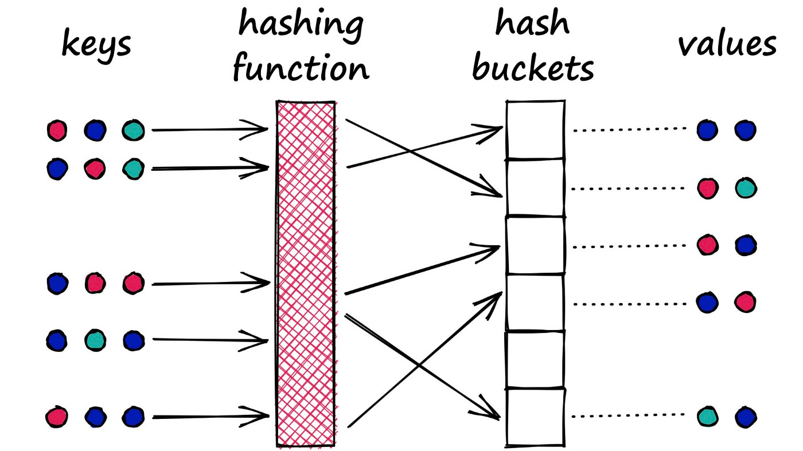
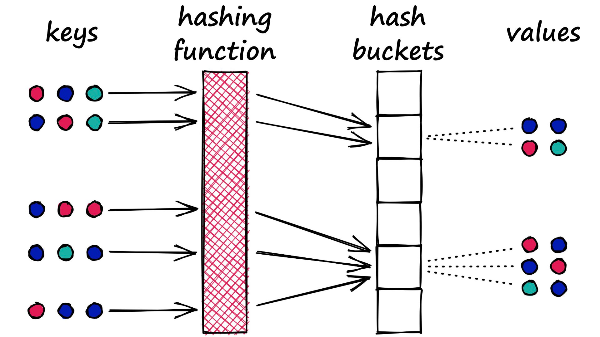

传统哈希算法，尽量减少冲突。对于hash冲突元素，使用开链表方式存储。

局部敏感哈希，把相似的元素哈希到同一个value，方便加速相似检索。

# LSH

局部敏感哈希(Locality-Sensitive Hashing, LSH) 是一种解决在海量的高维数据集中查找与查询数据点（query data point）近似最相邻的某个或某些数据点的方法。

LSH并不能保证一定能够查找到与query data point最相邻的数据，而是减少需要匹配的数据点个数的同时保证查找到最近邻的数据点的概率很大。

LSH的基本思想是将数据集中的每个数据点通过哈希函数映射到一个哈希值，使得相似的数据点具有相似的哈希值。通过这种方式，相似的数据点有很高的概率会被映射到相同的哈希桶中，从而可以在相似的哈希桶中进行快速搜索，减少了搜索的范围。

LSH的关键在于设计合适的哈希函数，使得相似的数据点在哈希值上的距离较近。

常用的LSH方法包括：
- 等距哈希（Euclidean LSH）：适用于欧几里得空间中的近似最近邻搜索。它通过将数据点投影到随机超平面上，并将投影结果进行量化，得到哈希值。
- Jaccard LSH：适用于集合数据的相似性搜索，如文档、DNA序列等。它通过将集合中的元素进行随机采样，并将元素的签名进行哈希，得到哈希值。
- Cosine LSH：适用于高维向量空间中的近似最近邻搜索。它通过将向量进行随机投影，并对投影结果进行二值化，得到哈希值。

# LSH应用领域

局部敏感哈希（LSH）在以下领域中被广泛应用：

1. 相似性搜索：LSH常用于高维数据的相似性搜索，如图像搜索、视频搜索、语义搜索等。通过将数据映射到哈希空间，LSH能够快速找到与查询数据相似的候选数据，从而加速搜索过程。

2. 推荐系统：在大规模的推荐系统中，LSH可用于快速发现相似的用户或物品。通过将用户或物品的特征进行哈希映射，LSH能够快速计算相似性，并生成个性化的推荐结果。

3. 数据去重：在大数据场景下，重复数据的存在会占用大量的存储空间和计算资源。LSH可用于快速识别和删除重复数据，从而减少存储和处理的开销。

4. 高维数据索引：对于高维数据集，传统的索引结构如B树或R树往往效率较低。LSH可以构建紧凑的索引结构，通过哈希映射和相似性搜索，加速高维数据的索引和查询。

5. 数据聚类：LSH能够将相似的数据点映射到相同的哈希桶中，基于这种映射关系，可以使用LSH进行数据聚类，将相似的数据点聚集在一起。

6. 图像识别：在图像识别和计算机视觉领域，LSH可用于图像搜索、图像分类和对象识别等任务。通过将图像特征进行哈希映射，可以快速找到与查询图像相似的候选图像。

# LSH哈希函数

局部敏感哈希（LSH）中常见的哈希函数包括：

1. 随机平面哈希（Random Plane Hashing）：将数据点映射到随机选择的超平面上，根据数据点在超平面上的投影结果进行哈希。

2. 随机投影哈希（Random Projection Hashing）：将数据点进行随机投影，将投影结果进行二值化，得到哈希值。

3. 符号哈希（Sign Hashing）：将数据点的特征向量中的每个维度与一个随机向量进行点积，根据点积结果的正负进行哈希。

4. 超平面切分哈希（Hyperplane Division Hashing）：将数据点映射到不同的超平面区域中，根据所属区域进行哈希。

5. MinHash哈希：用于处理集合数据的哈希函数，通过对集合中的元素进行随机排列，并选择一个最小的哈希值作为元素的签名。

6. SimHash哈希：用于处理文本数据的哈希函数，通过对文本进行特征提取，并根据特征的权重进行加权计算，得到文本的哈希值。

这些哈希函数在LSH中起到不同的作用，用于将数据点映射到不同的哈希桶中，以便快速搜索相似的数据点。在具体应用中，选择合适的哈希函数取决于数据特征和相似性度量的特点，以及性能和精度的要求。

# 常见LSH算法

| LSH算法              | 应用场景                                     | 哈希函数                                                     | 哈希原理                                                     |
|---------------------|--------------------------------------------|--------------------------------------------------------------|--------------------------------------------------------------|
| MinHash             | 文档相似性搜索、推荐系统中用户相似性计算     | 随机排列哈希函数                                               | 随机排列集合元素，选择最小哈希值作为元素的签名               |
| Random Projection   | 高维向量空间中的相似性搜索                   | 随机投影哈希函数                                               | 随机投影高维向量至低维空间，量化得到哈希值                   |
| SimHash             | 文本数据的相似性搜索                         | 特征加权哈希函数                                               | 对文本进行特征提取，根据特征权重进行加权计算得到哈希值       |
| LSH Forest          | 高维向量空间中的相似性搜索、数据索引           | 多个哈希函数的组合                                               | 构建多个哈希树，每个哈希树对数据进行哈希映射，查找相似候选数据 |
| Multi-Probe LSH     | 近似最近邻搜索                               | 多探针哈希函数                                                 | 引入多个探针进行哈希桶选择，提高相似数据映射到相同桶的概率   |

# 资料

- [Locality Sensitive Hashing (LSH): The Illustrated Guide](https://www.pinecone.io/learn/series/faiss/locality-sensitive-hashing/)
- [Locality Sensitive Hashing | Stanford University](https://web.stanford.edu/class/cs246/slides/03-lsh.pdf)
