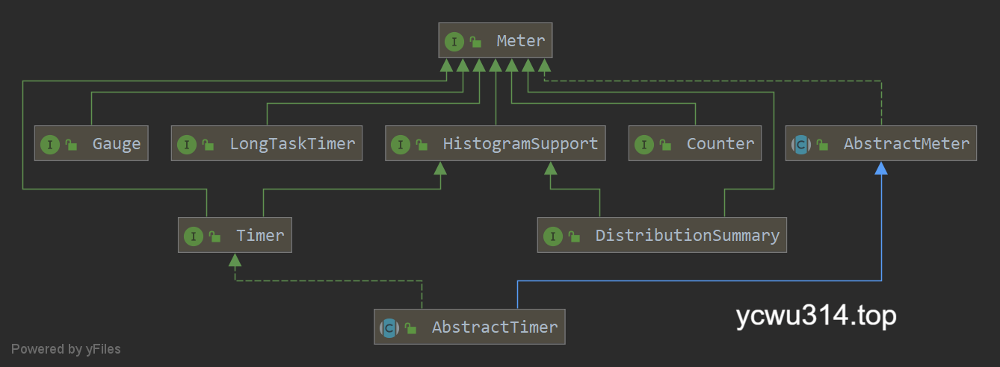
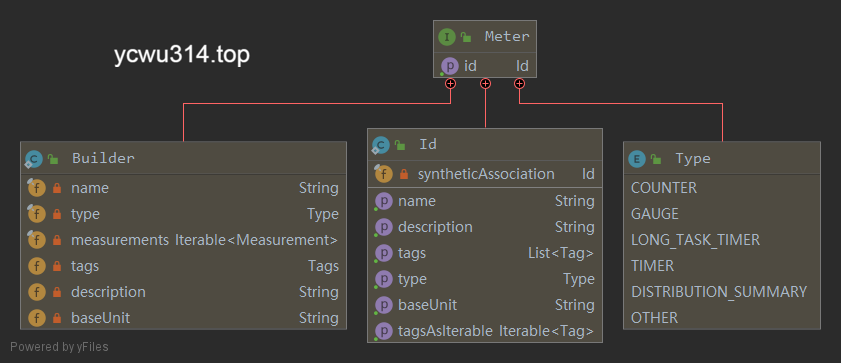
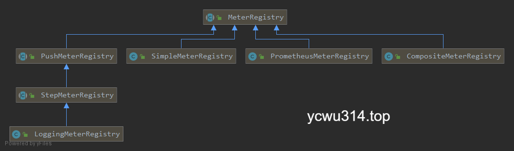
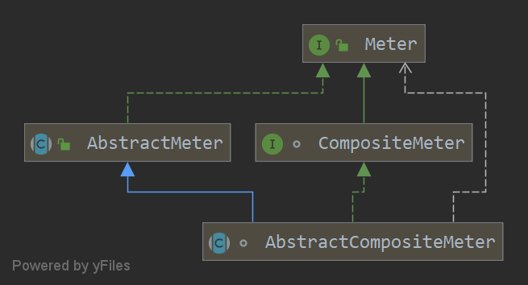

micrometer源码分析之Meter和MeterRegistry。
<!-- more -->

# Meter

Meter是整个micrometer指标的基础接口。





一个Meter包含的核心成员有Id、Measurement





## Id

Id包含名字、标签列表、Meter类型、基础单位等属性。
留意这里有个`syntheticAssociation`属性，用于记录当前Meter从哪个Meter衍生出来。

在micrometer中，tag和其他监控系统中的dimension是相同的概念。
支持tag的好处就是可以进行多维度的统计和查询。例如把服务作为一个tag，主机作为另一个tag，就可以观察到一个服务在不同主机的运行情况。
```java
class Id {
    private final String name;
    private final Tags tags;
    private final Type type;
    @Nullable
    /**
     * For internal use. Indicates that this Id is tied to a meter that is a derivative of another metric.
     * For example, percentiles and histogram gauges generated by {@link HistogramGauges} are derivatives
     * of a {@link Timer} or {@link DistributionSummary}.
     * <p>
     * This method may be removed in future minor or major releases if we find a way to mark derivatives in a
     * private way that does not have other API compatibility consequences.
     *
     * @return The meter id of a meter for which this metric is a synthetic derivative.
     */    
    private final Meter.Id syntheticAssociation;
    @Nullable
    private final String description;
    @Nullable
    private final String baseUnit;
}
```

## Measurement

Measurement包含了测量Meter的方式。
其中测量值抽象为`Supplier<Double> valueFunction`，方便提供不同的实现。
```java
public class Measurement {
    private final Supplier<Double> f;
    private final Statistic statistic;

    public Measurement(Supplier<Double> valueFunction, Statistic statistic) {
        this.f = valueFunction;
        this.statistic = statistic;
    }
    // more code
}
```

Statistic是对value类型描述的枚举类型。
```java
public enum Statistic {
    /**
     * The sum of the amounts recorded.
     */
    TOTAL("total"),

    /**
     * The sum of the times recorded. Reported in the monitoring system's base unit of time
     */
    TOTAL_TIME("total"),

    /**
     * Rate per second for calls.
     */
    COUNT("count"),

    /**
     * The maximum amount recorded. When this represents a time, it is reported in the monitoring system's base unit of time.
     */
    MAX("max"),

    /**
     * Instantaneous value, such as those reported by gauges.
     */
    VALUE("value"),

    /**
     * Undetermined.
     */
    UNKNOWN("unknown"),

    /**
     * Number of currently active tasks for a long task timer.
     */
    ACTIVE_TASKS("active"),

    /**
     * Duration of a running task in a long task timer. Always reported in the monitoring system's base unit of time.
     */
    DURATION("duration");

    private final String tagValueRepresentation;

    Statistic(String tagValueRepresentation) {
        this.tagValueRepresentation = tagValueRepresentation;
    }

    public String getTagValueRepresentation() {
        return tagValueRepresentation;
    }
}
```

## Builder

因为可配置属性多，Meter使用了builder设计模式，提供Builder内部类，方便自定义构建Meter。

## Type

Type枚举包含具体的metris类型，以后会分别探讨。
```java
enum Type {
    COUNTER,
    GAUGE,
    LONG_TASK_TIMER,
    TIMER,
    DISTRIBUTION_SUMMARY,
    OTHER;
}
```


# MeterRegistry





MeterRegistry是注册Meter的基类实现。MeterRegistry包含了
- Clock。用于测量持续时间。
- MeterFilter。过滤Meter的条件，还提供重命名、tag改名、修改tag value等功能。
- Meter监听机制（meterAddedListeners、meterRemovedListeners）。
- 配置工具Config。
- More类，提供不常用metrics的工具方法，例如FunctionCounter、LongTaskTimer等。
- PauseDetector，检测暂停，以后再讨论。
- syntheticAssociations 保存了meter之间的衍生关系。
- NamingConvention，用于转换不同底层监控系统的命名规则。

```java
public abstract class MeterRegistry {
    protected final Clock clock;
    private final Object meterMapLock = new Object();
    private volatile MeterFilter[] filters = new MeterFilter[0];
    private final List<Consumer<Meter>> meterAddedListeners = new CopyOnWriteArrayList<>();
    private final List<Consumer<Meter>> meterRemovedListeners = new CopyOnWriteArrayList<>();
    private final Config config = new Config();
    private final More more = new More();

    private volatile PMap<Id, Meter> meterMap = HashTreePMap.empty();

    /**
     * Map of meter id whose associated meter contains synthetic counterparts to those synthetic ids.
     * We maintain these associations so that when we remove a meter with synthetics, they can removed
     * as well.
     */
    private volatile PMap<Id, PSet<Id>> syntheticAssociations = HashTreePMap.empty();

    private final AtomicBoolean closed = new AtomicBoolean(false);
    private PauseDetector pauseDetector = new NoPauseDetector();

    /**
     * We'll use snake case as a general-purpose default for registries because it is the most
     * likely to result in a portable name. Camel casing is also perfectly acceptable. '-' and '.'
     * separators can pose problems for some monitoring systems. '-' is interpreted as metric
     * subtraction in some (including Prometheus), and '.' is used to flatten tags into hierarchical
     * names when shipping metrics to hierarchical backends such as Graphite.
     */
    private NamingConvention namingConvention = NamingConvention.snakeCase;

    // more code
}
```

不同的监控系统，通过实现各自的MeterRegistry，对接到micrometer。
micrometer也提供了2个基础MeterRegistry的实现。

## SimpleMeterRegistry

SimpleMeterRegistry是一个in-memory的实现。它不会对外暴露metrics。适合于简单测试。

## CompositeMeterRegistry

用于组合多个不同的监控系统。这样一个meter采集的数据可以发送到不同的监控系统。

把meter添加到各个registry，是一个可能发生并发但是低频的操作。在实现上，CompositeMeterRegistry使用CAS乐观锁提高性能。
```java
public class CompositeMeterRegistry extends MeterRegistry {
    private final AtomicBoolean registriesLock = new AtomicBoolean(false);
    private final Set<MeterRegistry> registries = Collections.newSetFromMap(new IdentityHashMap<>());

    private void lock(AtomicBoolean lock, Runnable r) {
        for (; ; ) {
            // CAS操作
            if (lock.compareAndSet(false, true)) {
                try {
                    r.run();
                    break;
                } finally {
                    lock.set(false);
                }
            }
        }
    }

    public CompositeMeterRegistry(Clock clock, Iterable<MeterRegistry> registries) {
        super(clock);
        config()
                .namingConvention(NamingConvention.identity)
                .onMeterAdded(m -> {
                    if (m instanceof CompositeMeter) { // should always be
                        lock(registriesLock, () -> nonCompositeDescendants.forEach(((CompositeMeter) m)::add));
                    }
                })
                .onMeterRemoved(m -> {
                    if (m instanceof CompositeMeter) { // should always be
                        lock(registriesLock, () -> nonCompositeDescendants.forEach(r -> r.remove(m)));
                    }
                });

        registries.forEach(this::add);
    }

}
```

CompositeMeterRegistry注册的meter都是AbstractCompositeMeter的子类。





```java
abstract class AbstractCompositeMeter<T extends Meter> extends AbstractMeter implements CompositeMeter {
    private AtomicBoolean childrenGuard = new AtomicBoolean();
    private Map<MeterRegistry, T> children = Collections.emptyMap();

    // There are no child meters at the moment. Return a lazily instantiated no-op meter.
    @Nullable
    private volatile T noopMeter;

    AbstractCompositeMeter(Id id) {
        super(id);
    }

    abstract T newNoopMeter();

    @Nullable
    abstract T registerNewMeter(MeterRegistry registry);

    // more code
}
```

子类需要实现newNoopMeter和registerNewMeter方法。
和CompositeMeterRegistry类似，AbstractCompositeMeter也是使用CAS方式解决并发安全问题。


## PrometheusMeterRegistry

`PrometheusMeterRegistry`的scrape()对外暴露Prometheus指标。
```java
public String scrape() {
    Writer writer = new StringWriter();
    try {
        scrape(writer);
    } catch (IOException e) {
        // This actually never happens since StringWriter::write() doesn't throw any IOException
        throw new RuntimeException(e);
    }
    return writer.toString();
}

public void scrape(Writer writer) throws IOException {
    TextFormat.write004(writer, registry.metricFamilySamples());
}
```

`io.prometheus.client.exporter.common.TextFormat`根据version 0.0.4暴露Prometheus指标。prometheus指标协议具体见[EXPOSITION FORMATS](https://prometheus.io/docs/instrumenting/exposition_formats/)。


```ini
# HELP go_gc_duration_seconds A summary of the GC invocation durations.
# TYPE go_gc_duration_seconds summary
go_gc_duration_seconds{quantile="0"} 0
go_gc_duration_seconds{quantile="0.25"} 0
go_gc_duration_seconds{quantile="0.5"} 0
go_gc_duration_seconds{quantile="0.75"} 0
go_gc_duration_seconds{quantile="1"} 0.001996
go_gc_duration_seconds_sum 0.0039907
go_gc_duration_seconds_count 48
```

# Metrics

Metrics是一个工具类，提供了全局静态meter注册器（是一个CompositeMeterRegistry）。
另外包含一个内部类More，提供不常用的meter类型，例如LongTaskTimer、FunctionCounter等。

```java
public class Metrics {
    public static final CompositeMeterRegistry globalRegistry = new CompositeMeterRegistry();
    private static final More more = new More();
    // more
}
```
