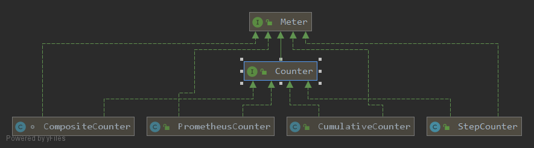

# Counter

Counter是计数器。核心方法就increment和count。
同样提供Builder模式构建实例。
<!-- more -->
Counter包含StepCounter和CumulativeCounter两大类





```java
public interface Counter extends Meter {
    static Builder builder(String name) {
        return new Builder(name);
    }

    /**
     * Update the counter by one.
     */
    default void increment() {
        increment(1.0);
    }

    /**
     * Update the counter by {@code amount}.
     *
     * @param amount Amount to add to the counter.
     */
    void increment(double amount);

    /**
     * @return The cumulative count since this counter was created.
     */
    double count();
```

Counter有2个类型：
- CumulativeCounter。 一直累加的计数器。
- StepCounter。 时间区间累加的计数器。

# CumulativeCounter

```java
public class CumulativeCounter extends AbstractMeter implements Counter {
    private final DoubleAdder value;

    @Override
    public void increment(double amount) {
        // 注意amount可以为负数
        value.add(amount);
    }

    @Override
    public double count() {
        return value.sum();
    }
}
```

CumulativeCounter底层使用java8 新增的DoubleAdder存储数据。在高并发的情况下，DoubleAdder提供更好的性能。
DoubleAdder基于Striped64的设计，因此访问当前值，转换为对所有槽位求和。

# StepCounter

```java
/**
 * Counter that reports a rate per second to a monitoring system. Note that {@link #count()}
 * will report the number events in the last complete interval rather than the total for
 * the life of the process.
 */
public class StepCounter extends AbstractMeter implements Counter {
    private final StepDouble value;

    public StepCounter(Id id, Clock clock, long stepMillis) {
        super(id);
        this.value = new StepDouble(clock, stepMillis);
    }

    @Override
    public void increment(double amount) {
        value.getCurrent().add(amount);
    }

    @Override
    public double count() {
        return value.poll();
    }    
```
StepCounter底层使用StepDouble存储数据。

```java
public class StepDouble {
    private final Clock clock;
    private final long stepMillis;
    private final DoubleAdder current = new DoubleAdder();
    // 上一个interval
    private final AtomicLong lastInitPos;
    // 上一个完成interval的值
    private volatile double previous = 0.0;

    public StepDouble(Clock clock, long stepMillis) {
        this.clock = clock;
        this.stepMillis = stepMillis;
        // 计算当前所在的interval
        lastInitPos = new AtomicLong(clock.wallTime() / stepMillis);
    }

    private void rollCount(long now) {
        final long stepTime = now / stepMillis;
        final long lastInit = lastInitPos.get();
        if (lastInit < stepTime && lastInitPos.compareAndSet(lastInit, stepTime)) {
            final double v = current.sumThenReset();
            // Need to check if there was any activity during the previous step interval. If there was
            // then the init position will move forward by 1, otherwise it will be older. No activity
            // means the previous interval should be set to the `init` value.
            previous = (lastInit == stepTime - 1) ? v : 0.0;
        }
    }

    public DoubleAdder getCurrent() {
        return current;
    }

    /**
     * @return The value for the last completed interval.
     */
    public double poll() {
        rollCount(clock.wallTime());
        return previous;
    }
}
```

StepDouble初始化的时候，先计算当前的interval。
读取上一个完成的interval的计数器值，先计算当前的间隔stepTime。如果CAS更新lastInitPos成功，则判断是否经历只一个interval。如果是，则返回当前计数值；否则，计数器的值已经过期，重置为0。


# PrometheusCounter

PrometheusCounter和CumulativeCounter类似，但是要求每次增加的值为正数。
```java
public class PrometheusCounter extends AbstractMeter implements Counter {
    private DoubleAdder count = new DoubleAdder();

    PrometheusCounter(Meter.Id id) {
        super(id);
    }

    @Override
    public void increment(double amount) {
        if (amount > 0)
            count.add(amount);
    }
}
```

