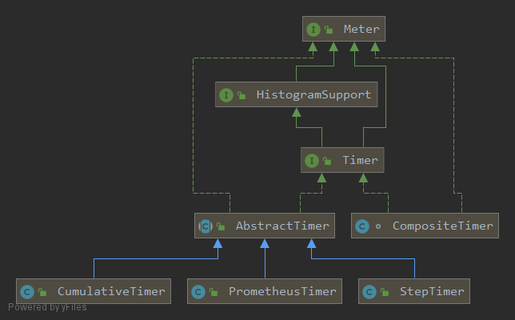

# Timer

Timer适用于测量短时间执行的事件。
<!-- more -->

```java
/* Timer intended to track of a large number of short running events. Example would be something like
 * an HTTP request. Though "short running" is a bit subjective the assumption is that it should be
 * under a minute.
*/
public interface Timer extends Meter, HistogramSupport {}
```
Timer继承了HistogramSupport。在micrometer中，使用Timer映射Prometheus的histogram类型。





计时器会记录两类数据：事件的数量和总的持续时间。

## Sample

计时功能依赖内部类Sample实现。
```java
class Sample {
    private final long startTime;
    private final Clock clock;
    
    Sample(Clock clock) {
        this.clock = clock;
        this.startTime = clock.monotonicTime();
    }

    public long stop(Timer timer) {
        long durationNs = clock.monotonicTime() - startTime;
        timer.record(durationNs, TimeUnit.NANOSECONDS);
        return durationNs;
    }
}
```
Sample初始化的时候记录当前的`monotonicTime`。当结束采样，通过`stop()`返回期间流逝的时间。
关于`wallTime`和`monotonicTime`，参见：
- [linux-wall-time-monotonic-time](/posts/linux-wall-time-monotonic-time)

Timer 只有在任务完成之后才会记录时间。具体实现见
```java
public abstract class AbstractTimer extends AbstractMeter implements Timer {
/**
 * Executes the runnable {@code f} and records the time taken.
 *
 * @param f Function to execute and measure the execution time.
 */
    @Override
    public void record(Runnable f) {
        final long s = clock.monotonicTime();
        try {
            f.run();
        } finally {
            final long e = clock.monotonicTime();
            record(e - s, TimeUnit.NANOSECONDS);
        }
    }
}
```
长时间执行的任务，应该使用LongTaskTimer。


# AbstractTimer

AbstractTimer是Timer的基本实现。
Timer实现的时候考虑了暂停pause的问题，引入了PauseDetector。通过注册PauseDetectorListener，Timer能够收到暂停事件。
（MeterRegistry默认使用NoPauseDetector。）
```java
public abstract class AbstractTimer extends AbstractMeter implements Timer {
    private static Map<PauseDetector, org.LatencyUtils.PauseDetector> pauseDetectorCache =
            new ConcurrentHashMap<>();

    protected final Clock clock;
    protected final Histogram histogram;
    private final TimeUnit baseTimeUnit;

    // Only used when pause detection is enabled
    @Nullable
    private IntervalEstimator intervalEstimator = null;

    @Nullable
    private org.LatencyUtils.PauseDetector pauseDetector;
}
```
AbstractTimer包含Histogram，处理直方图问题。以后再探讨。

# CumulativeTimer

CumulativeTimer是累积型的timer。计数和计时都使用AtomicLong类型保存。
比较有意思的是TimeWindowMax成员，会在未来讲解。
```java
public class CumulativeTimer extends AbstractTimer {
    // 次数
    private final AtomicLong count;
    // 时间
    private final AtomicLong total;
    private final TimeWindowMax max;

    @Override
    public double max(TimeUnit unit) {
        return max.poll(unit);
    }   
```

# StepTimer

StepTimer是区间间隔的timer。计数和计时都是用StepLong。
```java
public class StepTimer extends AbstractTimer {
    private final StepLong count;
    private final StepLong total;
    private final TimeWindowMax max;
```

StepLong和StepDouble类似，底层使用Striped64的子类作为存储，解决高并发的性能问题。
具体参见StepDouble部分：
- [micrometer-p2-counter](/posts/micrometer-p2-counter)

```java
public class StepLong {
    private final Clock clock;
    // 区间间隔
    private final long stepMillis;
    // Striped64 子类
    private final LongAdder current = new LongAdder();
    private final AtomicLong lastInitPos;
    // 上一个区间结束的计数
    private volatile double previous = 0.0;

```

# PrometheusTimer

和TimeWindowMax、 DistributionStatisticConfig一起再看。

# LongTaskTimer


>A long task timer is used to track the total duration of all in-flight long-running tasks and the number of such tasks.

```java
public interface LongTaskTimer extends Meter{}
```

和Timer类似，LongTaskTimer包含内部类Sample，用于统计耗时；内部会保存任务id。
```java
class Sample {
    private final LongTaskTimer timer;
    // task 是任务id
    private final long task;

    public Sample(LongTaskTimer timer, long task) {
        this.timer = timer;
        this.task = task;
    }
    // more code
}
```

DefaultLongTaskTimer 使用 ConcurrentHashMap 保存多个任务的计时。
```java
public class DefaultLongTaskTimer extends AbstractMeter implements LongTaskTimer {
    // key: taskId
    // value: 开始时间，monotonic time 单调时间
    private final ConcurrentMap<Long, Long> tasks = new ConcurrentHashMap<>();
    private final AtomicLong nextTask = new AtomicLong(0L);
    private final Clock clock;

    @Override
    public Sample start() {
        long task = nextTask.getAndIncrement();
        tasks.put(task, clock.monotonicTime());
        return new Sample(this, task);
    }

    @Override
    public long stop(long task) {
        Long startTime = tasks.get(task);
        if (startTime != null) {
            tasks.remove(task);
            return clock.monotonicTime() - startTime;
        } else {
            return -1L;
        }
    }
}
```

