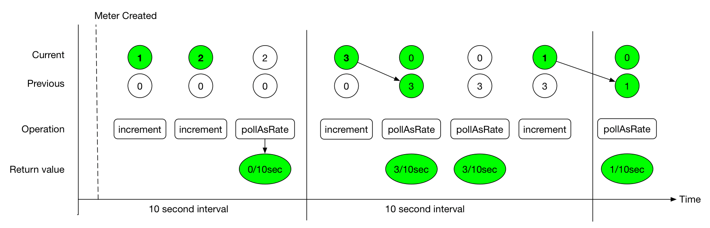

# rate aggregated

学习监控系统和micrometer的时候，接触了`rate aggregated`概念。
<!-- more -->

对于某些系统的监控，数据聚合的速率比绝对值更有意义。这类监控系统的数学计算更少。引用micrometer官网的一张图：





(来源：`https://micrometer.io/docs/concepts#_client_side`)

为了支持对数据进行rate aggregate，micrometer对当前发布间隔，通过记录step value来累计数值。
>Micrometer efficiently maintains rate data by means of a step value that accumulates data for the current publishing interval. 

发布间隔分为current和previous。每次轮询返回previous的值。一旦当前发布间隔结束，把current的值更新到previous。


# TimeWindowMax

最大值衰减，对最近接收的采样值给予更高的权重。
TimeWindowMax使用ringbuffer方式(一个AtomicLong数组)实现最大值衰减。
```java
/**
 * An implementation of a decaying maximum for a distribution based on a configurable ring buffer.
 *
 * @author Jon Schneider
 */
public class TimeWindowMax {
    @SuppressWarnings("rawtypes")
    private static final AtomicIntegerFieldUpdater<TimeWindowMax> rotatingUpdater =
            AtomicIntegerFieldUpdater.newUpdater(TimeWindowMax.class, "rotating");

    private final Clock clock;
    // ringbuffer反转间隔
    private final long durationBetweenRotatesMillis;
    // 留意ringbuffer是一个AtomicLong数组
    // 采用值是double，保存数值的long bit
    private AtomicLong[] ringBuffer;
    private int currentBucket;
    private volatile long lastRotateTimestampMillis;

    @SuppressWarnings({"unused", "FieldCanBeLocal"})
    private volatile int rotating = 0; // 0 - not rotating, 1 - rotating

    public TimeWindowMax(Clock clock, long rotateFrequencyMillis, int bufferLength) {
        this.clock = clock;
        this.durationBetweenRotatesMillis = rotateFrequencyMillis;
        this.lastRotateTimestampMillis = clock.wallTime();
        this.currentBucket = 0;

        this.ringBuffer = new AtomicLong[bufferLength];
        for (int i = 0; i < bufferLength; i++) {
            this.ringBuffer[i] = new AtomicLong();
        }
    }
}    
```

基础操作是rotate，负责按照设置的滑动时间窗口重置ringbuffer，维护当前使用的槽位。
```java
    private void rotate() {
        long timeSinceLastRotateMillis = clock.wallTime() - lastRotateTimestampMillis;
        // 到达滚动ringbuffer的时间点
        if (timeSinceLastRotateMillis < durationBetweenRotatesMillis) {
            // Need to wait more for next rotation.
            return;
        }
        // cas 并发检查
        if (!rotatingUpdater.compareAndSet(this, 0, 1)) {
            // Being rotated by other thread already.
            return;
        }

        try {
            int iterations = 0;
            synchronized (this) {
                do {
                    // 重置槽位数值
                    ringBuffer[currentBucket].set(0);
                    if (++currentBucket >= ringBuffer.length) {
                        currentBucket = 0;
                    }
                    timeSinceLastRotateMillis -= durationBetweenRotatesMillis;
                    lastRotateTimestampMillis += durationBetweenRotatesMillis;
                } while (timeSinceLastRotateMillis >= durationBetweenRotatesMillis && ++iterations < ringBuffer.length);
            }
        } finally {
            rotating = 0;
        }
    }
```

因为滑动窗口，因此在记录采样器数值时，要尝试更新所有的ringbuffer槽位。
```java
    /**
     * For use by distribution summary implementations.
     *
     * @param sample The value to record.
     */
    public void record(double sample) {
        rotate();
        // 把底层的二进制位转换为long类型。
        long sampleLong = Double.doubleToLongBits(sample);
        for (AtomicLong max : ringBuffer) {
            updateMax(max, sampleLong);
        }
    }

    private void updateMax(AtomicLong max, long sample) {
        for (; ; ) {
            long curMax = max.get();
            if (curMax >= sample || max.compareAndSet(curMax, sample))
                break;
        }
    }
```
新技能get： 
- JUC没有AtomicDouble，只有AtomicLong。为了使用CAS乐观方式高效更新计数器的值(double类型)，直接把sample底层的二进制位转换为long类型更新到ringbuffer槽位！

读取数值，直接把当前槽位的long bit转为double类型。
```java
    /**
     * @return An unscaled max. For use by distribution summary implementations.
     */
    public double poll() {
        rotate();
        synchronized (this) {
            return Double.longBitsToDouble(ringBuffer[currentBucket].get());
        }
    }
```

# DistributionStatisticConfig

DistributionStatisticConfig是Timer和DistributionSummary的配置类。

## sla

histogram会划分多个bucket。
sla用于指定发布哪些bucket。

## expiry 和 bufferLength

```java
/**
 * Statistics like max, percentiles, and histogram counts decay over time to give greater weight to recent
 * samples (exception: histogram counts are cumulative for those systems that expect cumulative
 * histogram buckets). Samples are accumulated to such statistics in ring buffers which rotate after
 * {@link #expiry}, with this buffer length.
 */
```
max, percentiles, and histogram 给最近的采样值更高的权重。采样值记录在ringbuffer环形数组。经过expiry时间之后，ringbuffer数组会被重置。
- bufferLength: ringbuffer数组长度。
- expiry: 采样值重置的时间间隔（The amount of time samples are accumulated to a histogram before it is reset and rotated.）。

## percentiles

本地计算的百分比时序，因此不能跨dimension合并。

# PrometheusTimer

有了上面的基础，来看看PrometheusTimer的相关实现。
```java
public class PrometheusTimer extends AbstractTimer {
    private static final CountAtBucket[] EMPTY_HISTOGRAM = new CountAtBucket[0];

    private final LongAdder count = new LongAdder();
    private final LongAdder totalTime = new LongAdder();
    private final TimeWindowMax max;

    @Nullable
    private final Histogram histogram;

    protected void recordNonNegative(long amount, TimeUnit unit) {
        count.increment();
        long nanoAmount = TimeUnit.NANOSECONDS.convert(amount, unit);
        totalTime.add(nanoAmount);
        max.record(nanoAmount, TimeUnit.NANOSECONDS);

        if (histogram != null)
            histogram.recordLong(TimeUnit.NANOSECONDS.convert(amount, unit));
    }

}
```
使用LongAdder类型记录次数和总时间，这里考虑了相当高并发情况。
TimeWindowMax支持区间最值衰减。

PrometheusTimer另一个功能是返回累积直方图，这个放在以后再说。

# 参考

- [Move Timer max to a ring buffer implementation #317](https://github.com/micrometer-metrics/micrometer/issues/317)

