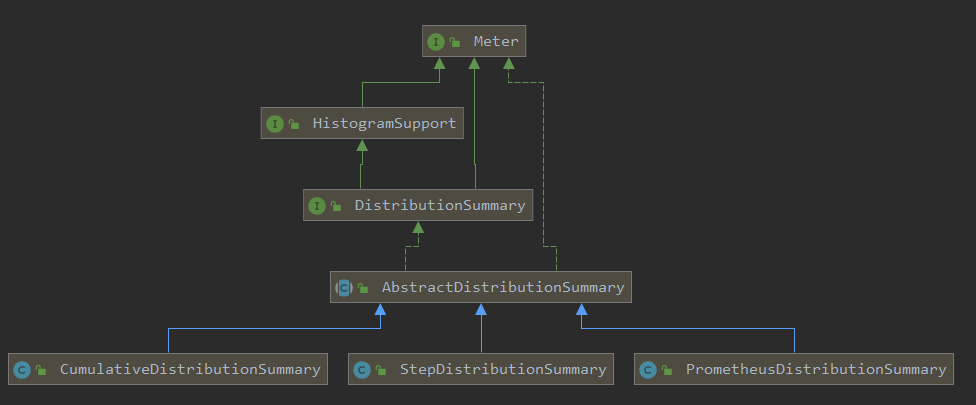

# 背景

分布概要（Distribution summary）用来记录事件的分布情况。
分布概要根据每个事件所对应的值，把事件分配到对应的桶（bucket）中。
与分布概要密切相关的是直方图和百分比（percentile）。大多数时候，我们并不关注具体的数值，而是数值的分布区间。
<!-- more -->

# DistributionSummary





DistributionSummary细分为间隔型（StepDistributionSummary）和累积型（CumulativeDistributionSummary）。实现套路和Timer类似，具体分析参见：
- [micrometer-p3-timer](/posts/micrometer-p3-timer)


AbstractDistributionSummary是基本实现，其构造函数主要是配置histogram实例。
```java
public abstract class AbstractDistributionSummary extends AbstractMeter implements DistributionSummary {
    protected final Histogram histogram;
    private final double scale;

    protected AbstractDistributionSummary(Id id, Clock clock, DistributionStatisticConfig distributionStatisticConfig, double scale,
                                          boolean supportsAggregablePercentiles) {
        super(id);
        this.scale = scale;

        if (distributionStatisticConfig.isPublishingPercentiles()) {
            // hdr-based histogram
            this.histogram = new TimeWindowPercentileHistogram(clock, distributionStatisticConfig, supportsAggregablePercentiles);
        } else if (distributionStatisticConfig.isPublishingHistogram()) {
            // fixed boundary histograms, which have a slightly better memory footprint
            // when we don't need Micrometer-computed percentiles
            this.histogram = new TimeWindowFixedBoundaryHistogram(clock, distributionStatisticConfig, supportsAggregablePercentiles);
        } else {
            // noop histogram
            this.histogram = NoopHistogram.INSTANCE;
        }
    }
}
```

# Histogram


micrometer提供2种类型的histogram：
- TimeWindowPercentileHistogram
- TimeWindowFixedBoundaryHistogram


## TimeWindowFixedBoundaryHistogram


不支持预先计算百分比（client端），但是可以计算聚合百分比（在监控系统server端计算）。不支持hdr。
```java
/*
 * A histogram implementation that does not support precomputed percentiles but supports
 * aggregable percentile histograms and SLA boundaries. There is no need for a high dynamic range
 * histogram and its more expensive memory footprint if all we are interested in is fixed histogram counts.
 */
```

核心是内部类FixedBoundaryHistogram，记录了每个bucket数值。
为了节省内存，使用`AtomicLongArray`存储，而非`AtomicLong[]`。
对于累积计数，在调用的时候再实时计算。

```java
public class TimeWindowFixedBoundaryHistogram
        extends AbstractTimeWindowHistogram<TimeWindowFixedBoundaryHistogram.FixedBoundaryHistogram, Void> {
    private final long[] buckets;

    @Override
    FixedBoundaryHistogram newBucket() {
        return new FixedBoundaryHistogram();
    }

    class FixedBoundaryHistogram {
        /**
         * For recording efficiency, this is a normal histogram. We turn these values into
         * cumulative counts only on calls to {@link #countAtValue(long)}.
         */
        final AtomicLongArray values;

        FixedBoundaryHistogram() {
            this.values = new AtomicLongArray(buckets.length);
        }

        long countAtValue(long value) {
            int index = Arrays.binarySearch(buckets, value);
            if (index < 0)
                return 0;
            long count = 0;
            for (int i = 0; i <= index; i++)
                count += values.get(i);
            return count;
        }
    }        
}
```

## TimeWindowPercentileHistogram

支持由micrometer预先计算百分比、再发送到监控系统。
```java
public class TimeWindowPercentileHistogram extends AbstractTimeWindowHistogram<DoubleRecorder, DoubleHistogram> {

    private final DoubleHistogram intervalHistogram;

}
```
核心功能依赖HdrHistogram包的DoubleHistogram实现，这个以后再研究。


# AbstractTimeWindowHistogram

不管是percentile还是fixed boundary类型的直方图，都继承自AbstractTimeWindowHistogram。

```java
/**
 * An abstract base class for histogram implementations who maintain samples in a ring buffer
 * to decay older samples and give greater weight to recent samples.
 *
 * @param <T> the type of the buckets in a ring buffer
 * @param <U> the type of accumulated histogram
 * @author Jon Schneider
 * @author Trustin Heuiseung Lee
 */
@SuppressWarnings("ConstantConditions")
abstract class AbstractTimeWindowHistogram<T, U> implements Histogram {

    @SuppressWarnings("rawtypes")
    private static final AtomicIntegerFieldUpdater<AbstractTimeWindowHistogram> rotatingUpdater =
            AtomicIntegerFieldUpdater.newUpdater(AbstractTimeWindowHistogram.class, "rotating");

    final DistributionStatisticConfig distributionStatisticConfig;

    private final Clock clock;
    private final boolean supportsAggregablePercentiles;

    private final T[] ringBuffer;
    private short currentBucket;
    private final long durationBetweenRotatesMillis;
    private volatile boolean accumulatedHistogramStale;

    private volatile long lastRotateTimestampMillis;

    @SuppressWarnings({"unused", "FieldCanBeLocal"})
    private volatile int rotating; // 0 - not rotating, 1 - rotating

    @Nullable
    private U accumulatedHistogram;

```
设计套路和`TimeWindowMax`很相似。具体见：
- [micrometer-p4-rate-aggregation](/posts/micrometer-p4-rate-aggregation)

使用ringbuffer存储数据，并且设定重置的时间间隔(rotate方法)。
基于cas乐观锁（rotating字段）进行并发控制。

一个常见的操作是获取直方图快照。
```java
    public final HistogramSnapshot takeSnapshot(long count, double total, double max) {
        rotate();

        final ValueAtPercentile[] values;
        final CountAtBucket[] counts;
        synchronized (this) {
            accumulateIfStale();
            values = takeValueSnapshot();
            counts = takeCountSnapshot();
        }

        return new HistogramSnapshot(count, total, max, values, counts, this::outputSummary);
    }
```

# PercentileHistogramBuckets

负责histogram的分桶方式，适用于可聚合百分数的监控系统（例如Prometheus）。
```java
public class PercentileHistogramBuckets {
    // Number of positions of base-2 digits to shift when iterating over the long space.
    private static final int DIGITS = 2;

    // Bucket values to use, see static block for initialization.
    private static final NavigableSet<Long> PERCENTILE_BUCKETS;

    // The set of buckets is generated by using powers of 4 and incrementing by one-third of the
    // previous power of 4 in between as long as the value is less than the next power of 4 minus
    // the delta.
    //
    // <pre>
    // Base: 1, 2, 3
    //
    // 4 (4^1), delta = 1
    //     5, 6, 7, ..., 14,
    //
    // 16 (4^2), delta = 5
    //    21, 26, 31, ..., 56,
    //
    // 64 (4^3), delta = 21
    // ...
    // </pre>
    static {
        PERCENTILE_BUCKETS = new TreeSet<>();
        PERCENTILE_BUCKETS.add(1L);
        PERCENTILE_BUCKETS.add(2L);
        PERCENTILE_BUCKETS.add(3L);

        int exp = DIGITS;
        while (exp < 64) {
            long current = 1L << exp;
            long delta = current / 3;
            long next = (current << DIGITS) - delta;

            while (current < next) {
                PERCENTILE_BUCKETS.add(current);
                current += delta;
            }
            exp += DIGITS;
        }
        PERCENTILE_BUCKETS.add(Long.MAX_VALUE);
    }
```


# 参考

- [使用 Micrometer 记录 Java 应用性能指标](https://www.ibm.com/developerworks/cn/java/j-using-micrometer-to-record-java-metric/index.html)

