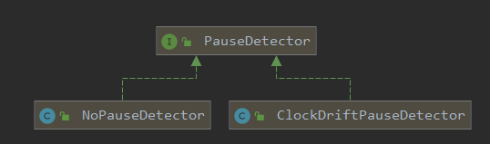

# 背景

之前在`AbstractTimer`源码第一次接触到`PauseDetector`，下面是调研笔记。
<!-- more -->

# why latency ?

复制粘贴自latencyutils官网，解释为什么需要暂停统计追踪：
>- When a pause occurs during a tracked operation, a single long recorded latency will appear in the recorded values, with no long latencies associated with any pending requests that may be stalled by the pause.
>- When a pause occurs outside of the tracked operation (and outside of the tracked time window) no long latency value would be recorded, even though any requested operation would be stalled by the pause.

翻译过来，大概是：
- 当在跟踪操作期间发生暂停时，记录的值中将出现一个长记录的延迟，那么后续挂起的请求不会被关联到长延迟。
- 当在跟踪的操作之外（以及在跟踪的时间窗口之外）发生暂停时，也不会记录长时间的延迟值。

有了暂停跟踪，能够对被测量操作获取更加精确的耗时统计。

# PauseDetector体系

在micrometer中，使用PauseDetector包装延迟统计的实现。





因为暂停统计会带来性能上的overhead，所以新版micrometer默认实现是`NoPauseDetector`。

`ClockDriftPauseDetector`是另一个实现，考虑到时钟漂移：
```java
public class ClockDriftPauseDetector implements PauseDetector {
    private final Duration sleepInterval;
    private final Duration pauseThreshold;
```
嗯，然而并没看出什么神奇地方，只是携带sleepInterval和pauseThreshold两个参数而已。

真正应用PauseDetector是在`AbstractTimer`的实现中：
```java
    private static Map<PauseDetector, org.LatencyUtils.PauseDetector> pauseDetectorCache =
            new ConcurrentHashMap<>();

    private void initPauseDetector(PauseDetector pauseDetectorType) {
        pauseDetector = pauseDetectorCache.computeIfAbsent(pauseDetectorType, detector -> {
            if (detector instanceof ClockDriftPauseDetector) {
                ClockDriftPauseDetector clockDriftPauseDetector = (ClockDriftPauseDetector) detector;
                // 底层实现是SimplePauseDetector， 来自LatencyUtils工具包
                return new SimplePauseDetector(clockDriftPauseDetector.getSleepInterval().toNanos(),
                        clockDriftPauseDetector.getPauseThreshold().toNanos(), 1, false);
            }
            return null;
        });

        if (pauseDetector instanceof SimplePauseDetector) {
            this.intervalEstimator = new TimeCappedMovingAverageIntervalEstimator(128,
                    10000000000L, pauseDetector);

            pauseDetector.addListener((pauseLength, pauseEndTime) -> {
//            System.out.println("Pause of length " + (pauseLength / 1e6) + "ms, end time " + pauseEndTime);
                if (intervalEstimator != null) {
                    // 间隔区间
                    long estimatedInterval = intervalEstimator.getEstimatedInterval(pauseEndTime);
                    long observedLatencyMinbar = pauseLength - estimatedInterval;
                    if (observedLatencyMinbar >= estimatedInterval) {
                        recordValueWithExpectedInterval(observedLatencyMinbar, estimatedInterval);
                    }
                }
            });
        }
    }
```

# SimplePauseDetector

LatencyUtils是一个暂停统计追踪开发包，提供了SimplePauseDetector等工具实现。
SimplePauseDetector通过一组线程检测是否发生了暂停，以及监听器机制（`PauseDetectorListener`）通知调用方发生了pause。

```java
public class SimplePauseDetector extends PauseDetector {
    // consensus time： 共识时间
    // 结合CAS操作解决多个检测线程的并发安全
    final AtomicLong consensusLatestTime = new AtomicLong();
    // 检查线程，最多64个
    private final SimplePauseDetectorThread detectors[];
    // 挂起detector线程的标记位
    private volatile long stallThreadMask = 0;
    private volatile long stopThreadMask = 0;    

    private class SimplePauseDetectorThread extends Thread {
        volatile long observedLasUpdateTime;
        final int threadNumber;
        final long threadMask;

        // 省略构造函数

        public void run() {
            long shortestObservedTimeAroundLoop = Long.MAX_VALUE;

            observedLasUpdateTime = consensusLatestTime.get();
            long now = TimeServices.nanoTime();
            long prevNow = now;
            // 初始化共识时间
            consensusLatestTime.compareAndSet(observedLasUpdateTime, now);

            while ((stopThreadMask & threadMask) == 0) {
                if (sleepInterval != 0) {
                    TimeServices.sleepNanos(sleepInterval);
                }

                // 外部调用明确要挂起该检测线程，则自旋等待
                // This is ***TEST FUNCTIONALITY***: Spin as long as we are externally asked to stall:
                while ((stallThreadMask & threadMask) != 0);

                observedLasUpdateTime = consensusLatestTime.get();
                // Volatile store above makes sure new "now" is measured after observedLasUpdateTime sample
                now = TimeServices.nanoTime();

                // Track shortest time around loop:
                shortestObservedTimeAroundLoop = Math.min(now - prevNow, shortestObservedTimeAroundLoop);

                // Update consensus time as long as it is is the past:
                // 这里考虑多线程环境/上下文切换等场景导致 observedLasUpdateTime 可能大于now
                while (now > observedLasUpdateTime) {
                    if (consensusLatestTime.compareAndSet(observedLasUpdateTime, now)) {
                        // Successfully and atomically moved consensus time forward. Act on the known delta:
                        final long deltaTimeNs = now - observedLasUpdateTime;

                        // Calculate hiccup time (accounting for known time around loop):
                        long hiccupTime = Math.max(deltaTimeNs - shortestObservedTimeAroundLoop, 0);

                        // 超过暂停阈值才通知监听器
                        if (hiccupTime > pauseNotificationThreshold) {
                            if (verbose) {
                                System.out.println("SimplePauseDetector thread " + threadNumber +
                                        ": sending pause notification message: pause of " + hiccupTime +
                                        " nsec detected at nanoTime: " + now);
                            }
                            
                            notifyListeners(hiccupTime, now);
                        }
                    } else {
                        // Failed to atomically move consensus time forward. Try again with current value:
                        observedLasUpdateTime = consensusLatestTime.get();
                    }
                }

                prevNow = now;
            }
            if (verbose) {
                System.out.println("SimplePauseDetector thread " + threadNumber + " terminating...");
            }
        }
    }

```

# IntervalEstimator

`AbstractTimer`在配置PauseDetector时候，还要指定间隔估算器。

TODO：
- MovingAverageIntervalEstimator
- TimeCappedMovingAverageIntervalEstimator

以后继续深入。

# 参考

- [LatencyUtils: A latency stats tracking package.](http://latencyutils.org/)
- [Your Load Generator Is Probably Lying To You - Take The Red Pill And Find Out Why](http://highscalability.com/blog/2015/10/5/your-load-generator-is-probably-lying-to-you-take-the-red-pi.html;jsessionid=665DE20AE37DDF42236EC0BEC9FC6313.v5-web006)

