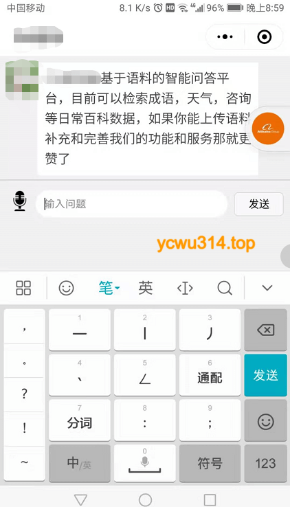
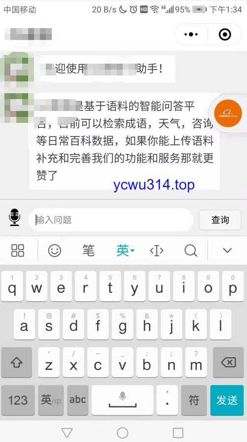

记录2个小程序开发bugfix case。
<!-- more -->

# 软键盘弹起导致布局上移

输入框父容器使用fixed布局。但是软键盘弹起导致布局上浮，并且产生了一块空白区域。如下图所示





试了几种方案，最后解决如下：
1. 输入框的父容器保持fixed布局，另外动态调整bottom属性
```html
<view class='inputRoom' style='bottom: {{inputBottom}}'>
```

2. 输入框增加focus、blur事件，更新bottom。强制减去60是为了去掉多余的空白区域。手上机型不多，减去60高度还凑合，暂时不做机型适配。
```js
focus: function(e) {
  // 修复软键盘弹起，导致fixed布局失效
  keyHeight = e.detail.height;
  // 兼容开发者工具
  if (keyHeight > 0) {
    keyHeight -= 60
  }
  this.setData({
    inputBottom: keyHeight + 'px'
  })
},
```

调整后的效果





# view标签换行符

原来用view标签展示文本。后台录入的换行符`\n`并没有展示生效，只展示为一个空格，导致文字挤成一团。
解决：
text标签才支持`\n`换行。


