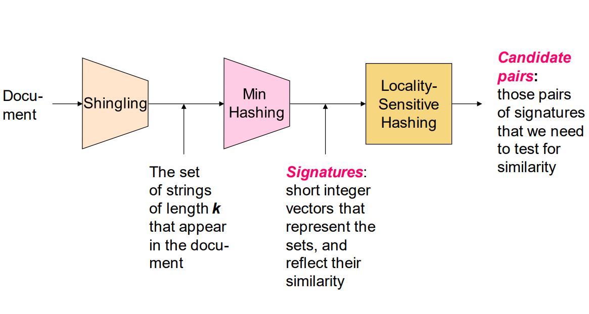

# 资料

- 强烈推荐：[Locality Sensitive Hashing | Stanford University](https://web.stanford.edu/class/cs246/slides/03-lsh.pdf)
- [文本内容相似度计算方法：minhash](https://www.biaodianfu.com/minhash.html)
- [局部敏感哈希 - MinHash](https://blog.rexking6.top/2018/10/09/%E5%B1%80%E9%83%A8%E6%95%8F%E6%84%9F%E5%93%88%E5%B8%8C-Locality-Sensitive-Hashing-LSH/)

# Shingling

Shingling（也称为k-gram）是一种将文本或序列数据转换为具有固定大小的片段的技术。

Shingling的基本思想是将文本或序列数据分割成连续的、非重叠的片段，每个片段称为一个shingle。这些shingle可以是字符级别的、单词级别的或其他更大的语言单元。然后，通过表示这些shingle的集合或哈希值，来描述原始文本或序列数据的特征。

具体来说，Shingling过程包括以下步骤：

1. 将文本或序列数据分割成固定长度的片段，例如，将文本分割成长度为k的连续字符或单词。
2. 对于每个片段，生成一个唯一的标识符（例如，哈希值）来表示该片段。
3. 将所有片段的标识符组合成一个集合或向量，表示原始文本或序列数据的shingle特征。

>Document 𝑫𝒊 is represented by a set of its k-shingles 𝑪𝒊 = 𝑺(𝑫𝒊)

>Rows = elements (shingles)
>
>Columns = sets (documents)

通常会生成一个稀疏矩阵。

# minhash

## 哈希签名

>原始集合按列组成的矩阵，将这个矩阵按行打乱排序P次，在每一次打乱之后，找出每个集合（即矩阵的列向量）的第一个值为1的行索引，并将这个索引分别填充进一个新的集合中（每个原始集合拥有各自的一个新的集合），这个新的集合就是原始集合的哈希签名。

在经过随机行打乱后，两个集合的最小哈希值相等的概率等于这两个集合的Jaccard相似度。

在现实中排列一个很大的行索引也是很慢的，所以一般用随机的哈希函数来替代排列。

## 缺点

当矩阵很大，计算多个哈希函数的代价是相当昂贵的

## 改进

对于每个集合，使用这个单一的哈希函数选出其中的多个值，而不是每个哈希函数选择一个值。

前面我们定义过 hmin(S)为集合S中具有最小哈希值的一个元素，那么我们也可以定义hmink(S)为集合S中具有最小哈希值的K个元素。这样一来，我们就只需要对每个集合求一次哈希，然后取最小的K个元素。计算两个集合A、B的相似度，就是集合A中最小的K个元素与集合B中最小的K个元素的交集个数与并集个数的比例。

# band

Band是一种用于将MinHash签名划分成多个块的技术。通过将MinHash签名分组到不同的Band中，可以更精确地定位相似集合，同时减少计算量。

## 背景

MinHash算法使用Band技术的目的是减少相似性比较的计算开销，并提高算法的效率和可扩展性。通过将MinHash签名划分成多个Band，可以在比较相似集合时只需要比较相同Band中的桶，而不必比较所有的MinHash值。

## 基本原理

1. 将MinHash签名分成多个Band。每个Band由多个行组成，每行包含一个MinHash值。

2. 对于每个Band，计算其哈希值。将相同Band哈希值的MinHash值归为一组。

3. 每个Band生成一个带有哈希值的桶。每个桶中包含该Band中所有MinHash值的标识符。

通过比较相同Band的桶，可以确定相似集合的候选对。

Band的数量和每个Band的行数是根据具体应用和数据集进行选择的。较小的Band数量和较大的行数可以提供更高的召回率（找到更多的相似集合），但会增加计算开销。相反，较大的Band数量和较小的行数可以提供更高的准确率（减少误报），但可能会减少召回率。

## 分析

上面得到向量可以分为b段（桶），每个段有r个行，假设两个点的Jaccard相似度为s，根据 **minHash的值相等的概率等于Jaccard相似度** 这个定理，若两个点在某个段完全相同，则认为这两个点为相似对。分析如下：
- 两个点在一个段中，完全一样的概率为`s^r`
- 两个点在一个段中，不完全一样的概率为`1-s^r`
- 两个点在所有段中，不完全一样的概率为`(1-s^r)^b`
- 两个点至少有一个段相同的概率为`1-(1-s^r)^b`

