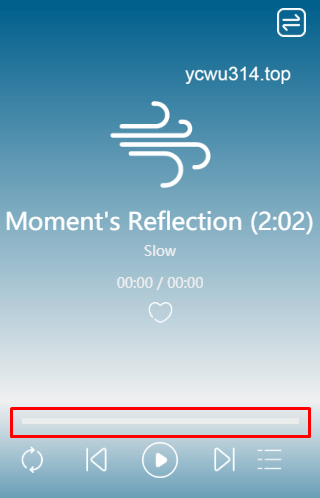

# 背景

一个音乐小程序，最初使用progress组件实现进度条。
模拟器上一切正常，但是放到真机上发现进度条不见了！

打开真机调试器，使用“节点审查”，发现progress组件被canvas遮盖了。
<!-- more -->





# canvas

canvas层级比小程序原生组件更高，因此覆盖在progress之上。
在css中，可以使用`z-index`属性控制层级。
但是canvas无视`z-index`属性。
对于这个问题，小程序提供了`cover-view`等标签，可以覆盖在canvas之上。
但是`cover-view`不支持内嵌progress组件。
目前只想到使用canvas绘制进度条。

# rpx 适配

rpx单位是微信小程序中css的尺寸单位，rpx可以根据屏幕宽度进行自适应。规定屏幕宽为750rpx。如在 iPhone6 上，屏幕宽度为375px，共有750个物理像素，则750rpx = 375px = 750物理像素，1rpx = 0.5px = 1物理像素。
使用rpx作为单位，可以方便进行屏幕适配。
rpx换算成px的公式是：`1rpx = 屏幕宽度 / 750`。

然而，小程序canvas不支持rpx作为单位，使用的是px。

为了实现适配，在`onLoad`事件保存屏幕分辨率信息。
```js
var h, w;
wx.getSystemInfo({
  success: function (res) {
    h = res.screenHeight;
    w = res.screenWidth;
  },
})
this.setData({
  screenHeight: h,
  screenWidth: w
})
```
然后再进行缩放。

# 绘制进度条

进度条可以看成两个方块的叠加。
一个方块是背景，另一个方块是当前进度。
```js
var ctx = wx.createCanvasContext('progressBar');
ctx.setFillStyle('grey')
ctx.fillRect(0, 0, width, 12)
ctx.setFillStyle('green')
ctx.fillRect(0, 0, parseInt(width * progress), 12)
ctx.draw()
```

这里要留意draw函数
```js
CanvasContext.draw(boolean reserve, function callback)

参数
boolean reserve
本次绘制是否接着上一次绘制。即 reserve 参数为 false，则在本次调用绘制之前 native 层会先清空画布再继续绘制；
若 reserve 参数为 true，则保留当前画布上的内容，本次调用 drawCanvas 绘制的内容覆盖在上面，默认 false。
```

做了如下修改，未确定是否有效😂
```js
// reserve参数:
// true：保留原来的绘图，越来越慢
// false：不保留，会刷新绘图区域
// 
var cnt = this.data.progressCnt
if (cnt++ > PROGRESS_BAR_REFERSH_CNT) {
  cnt = 0
  ctx.draw(false)
} else {
  ctx.draw(true)
}
this.setData({
  progressCnt: cnt
})
```

ps: 后来才知道`setData`会触发页面刷新。progressCnt的更新不涉及页面刷新，可以放在另一个变量存储：
```js
    if (this.counter.progressCnt++ > PROGRESS_BAR_REFERSH_CNT) {
      this.counter.progressCnt = 0
      ctx.draw(false)
    } else {
      ctx.draw(true)
    }
```

# 获取播放时间

`backgroundAudioManager.duration`是只读属性，表示音乐文件的长度，单位是秒。
经过测试，播放的时候立即读取这个属性，可能是undefined。加载音频时可能需要缓冲，因此延迟一段时间再读取，发生异常概率小很多：
```js
backgroundAudioManager.onCanplay(() => {
    console.log(backgroundAudioManager.duration);
    setTimeout(() => {
        // Yes, I can
        console.log(backgroundAudioManager.duration);
    }, 500);
});
```

# 定时器

wx.setInterval()：
- 返回number类型，是定时器的编号。这个值可以传递给 clearTimeout 来取消该定时。

考虑到进度条对小程序在前台展示才有用，注册在onTimeUpdate事件：
```
BackgroundAudioManager.onTimeUpdate(function callback)
监听背景音频播放进度更新事件，只有小程序在前台时会回调。
```

# 闪屏问题

偶尔发生闪屏，但是没有复现，有点麻烦。估计是canvas的问题，待跟踪


# 单曲循环问题

这个跟canvas无关，但是值得记下。
在`BackgroundAudioManager.onEnded`事件中增加重放，直接从0开始播放
```js
backgroundAudioManager.startTime = 0;
backgroundAudioManager.play();
```
结果时不时不能正常播放。
加上console打印，发现`backgroundAudioManager.src`为空，查资料发现，BAM播放结束后src会被置空。
解决方式很简单，增加一个变量保存当前src，单曲循环模式下触发`onEnded`事件后把这个src填到BAM即可。

# 参考资料

- [小程序坑-canvas](https://segmentfault.com/a/1190000011805262)
- [微信小程序 BackgroundAudioManager currentTime、duration 的问题以及如何规避](https://www.onlyling.com/archives/390)
- [小程序 BackgroundAudioManager 踩坑之旅](https://juejin.im/post/5d2c2122f265da1b9613355c)
