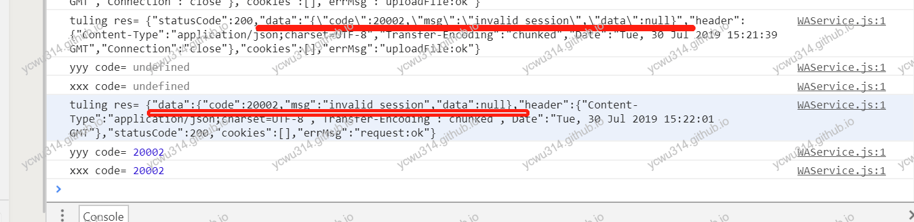

最近为小程序增加语音识别转文字的功能，坑路不断，特此记录。

# 微信开发者工具

>开发者工具上的录音文件与移动端格式不同，暂时只可在工具上进行播放调试，无法直接播放或者在客户端上播放

debug的时候发现，工具上录音的路径是`http://tmp/xxx.mp3`，客户端上录音是`wxfile://xxx.mp3`。
忽悠呢，不是格式不同，是映射路径不同。
其实做个兼容也不难，每次提示一行文字，很丑。

<!-- more -->

# 采样率与编码码率限制

每种采样率有对应的编码码率范围有效值，设置不合法的采样率或编码码率会导致录音失败。详细看这个
https://developers.weixin.qq.com/miniprogram/dev/api/media/recorder/RecorderManager.start.html

一开始没有留意，导致录音不成功。
试过几次后，采用这样的配置，感觉录音识别率和体积之间比较好平衡：
```
  sampleRate: 16000, //采样率
  numberOfChannels: 1, //录音通道数
  encodeBitRate: 96000, //编码码率
```

单通道基本是必选的。因为asr只支持单通道。frameSize也是可以的，但是要考虑截断对识别的影响。暂时没有用上。

# 录音优化

因为可能误按，于是对小于500ms的录音直接忽略。
另外，松开录音按键后，再延迟一点时间才真正stop录音。

# 录音文件格式

微信录音文件支持mp3和aac。这2种格式文件都比较小，aac文件体积更小。这对上传来说是件好事情，速度更快。
但是对语音识别转文字就不友好了。因为百度、阿里云ASR、讯飞的语音转文字接口都不支持aac和mp3，通常要求是pcm或者wav格式。
如果微信录音能提供wav格式，那么就不用服务器做格式转换了，但是wav格式体积是mp3、aac的5到10倍，至少短期是没戏了，这也是很多人吐槽的地方。

# 服务器转换录音文件格式

可以用java第三方库转换，也可以用Process调用ffmpeg转换。要注意的是，根据识别API的要求来做转换。比如阿里云asr的要求是：
>支持音频编码格式：pcm(无压缩的pcm文件或wav文件)、opus，16bit采样位数的单声道(mono)；
>支持音频采样率：8000Hz、16000Hz；

# java ProcessBuilder要使用数组传参

转换音视频，习惯用ffmpeg。安装完ffmpeg之后，用java新建进程调用。
```java
Process = new ProcessBuilder("ffmpeg -i in.mp3 out.wav").start();
```
一直提示`CreateProcess error`。
后来看文档才发现，要以数组的形式传入参数。
```java
Process = new ProcessBuilder("ffmpeg", "-y", "-i", "in.mp3", "out.wav").start();
```
这样就启动成功了。
关于java启动进程，不是本文重点，以后再写篇文章总结。

# 阿里云asr sdk使用问题

这个问题困扰了一天时间，回想起来真是吐血。
问题表现是微信录制的语音很多都识别不了。
最初是直接把录音mp3文件转换为pcm文件，本地能播放，但是**用阿里云asr sdk却识别不了**。
一开始以为是文件编码问题。特意查了asr支持的文件格式，用ffprobe检查，potplayer看属性，都没有看出问题。
甚至把启动ffmpeg进程转换也改了，用了java的库去做，还是不行。
后来为了方便测试问题，**用asr的restful接口测试录音文件，都能识别**！ 
似乎是sdk的问题。于是打开官方文档例子对比。发现用的是sdk 2.x，老铁啊你复制粘贴过来的代码竟然少了！欲哭无泪。

```java
// TODO  重要提示：这里是用读取本地文件的形式模拟实时获取语音流并发送的，因为read很快，所以这里需要sleep
// TODO  如果是真正的实时获取语音，则无需sleep, 如果是8k采样率语音，第二个参数改为8000
int deltaSleep = getSleepDelta(len, sampleRate);
Thread.sleep(deltaSleep);
```
也少了对sampleRate的设置。

# 阿里云asr token过期

因为用的是免费版asr，没有给福报厂充值，因此token一天失效，导致联调的时候突然报错。
最后实在受不了，写了个定时任务每小时更新token。
这，就是beggar VIP😎

# wx.uploadFile返回值

封装了一个接口parseResponse，统一解析查询结果（文本、语音）。发现奇怪的问题：
- 用文本查询的，可以正常解析结果
- 用语音查询的，明明已经返回了结果，却解析不了！

只能`console.log()`打印出来对比





第一行是`wx.request()`发起文本查询。
第二行是`wx.uploadFile()`上传语音文件后直接语音转文字，并且查询。

`wx.request`返回值是json对象。
`wx.uploadFile`返回值是“字符串”！
`wx.uploadFile`返回值是“字符串”！
`wx.uploadFile`返回值是“字符串”！
重要的事情要说3遍。尽管`Content-Type: "application/json; charset=utf8"`，但是微信根本不做转换！非常坑爹！

解决：对`wx.uploadFile`返回值进行`JSON.parse(res.data)`，得到json对象。

# 更换appid和secret

因为正式小程序项目账号一直拖着没有申请，所以这段时间用的是我个人的appid和secret进行开发。
等正式账号准备好了，更新了小程序项目的appid，并且发出内部体验包。

此时已经深夜1点半，头脑有点发懵。只更新了小程序appid，竟然忘了更新服务器的appid和secret。。。
于是乎反复报错登录失败。
过了一会才反映过来，更新服务器的appi的secret，但是还是用户。才想起忘了还有storage缓存没有清除😂，里面放着自定义的session。这下真机体验没问题了。
但是微信开发者工具又是登录失败。反复摸索后发现：更换小程序appid后，清除所有数据，关闭开发者工具，重新打开，这就正常了。应该是微信开发者工具的bug。

结论：深夜不宜加班写bug😭。


