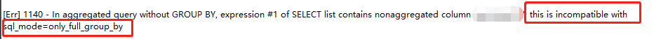

# 背景

mysql开发环境执行报错：





<!-- more -->

这份代码原来能正常执行，切换环境不正常。
后来发现是两个环境的mysql配置不一样，其中一个增加了sql_mode配置。MySQL 5.7.5 和以后版本默认`ONLY_FULL_GROUP_BY`为开启，增加group by字段检查。

# ONLY_FULL_GROUP_BY

SQL-92 和以前的标准，如果包含group by条件，则select列表、having条件、order by条件出现的非聚合字段必须在group by中。
```sql
SELECT o.custid, c.name, MAX(o.payment)
  FROM orders AS o, customers AS c
  WHERE o.custid = c.custid
  GROUP BY o.custid;
```

payment字段不出现在group by条件，但是执行max函数后得到唯一的值。
因为name不出现在group by条件中，会报错：该字段可能有多个值，数据库不知道使用哪个值作为返回。


SQL-99 标准放宽了要求。如果能够确认非聚合字段和group by条件的关系，则允许执行该sql。
>SQL:1999 and later permits such nonaggregates per optional feature T301 if they are functionally dependent on GROUP BY columns: If such a relationship exists between name and custid, the query is legal. This would be the case, for example, were custid a primary key of customers.

还是上面的例子，如果custid是主键，那么group by custid后只有一条记录，那么该行的name是唯一确定的。

对应于mysql sql_mode的`ONLY_FULL_GROUP_BY`配置：
- 关闭，则允许出现非聚合字段，即使跟group by条件没有依赖（ functionally dependent）
- 开启，则按照sql-99标准检查非聚合字段

如果不想修改全局sql_mode配置、只要单独放行个别包含非聚合字段的group by sql语句，可以使用`ANY_VALUE()`函数。`ANY_VALUE()`函数告知mysql不要对该字段进行group by依赖检查。

# 参考

- [MySQL Handling of GROUP BY](https://dev.mysql.com/doc/refman/5.7/en/group-by-handling.html)
