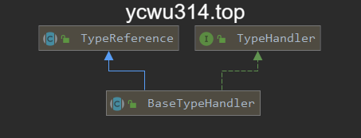

# 整体方案

数据库的extra字段是json类型，相应的jdbc类型是`JdbcType.VARCHAR` 。 
对应java实体类的extra字段，类型是Map`<String, Object>` 。 
通过Mybatis TypeHandler机制，实现java类型和jdbc类型转换。 
通过自定义mapper函数方式，实现json字段的增量更新。

<!-- more -->

# 前置要求

## mysql server verson

```sql
select version()
```
`>= 5.7.8`

## jdbc driver version

```xml
<dependency>
    <groupId>mysql</groupId>
    <artifactId>mysql-connector-java</artifactId>
    <version>5.1.48</version>
</dependency>
```
`>= 5.1.48`

## mybatis 

# 自定义Mybatis TypeHandler

TypeHandler解决Java数据类型和DB数据类型的转换。
mybatis提供一堆默认实现，具体见`org.apache.ibatis.type`。





这里只需要使用json字段存储object，不考虑json array（当然实现起来也简单）。
`@MappedTypes`是java类型。
`@MappedJdbcTypes`是jdbc类型。
这里使用fastjson进行json序列化/反序列化。
```java
@MappedTypes(Map.class)
@MappedJdbcTypes(JdbcType.VARCHAR)
public class ObjectJsonTypeHandler extends BaseTypeHandler<Map> {

    @Override
    public void setNonNullParameter(PreparedStatement ps, int i, Map parameter, JdbcType jdbcType) throws SQLException {
        ps.setString(i, JSON.toJSONString(parameter));
    }

    @Override
    public Map getNullableResult(ResultSet rs, String columnName) throws SQLException {
        String sqlJson = rs.getString(columnName);
        if (null != sqlJson){
            return JSON.parseObject(sqlJson);
        }
        return null;
    }

    @Override
    public Map getNullableResult(ResultSet rs, int columnIndex) throws SQLException {
        String sqlJson = rs.getString(columnIndex);
        if (null != sqlJson){
            return JSON.parseObject(sqlJson);
        }
        return null;
    }

    @Override
    public Map getNullableResult(CallableStatement cs, int columnIndex) throws SQLException {
        String sqlJson = cs.getString(columnIndex);
        if (null != sqlJson){
            return JSON.parseObject(sqlJson);
        }
        return null;
    }
}
```

## 在mapper xml增加映射

在mapper xml文件的`/mapper/resultMap`节点增加动态字段类型映射
```xml
<result column="extra" typeHandler="com.xxx.ObjectJsonTypeHandler" property="extra" />
```

## application.yml

增加扫描typehandler
```yml
mybatis:
  // typehandler所在的package路径
  type-handlers-package: com.xxx
```

# CRUD 操作

## select by id

无需特殊处理。从mysql读取的json字符串，被反序列化为Map类型。

## insert 

无需特殊处理。整个Map被序列化为json字符串，以varchar类型写入mysql。

## update by id

1. 更新json字段的“全部数据”，无需特殊处理。整个Map被序列化为json字符串，以varchar类型写入mysql。

2. 更新json字段的“部分字段”，需要增加自定义mapper方法，底层使用mysql的json_set函数更新，例子如下：

```xml
  <update id="updateByPrimaryKeyPartial" parameterType="com.xxx.Person">
    update t_person
    set name = #{name,jdbcType=VARCHAR},
    age = #{age,jdbcType=INTEGER},
    extra = JSON_SET(extra,
        <foreach collection="extra" index="key" separator="," item="value">
          '$.${key}', #{value}
        </foreach>
    )
    where id = #{id,jdbcType=INTEGER}
  </update>
```

这里有2个细节：
第一，JSON_SET()函数:
```
JSON_SET(json_doc, path, val[, path, val] ...)
```
设置指定路径的数据（不管是否存在）。如果有参数为NULL，则返回NULL。

第二，mybatis xml遍历Map类型。
使用`foreach`标签。当`collection`指向Map类型，`index`对应key，`item`对应value。
由于key是字符串，并且是列字段名，这里使用`${key}`读取字面值。如果使用了`#{key}`则生成的sql多添加了`""`，导致语法报错。

## delete by id

无需特殊处理。

## json字段上where条件

mysql json type的字段，需要使用特殊语法访问(`'$.<json内的字段名>'`):
```sql
select * from t_person where extra->'$.type' = 22
```

为了简化java层面使用，基于mybatis generator example，封装了GenericExample：
```java
GenericExample example2 = new GenericExample();
GenericExample.Criteria criteria2 = example2.createCriteria();
criteria2.andEqualTo("extra->'$.name'", "aaa", "extra.name");
criteria2.andGreaterThan("extra->'$.type'", 222, "extra.type");
List<Person2> result2 = personMapper2.selectByExample(example2);
```

# 全文检索问题

mysql json type 不支持全文索引。
即使对json字段建立伪列(generated column)，也不支持全文检索。
目前只能使用like模糊检索：
```sql
select * from t_person where extra like '%aaa%'
```

# 实践tips

虽然json内部可以存储不同类型，但是为了序列化和反序列化方便，我在应用层进行了使用约束：
- 整数
- 浮点
- 字符串
- 布尔

日期类型转换为unix时间戳。

业务上使用额外的表，存储json内部字段的期望类型，在dto层进行转换。