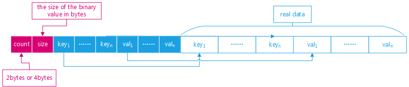

# 简介

>MySQL 5.7支持 JSON 的做法是，在server层提供了一堆便于操作 JSON 的函数，至于存储，就是简单地将 JSON 编码成 BLOB，然后交由存储引擎层进行处理，也就是说，MySQL 5.7的JSON 支持与存储引擎没有关系。

<!-- more -->

mysql json代码，主要在`sql`目录。

5.7.27与json相关：
```
item_json_func.cc
item_json_func.h
json_binary.cc
json_binary.h
json_dom.cc
json_dom.h
json_path.cc
json_path.h
opt_explain_json.cc
opt_explain_json.h
```

8.0又新增了：
```
json_diff.cc
json_diff.h
json_schema.cc
json_schema.h
json_syntax_check.cc
json_syntax_check.h
```


# json_binary.h

`json_binary.h`包含了json类型的存储结构，比较简单：
```
  The actual keys and values will come after the header, in the same
  order as in the header.

  object ::= element-count size key-entry* value-entry* key* value*

  array ::= element-count size value-entry* value*

  // number of members in object or number of elements in array
  element-count ::=
      uint16 |  // if used in small JSON object/array
      uint32    // if used in large JSON object/array

  // number of bytes in the binary representation of the object or array
  size ::=
      uint16 |  // if used in small JSON object/array
      uint32    // if used in large JSON object/array

  key-entry ::= key-offset key-length

  key-offset ::=
      uint16 |  // if used in small JSON object
      uint32    // if used in large JSON object

  key-length ::= uint16    // key length must be less than 64KB

  value-entry ::= type offset-or-inlined-value

  // This field holds either the offset to where the value is stored,
  // or the value itself if it is small enough to be inlined (that is,
  // if it is a JSON literal or a small enough [u]int).
  offset-or-inlined-value ::=
      uint16 |   // if used in small JSON object/array
      uint32     // if used in large JSON object/array
```
注意，key的长度要小于64KB。

再看一张网上的图





# partial update

5.7.x的json update，即便指定更新某个path，底层实现是读取整个json字段，修改完后再回写整个json字段。
对于大型的json，效率显然不高。
8.0版本引入partial update，能够只更新对应字段。

从binlog来观察对比json update的实现，就很直观，具体见[Partial (Optimised) JSON updates and Replication in MySQL 8.0](https://mydbops.wordpress.com/2018/05/04/optimised-json-updates-and-replication-in-mysql-8-0/)。

partial update的好处：
- 减少IO，提供update tps
- 减少binlog文件大小

支持partial update的函数
```
JSON_SET() 
JSON_REPLACE()
JSON_REMOVE()
```

相关源码：`json_diff.h`
```
  The Json_diff class is used to represent a logical change in a JSON column,
  so that a replication master can send only what has changed, instead of
  sending the whole new value to the replication slave when a JSON column is
  updated.
```

json的变更，抽象到一个向量。最终的二进制结构：
```cpp
/**
  Vector of logical diffs describing changes to a JSON column.
*/
class Json_diff_vector

/**
   The binary format has this form:

        +--------+--------+--------+     +--------+
        | length | diff_1 | diff_2 | ... | diff_N |
        +--------+--------+--------+     +--------+
**/
```

开启partial update，修改`my.cnf`
```
binlog_format=ROW
binlog_row_image=MINIMAL
binlog_row_value_options=partial_json
```

>binlog_row_value_options=PARTIAL_JSON takes effect only when binary logging is enabled and binlog_format is set to ROW or MIXED. 


# 参考

- [MySQL5.7 的 JSON 实现](http://mysql.taobao.org/monthly/2016/01/03/)

