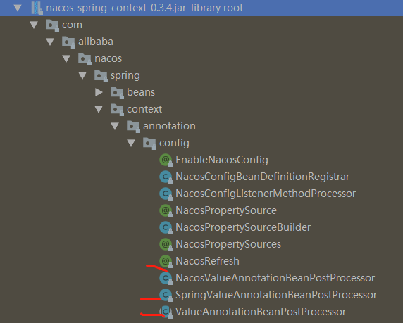
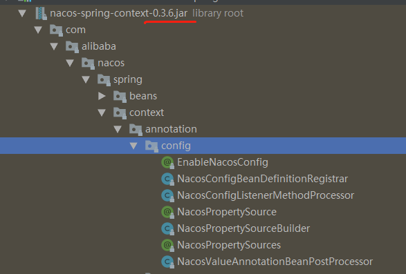
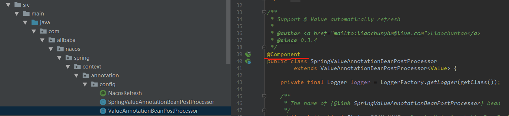

整理nacos使用中遇到的问题。
<!-- more -->

# nacos server地址配置问题，缺少必要的日志提示

背景：
- 使用k8s nacos，为了兼容部分物理机部署应用，把nacos端口容器内外端口统一为30848。但是部分容器内应用访问nacos端口忘记相应改变，导致没有访问到nacos服务器。

启动的时候，报错不能解析placeholder:
```java
2020-04-27 20:41:32.894  INFO 11088 --- [  restartedMain] c.a.b.n.c.u.NacosConfigPropertiesUtils   : nacosConfigProperties : com.alibaba.boot.nacos.config.properties.NacosConfigProperties@59d702db
2020-04-27 20:41:37.098  INFO 11088 --- [  restartedMain] c.a.b.n.config.util.NacosConfigUtils     : load config from nacos, data-id is : test, group is : ycwu

// 省略一堆无关日志
Caused by: java.lang.IllegalArgumentException: Could not resolve placeholder 'msg.text' in value "${msg.text}"
```

一开始没想到是服务器端口改变，查了好一会。
最终同事发现是服务端口对不上，修改后就正确了。

对应问题：
- nacos没有输出不能连接服务器的错误提示（即使修改日志级别为debug也没有！），不方便排查问题。

处理方案：
- `Could not resolve placeholder`可能是nacos没有正常连接到nacos server，导致placeholder解析失败。检查配置是否正确

# nacos-config-spring-boot-starter 和 @NacosRefresh 版本支持

问题：
- 使用`nacos-config-spring-boot-starter`接入nacos。最初使用0.2.4，后来升级为0.2.6。升级之后，发现`@NacosRefresh`不见了，编译报错。

`@NacosRefresh`支持对spring的`@Value`注解实现热更新。

nacos-config-spring-boot-starter会引入nacos-spring-context依赖，对应关系为：
- 0.2.4，对应0.3.4
- 0.2.6，对应0.3.6








对比发现在新版本nacos-spring-context，以下类被删掉了：
- NacosRefresh
- SpringValueAnnotationBeanPostProcessor
- ValueAnnotationBeanPostProcessor

于是通过`@NacosRefresh`对spring的`@Value`支持就没了。

在官方github找到这个文章：[support @Value auto refresh #160](https://github.com/nacos-group/nacos-spring-project/issues/160)。


这。。。有点无力吐槽。

为了支持热更新，对应的解决方案：
- 使用`@NacosValue`替换spring的`@Value`
- 或者使用spring cloud nacos，以及spring cloud的`@RefreshScope`
- 或者，把nacos-spring-context 0.3.4中的几个java文件收到拷贝到项目，并且`@Component`在spring中激活：





# nacos client日志和数据缓存

nacos client会在启动应用的用户目录创建日志和数据缓存，可以方便排查问题
```
# 日志
~/logs/nacos/config.log
~/logs/nacos/naming.log

# 数据缓存
~/nacos/config/<配置中心>-<名空间>/snapshot-tenant/<名空间>/<group>/<data id>
```

日志文件可以看到nacos client访问nacos server的情况
```
2020-07-15 15:53:19.279 ERROR [com.alibaba.nacos.client.Worker.longPolling.fixed-nacos-center.v-base_30848-a85a37ef-5bec-478c-a60f-0b11f10b3da4:c.a.n.c.
java.net.ConnectException: no available server, currentServerAddr : http://nacos-center.v-base:30848                                                    
        at com.alibaba.nacos.client.config.http.ServerHttpAgent.httpPost(ServerHttpAgent.java:178) ~[nacos-client-1.2.0.jar!/:na]                       
        at com.alibaba.nacos.client.config.http.MetricsHttpAgent.httpPost(MetricsHttpAgent.java:64) ~[nacos-client-1.2.0.jar!/:na]                      
        at com.alibaba.nacos.client.config.impl.ClientWorker.checkUpdateConfigStr(ClientWorker.java:386) [nacos-client-1.2.0.jar!/:na]                  
        at com.alibaba.nacos.client.config.impl.ClientWorker.checkUpdateDataIds(ClientWorker.java:354) [nacos-client-1.2.0.jar!/:na]                    
        at com.alibaba.nacos.client.config.impl.ClientWorker$LongPollingRunnable.run(ClientWorker.java:521) [nacos-client-1.2.0.jar!/:na]               
        at java.util.concurrent.Executors$RunnableAdapter.call(Executors.java:511) [na:1.8.0_221]                                                       
        at java.util.concurrent.FutureTask.run(FutureTask.java:266) [na:1.8.0_221]                                                                      
        at java.util.concurrent.ScheduledThreadPoolExecutor$ScheduledFutureTask.access$201(ScheduledThreadPoolExecutor.java:180) [na:1.8.0_221]         
        at java.util.concurrent.ScheduledThreadPoolExecutor$ScheduledFutureTask.run(ScheduledThreadPoolExecutor.java:293) [na:1.8.0_221]                
        at java.util.concurrent.ThreadPoolExecutor.runWorker(ThreadPoolExecutor.java:1149) [na:1.8.0_221]                                               
        at java.util.concurrent.ThreadPoolExecutor$Worker.run(ThreadPoolExecutor.java:624) [na:1.8.0_221]                                               
        at java.lang.Thread.run(Thread.java:748) [na:1.8.0_221]
```

数据目录可以看到是否拉取到最新数据。
