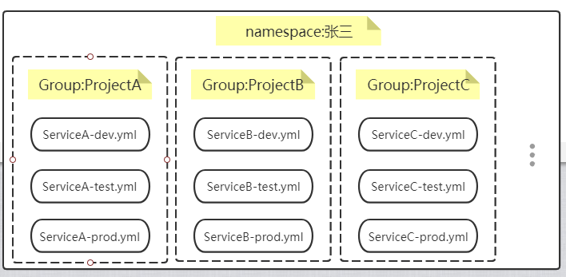

引入配置中心后，需要解决多环境、多项目的配置隔离问题。
<!-- more -->

# 配置隔离的原理和方案

nacos的配置隔离支持单租户和多租户模式，很灵活。
nacos引入了几个概念来支持配置隔离：
- namespace: 用于进行租户粒度的配置隔离。不同的命名空间下，可以存在相同的 Group 或 Data ID 的配置。
- group: 通过一个有意义的字符串（如 Buy 或 Trade ）对配置集进行分组，从而区分 Data ID 相同的配置集。
- dataId: Data ID 通常用于组织划分系统的配置集。一个系统或者应用可以包含多个配置集。

通常来说，namespace可以灵活用于租户或者环境隔离；group可以作为同一个环境不同项目的隔离。

## 单租户模式

一个nacos集群只服务一个租户。配置隔离可以这样设计：
- namespace: 不同的环境，例如dev、test、prod。
- group: 项目。
- dataId: xxx-service，不同服务的配置。


(图片来源:`https://www.cnblogs.com/larscheng/p/11411423.html`)

## 多租户模式

nacos支持多租户、多环境的配置隔离，适合灵活扩展，也是官方推荐用法。配置隔离可以这样设计：
- namespace: 租户。
- group: 项目。
- dataId: `xxx-service-[环境编号]`，不同服务的配置。注意这里把环境加入到dataId中。





(图片来源:`https://www.cnblogs.com/larscheng/p/11411423.html`)


## 其他

nacos默认提供public namespace，和默认分组DEFAULT_GROUP。
如果不指定namespace、group，就会使用默认配置。


# 实践

当前部门应用服务和环境的情况是：
- 开发、测试、生产环境**物理隔离**。不存在一个nacos集群服务多个租户的情况。
- 应用服务数量不多，未来一两年也不会有大量增加。

另外，nacos v1.1.4限制一个namespace最多200个dataId。

因此基调是使用nacos的单租户服务模式。
public保留不使用。
DEFAULT_GROUP保留不使用。

## namespace

虽然是独立部署、物理隔离，但是依然使用namespace用于环境隔离，例如DEV/TEST/PROD，但是实际上只应用使用PROD环境。
保留DEV、TEST是为了方便开发人员临时用一下。
**出发点是和主流使用方式保持概念上的一致。**

注意: nacos client要配置namespace id，是一个md5字符串。因此每次创建namespace都不一样。
于是创建了DEV、TEST、PROD三个namespace，并且固化到nacos安装后的初始化脚本。
所有应用提交的配置都使用固定的名空间，减少不必要的修改。
```yml
spring:
  application:
    name: xxx
  profiles:
    active: prod
  cloud:
    nacos:
      config:
        server-addr: 127.0.0.1:30848
        prefix: ${spring.application.name}
        file-extension: yml
        # 注意：这里使用的是namespace id （是md5）
        namespace: a85a37ef-5bec-478c-a60f-0b11f10b3da4
```


## group

每个应用分配一个group。一个group下面自由分配多个不同的dataId。

## 支持容器化和非容器化部署

应用部署分为容器化和非容器化两种模式。
为了进一步减少配置修改，为nacos分配了域名，同时修改端口，从默认的8848改为30848（因为k8s部署对外开放的端口范围为30000以上）。
应用服务使用域名和固定端口访问nacos，从而屏蔽容器化和非容器化的差异，减少一个配置修改点。

## 题外话：公共配置

有些配置需要集中管理，并且被不同应用引用，例如中间件地址和端口、公共使用的第三方key等。

于是设计了一个group，专门存放这些公共配置，并且被其他应用引用。
```ini
# ip:port，多个用逗号隔开
zookeeper.nodes=172.25.20.1:2181,172.25.20.2:2181,172.25.20.3:2181
#如果没有设置用户密码，可以不配置
zookeeper.username=
zookeeper.password=
```
应用服务应用了公共配置后，通过`${zookeeper.nodes}`方式使用。

nacos配置有优先级，因此要把公共配置作为主配置，应用自身的配置放在`ext-config`，才能正常解析（解析占位符的能力依赖client实现。java客户端已经提供）。
例子如下：
```yml
# nacos配置中心配置项
nacos:
  config:
    bootstrap:
      #开启配置预加载功能
      enable: true
    #主配置服务器地址,配置格式：ip:port，多个用英文逗号隔开，可配置nacos集群。
    server-addr: 127.0.0.1:30848
    # 主配置，命名空间，如果不填，默认为public，非public命名空间，则需要配置命名空间ID
    namespace: a85a37ef-5bec-478c-a60f-0b11f10b3da4
    #主配置，优先级高于data-ids配置，如果需要配置多个data-id,请在data-ids配置项配置，两者不能同时生效
    data-id: xxx
    #主配置 data-ids，可以配置多个data-id,多个配置之间用英文逗号隔开
    data-ids:
    # 主配置 group-id,默认值：DEFAULT_GROUP
    group: common-group
    # 主配置 开启自动刷新,默认值：false
    auto-refresh: true
    # 主配置 配置文件类型
    type: yaml
    # nacos配置中心服务的项目名称
    context-path: nacos
    #获取配置重试时间
    config-retry-time: 10
    #长轮询重试次数
    max-retry: 3
#扩展配置
    ext-config:
      - serverAddr : 127.0.0.1:30848
        # 主配置，命名空间，如果不填，默认为public，非public命名空间，则需要配置命名空间ID
        namespace: a85a37ef-5bec-478c-a60f-0b11f10b3da4
        #主配置，优先级高于data-ids配置，如果需要配置多个data-id,请在data-id配置项配置，两者不能同时生效
        data-id:
        #主配置 data-ids，可以配置多个data-id,多个配置之间用英文逗号隔开
        data-ids: xx, yy, zz
        # 主配置 group-id,默认值：DEFAULT_GROUP
        group: my-group
        # 主配置 开启自动刷新,默认值：false
        auto-refresh: true
        # 主配置 配置文件类型
        type: yaml
        # nacos配置中心服务的项目名称
        context-path: nacos
        #获取配置重试时间，可修改
        config-retry-time: 10
        #长轮询重试次数，可修改
        max-retry: 3
```

# 参考资料

- [Nacos（六）：多环境下如何“管理”及“隔离”配置和服务](https://www.cnblogs.com/larscheng/p/11411423.html)
- [Namespace, endpoint 最佳实践](https://nacos.io/zh-cn/blog/namespace-endpoint-best-practices.html)

