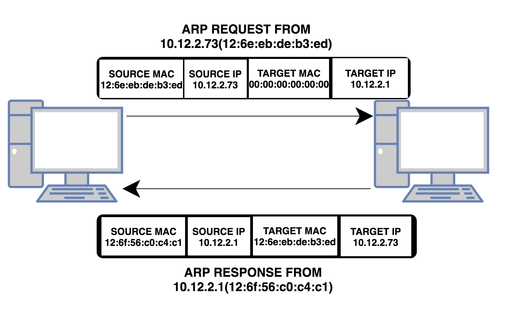
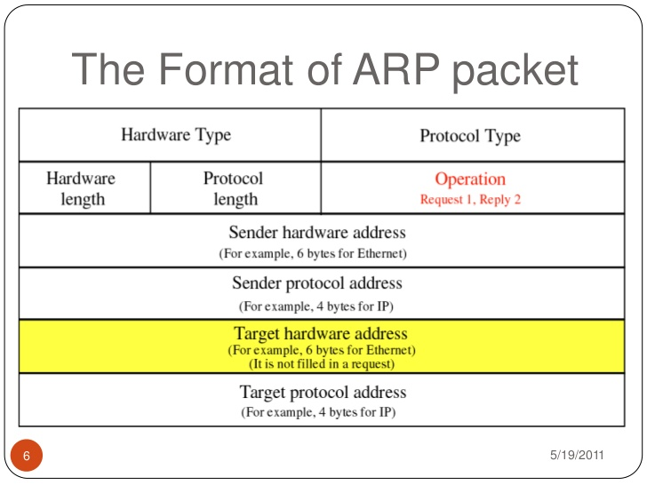
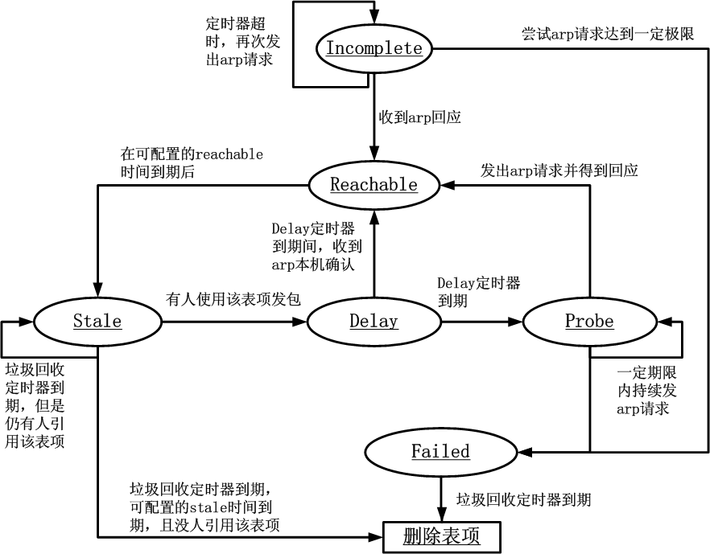

# 概述

ARP（Address Resolution Protocol）即地址解析协议，用于实现从IP地址到MAC地址的映射，即询问目标IP对应的MAC地址。
IPv4需要arp协议，IPv6使用NDP替代arp协议。
<!-- more -->

为什么需要ARP协议：
>IP地址在OSI模型的第三层，MAC地址在第二层，彼此不直接打交道。
>在通过以太网发送IP数据包时，需要先封装第三层（32位IP地址）、第二层（48位MAC地址）的报头，但由于发送时只知道目标IP地址，不知道其MAC地址，又不能跨第二、三层，所以需要使用地址解析协议。

粗略来看，arp协议流程是：
1. 主机发送信息时将包含目标IP地址的ARP请求广播到局域网络上的所有主机（ARP广播请求），并接收返回消息，以此确定目标的物理地址。
2. 收到返回消息后将该IP地址和物理地址存入本机ARP缓存中并保留一定时间，下次请求时直接查询ARP缓存以节约资源。

来一张gif动图加强印象（来源见水印）：


对于网络协议，一般要思考工作在osi模型的哪一层：
基于功能来考虑，ARP是链路层协议；基于分层/包封装来考虑，ARP是网络层协议。

# arp流程





主机A的IP地址为10.12.2.73，MAC地址为12:6e:eb:de:b3:ed；
主机B的IP地址为10.12.2.1，MAC地址为12:6f:56:c0:c4:c1；
当主机A要与主机B通信时，地址解析协议可以将主机B的IP地址（10.12.2.1）解析成主机B的MAC地址。

arp工作流程：
- 第1步：根据主机A上的路由表内容，IP确定用于访问主机B的转发IP地址是10.12.2.1。然后A主机在自己的本地ARP缓存中检查主机B的匹配MAC地址。
- 第2步：如果主机A在ARP缓存中没有找到映射，它将询问10.12.2.1的硬件地址，从而将ARP请求帧广播到本地网络上的所有主机。源主机A的IP地址和MAC地址都包括在ARP请求中。本地网络上的每台主机都接收到ARP请求并且检查是否与自己的IP地址匹配。如果主机发现请求的IP地址与自己的IP地址不匹配，它将丢弃ARP请求。
- 第3步：主机B确定ARP请求中的IP地址与自己的IP地址匹配，则将主机A的IP地址和MAC地址映射添加到本地ARP缓存中。
- 第4步：主机B将包含其MAC地址的ARP回复消息直接发送回主机A。
- 第5步：当主机A收到从主机B发来的ARP回复消息时，会用主机B的IP和MAC地址映射更新ARP缓存。本机缓存是有生存期的，生存期结束后，将再次重复上面的过程。主机B的MAC地址一旦确定，主机A就能向主机B发送IP通信了。


# arp缓存

整理自百度百科
>每个动态ARP缓存项的潜在生命周期是10分钟。
>新加到缓存中的项目带有时间戳，如果某个项目添加后2分钟内没有再使用，则此项目过期并从ARP缓存中删除；
>如果某个项目已在使用，则又收到2分钟的生命周期；
>如果某个项目始终在使用，则会另外收到2分钟的生命周期，一直到10分钟的最长生命周期。
>
>静态项目一直保留在缓存中，直到重新启动计算机为止。

# arp报文格式





操作类型：用来表示这个报文的类型，ARP请求为1，ARP响应为2，RARP请求为3，RARP响应为4。

# linux arp命令

`ip neigh`命令可以替代`arp`命令：
>This program is obsolete. For replacement check ip neigh


## 查看arp表

```sh
[root@host143 ~]# arp
Address                  HWtype  HWaddress           Flags Mask            Iface
172.25.21.175            ether   0c:c4:7a:6c:40:06   C                     ens192
172.25.20.20                     (incomplete)                              ens192
172.25.22.109                    (incomplete)                              ens192
172.25.23.21             ether   4c:ed:fb:3e:c4:70   C                     ens192
172.25.21.4              ether   ac:1f:6b:1a:e1:74   C                     ens192
```

arp表写在内存，可以通过`/proc`路径访问：
```sh
[root@host143 ~]# cat /proc/net/arp
IP address       HW type     Flags       HW address            Mask     Device
172.25.21.175    0x1         0x2         0c:c4:7a:6c:40:06     *        ens192
172.25.22.109    0x1         0x0         00:50:56:b0:80:c6     *        ens192
172.25.23.21     0x1         0x2         4c:ed:fb:3e:c4:70     *        ens192
172.25.21.4      0x1         0x2         ac:1f:6b:1a:e1:74     *        ens192
172.25.21.229    0x1         0x2         00:50:56:b0:7d:86     *        ens192
172.17.0.2       0x1         0x2         02:42:ac:11:00:02     *        docker0

```


## 手动删除条目

需要root或者netadmin权限
```sh
[root@host143 ~]# arp -d 172.25.20.20
```

## 手动增加条目
```sh
# arp  -s  address  hw_addr 
[root@host143 ~]# arp -s 172.25.20.20 12:48:08:bb:a5:bb
```

## 批量添加多个arp映射

使用`arp -f`，默认文件位置为`/etc/ethers`，文件demo如下:
>12:f7:fd:48:aa:79 10.12.2.40
>12:48:08:aa:a5:bb 10.12.2.43

执行`arp -f /etc/ethers`

## 只显示某个网络接口

```sh
[root@host143 ~]# arp -i veth0
Address                  HWtype  HWaddress           Flags Mask            Iface
localhost                        (incomplete)                              veth0
host143                  ether   c6:b2:b2:46:60:cc   C                     veth0
```

# arp参数调优

```sh
[root@host143 ~]# ls -1 /proc/sys/net/ipv4/neigh/default
anycast_delay
app_solicit
base_reachable_time
base_reachable_time_ms
delay_first_probe_time
gc_interval
gc_stale_time
gc_thresh1
gc_thresh2
gc_thresh3
locktime
mcast_solicit
proxy_delay
proxy_qlen
retrans_time
retrans_time_ms
ucast_solicit
unres_qlen
unres_qlen_bytes
```
这些参数的介绍，可以使用`man 7 arp`获取。

几个核心参数
```
delay_first_probe_time
       发现某个相邻层记录无效(stale)后，发出第一个探测要等待的时间。 缺省值是5秒。

gc_interval
       收集相邻层记录的无用记录的垃圾收集程序的运行周期，缺省为30秒。

gc_stale_time
       决定检查一次相邻层记录的有效性的周期。 当相邻层记录失效时，将在给它发送数据前，再解析一次。 缺省值是60秒。

gc_thresh1
       存在于ARP高速缓存中的最少层数，如果少于这个数， 垃圾收集器将不会运行。缺省值是128。

gc_thresh2
       保存在 ARP 高速缓存中的最多的记录软限制。 垃圾收集器在开始收集前，允许记录数超过这个数字 5 秒。 缺省值是 512。

gc_thresh3
       保存在 ARP 高速缓存中的最多记录的硬限制， 一旦高速缓存中的数目高于此， 垃圾收集器将马上运行。缺省值是1024。

locktime
       ARP记录保存在高速缓存内的最短时间（jiffy数），以防止存在多个可能的映射(potential mapping)时，ARP高速缓存系统的颠簸
       (经常是由于网络的错误配置而引起)。 缺省值是 1 秒。
```

对应常见的错误是arp表溢出：Neighbour table overflow。

# linux arp状态机


`neighbour.h`定义了一堆状态，参见[neighbour.h](https://elixir.bootlin.com/linux/latest/source/include/net/neighbour.h)
```cpp
#define NUD_IN_TIMER	(NUD_INCOMPLETE|NUD_REACHABLE|NUD_DELAY|NUD_PROBE)
#define NUD_VALID	(NUD_PERMANENT|NUD_NOARP|NUD_REACHABLE|NUD_PROBE|NUD_STALE|NUD_DELAY)
#define NUD_CONNECTED	(NUD_PERMANENT|NUD_NOARP|NUD_REACHABLE)
```

摘自参考资料：
- NUD_INCOMPLETE：未完成状态。当第一个包发送需要新的ARP缓存条目时neigh_resolve_output()被调用。最后实际调用的是neigh_event_send()函数,它发送一个ARP请求并置传输状态为NUD_INCOMPLETE。
- NUD_REACHABLE：可达状态。当收到ARP响应时,邻居表进入NUD_REACHABLE状态
- NUD_STALE：过期状态。当定时器触发neigh_periodic_timer()函数扫描到邻居表条目的最后时间超过可达时间参数时，它设置条目状态为过期状态
- NUD_DELAY：延迟状态。当在NUD_STALE状态下有报文需要发送时，调用neigh_resolve_output()函数发送数据，在发送报文同时，将状态迁移到这个状态，同时启动一个定时器。
- NUD_PROBE：探测状态。NUD_DELAY的定时器到时调用neigh_timer_handler()迁移到这个状态，这个状态下，发送ARP请求并等待响应。
- NUD_FAILED： 失败状态。连续重发多次都没有响应。
- NUD_NOARP：不需要解析，如PPP接入。
- NUD_PERMANENT：静态ARP
- NUD_IN_TIMER：定时器状态。表示邻居系统正在运行一个定时器
- NUD_VALID：有效状态。表示邻居表有一个可用地址
- NUD_CONNECTED：连接状态。表示可以直接根据邻居系统发送数据包





arp缓存项的reachable状态对于外发包是可用的，对于stale状态的arp缓存项而言，它实际上是不可用的。
如果本地发出的包使用了这个stale状态的arp缓存表项，那么就将状态机推进到delay状态，如果在“垃圾收集”定时器到期后还没有人使用该邻居，那么就有可能删除这个表项了。


# linux arping命令

向相邻主机发送ARP请求。

```sh
[root@localhost ~]# arping -h
Usage: arping [-fqbDUAV] [-c count] [-w timeout] [-I device] [-s source] destination
  -f : quit on first reply
  -q : be quiet
  -b : keep broadcasting, don't go unicast
  -D : duplicate address detection mode
  -U : Unsolicited ARP mode, update your neighbours. No replies are expected.
  -A : ARP answer mode, update your neighbours
  -V : print version and exit
  -c count : how many packets to send
  -w timeout : how long to wait for a reply
  -I device : which ethernet device to use (默认是eth0)
  -s source : source ip address
  destination : ask for what ip address
```

`-s`指定源ip地址：
```
-s source
    IP source address to use in ARP packets.  If this option is absent, source address is:
    · In DAD mode (with option -D) set to 0.0.0.0.
    · In Unsolicited ARP mode (with options -U or -A) set to destination.
    · Otherwise, it is calculated from routing tables.
```

## 向邻居发送arp请求

```
[root@host143 ~]# arping -f -I ens192  172.25.22.138
ARPING 172.25.22.138 from 172.25.20.143 ens192
Unicast reply from 172.25.22.138 [00:50:56:B0:82:3C]  0.852ms
Sent 1 probes (1 broadcast(s))
Received 1 response(s)
```

## 地址冲突检查 (DAD)

>Duplicate address detection mode (DAD). See RFC2131, 4.4.1.  Returns 0, if DAD succeeded i.e. no replies are received

相关资料见[RFC2131, 4.4.1](https://tools.ietf.org/html/rfc2131) 
TODO: 和DHCP相关，以后研究。

```sh
[root@host143 ~]# arping -D -I ens192 172.25.22.138
# 注意-D模式，默认的source ip是0.0.0.0
ARPING 172.25.22.138 from 0.0.0.0 ens192
Unicast reply from 172.25.22.138 [00:50:56:B0:82:3C]  0.954ms
Sent 1 probes (1 broadcast(s))
Received 1 response(s)
```

# 免费arp

gratuitous ARP（GARP）是一种功能而非协议。

普通ARP是请求对方IP地址对应的MAC地址。
免费ARP是以源、目IP都是自己，源MAC也是自己，目标MAC是广播，即向自己所在网络请求自己的MAC地址。
免费ARP的作用，主机可以用它来确定另一台主机是否设置了同样的IP地址。如果免费ARP请求收到了恢复说明广播域内存储IP地址冲突。

```sh
# 主机host143的ip地址为172.25.20.143
# 5s内检查该地址是否有冲突

[root@host143 ~]# arping -w 5 -I ens192 172.25.20.143
ARPING 172.25.20.143 from 172.25.20.143 ens192
Sent 6 probes (6 broadcast(s))
Received 0 response(s)
```

免费ARP的报文发出去是不希望收到回应的，只希望是起宣告作用；如果收到回应，则证明对方也使用自己目前使用的IP地址。
所有网络设备（包括计 算机网卡）up的时候，都会发送这样的免费ARP广播。

# arp抓包

在172.25.20.143发送arp请求到172.25.22.138。

窗口1：
```sh
[root@host143 ~]# tcpdump -i ens192 -ennt '(dst 172.25.22.138 and src 172.25.20.143) or (dst 172.25.20.143 and src 172.25.22.138)'
tcpdump: verbose output suppressed, use -v or -vv for full protocol decode
listening on ens192, link-type EN10MB (Ethernet), capture size 262144 bytes
00:50:56:b0:b8:fd > ff:ff:ff:ff:ff:ff, ethertype ARP (0x0806), length 42: Request who-has 172.25.22.138 (ff:ff:ff:ff:ff:ff) tell 172.25.20.143, length 28
00:50:56:b0:82:3c > 00:50:56:b0:b8:fd, ethertype ARP (0x0806), length 60: Reply 172.25.22.138 is-at 00:50:56:b0:82:3c, length 46
```

- `-i`：指定网络接口。
- `-e`：显示链路层报头
- `-nn`：不把地址转换为主机名
- `-t`：不打印时间

窗口2：
```sh
[root@host143 ~]# arping -I ens192 -f 172.25.22.138
ARPING 172.25.22.138 from 172.25.20.143 ens192
Unicast reply from 172.25.22.138 [00:50:56:B0:82:3C]  0.901ms
Sent 1 probes (1 broadcast(s))
Received 1 response(s)
```

# arp欺骗

地址解析协议是建立在网络中各个主机互相信任的基础上的。
ARP地址转换表保存在缓存当中，并且周期性更新，这就给攻击者在更新表项之前修改地址转换表、达到攻击目标。
ARP欺骗会导致通信重定向，所有的数据都会通过攻击者的机器。


防御措施：
- 不要单独信任ip或者mac。理想的关系应该建立在IP+MAC基础上。
- 使用ARP服务器。通过该服务器查找自己的ARP转换表来响应其他机器的ARP广播。
- 使用静态配置路由ARP条目。

TODO: 补充arp欺骗实验。

# RARP

Reverse Address Resolution Protocol。
从网关服务器的ARP表或者缓存上根据MAC地址请求IP地址的协议，其功能与地址解析协议相反。

# 代理ARP

地址解析协议工作在一个网段中，而代理ARP（Proxy ARP）工作在不同的网段间，其一般被像路由器这样的设备使用，用来代替处于另一个网段的主机回答本网段主机的ARP请求。

# NDP

来自百度：
>在IPv6中，地址解析协议的功能将由NDP（邻居发现协议，Neighbor Discovery Protocol）实现，它使用一系列IPv6控制信息报文（ICMPv6）来实现相邻节点（同一链路上的节点）的交互管理，并在一个子网中保持网络层地址和数据链路层地址之间的映射。

TODO: 以后再深入。

# 参考

- [How Does ARP(Address Resolution Protocol) Work?](https://www.slashroot.in/how-does-arp-address-resolution-protocol-work)
- [ARP状态](https://blog.csdn.net/jccz_zys/article/details/1324420)
- [Linux实现的ARP缓存老化时间原理解析](https://blog.csdn.net/js_xj/article/details/26563885)


