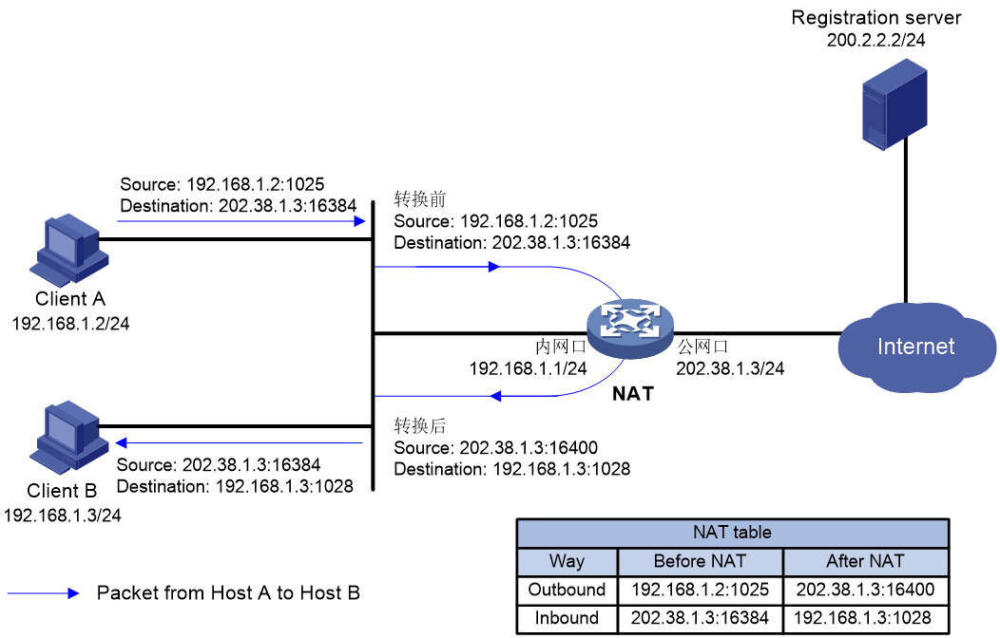
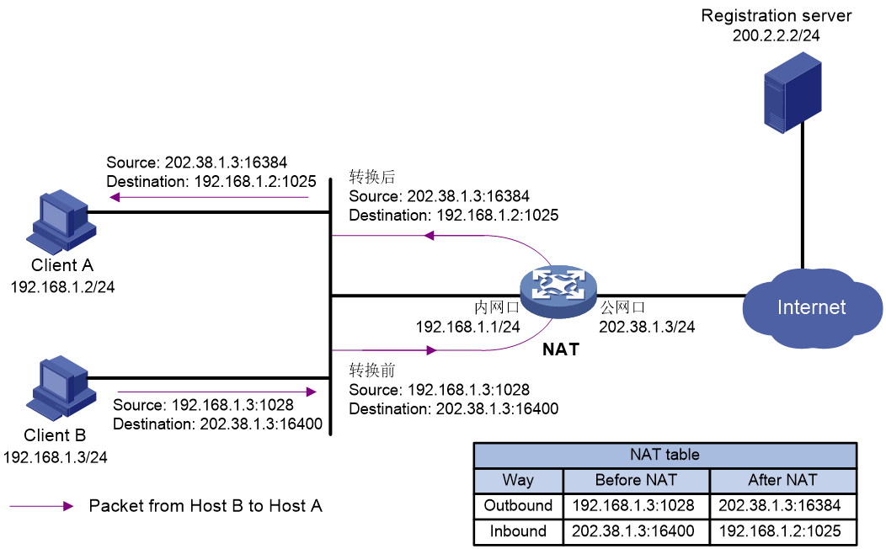
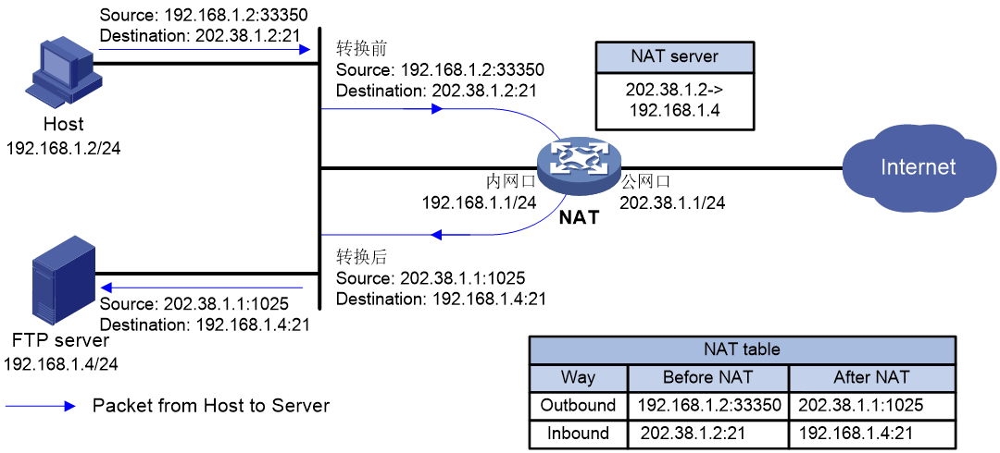
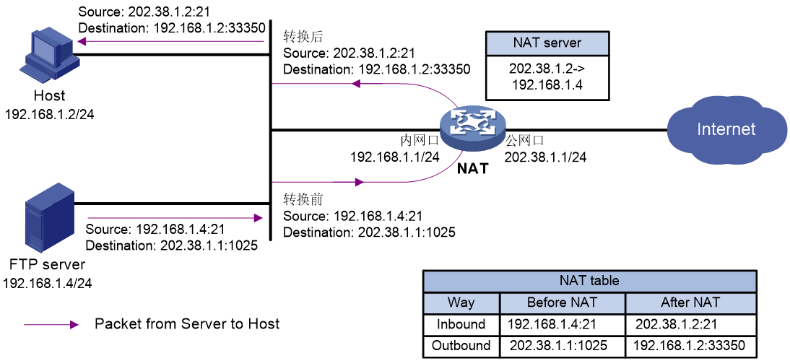

以下内容整理自：[NAT技术白皮书](http://www.h3c.com/cn/Service/Document_Software/Document_Center/Home/Switches/00-Public/Trending/White_Paper/NAT_White_Paper-6W100/)。
<!-- more -->

NAT hairpin功能用于满足位于内网侧的用户之间或内网侧的用户与服务器之间通过NAT地址进行访问的需求。开启NAT hairpin的内网侧接口上会对报文同时进行源地址和目的地址的转换。
支持两种组网模式：
- P2P：位于内网侧的用户之间通过动态分配的NAT地址互访。
- C/S：位于内网侧的用户使用静态配置的NAT地址访问内网服务器。

# P2P

P2P：位于内网侧的用户之间通过NAT地址互访。内网各主机首先向外网服务器注册自己NAT转换后的外网IP地址和端口号信息。当内网的一个客户端使用NAT地址访问内网的另一个客户端时，首先从服务器获取对方注册的IP地址和端口号信息，然后根据该信息与对方建立连接。

# C/S

C/S：位于内网侧的用户使用NAT地址访问内网服务器。内部网络中有一台FTP服务器，内网用户使用NAT地址访问该FTP服务器时，NAT设备同时转换访问内网服务器的报文的源和目的IP地址，其中，目的IP地址转换通过匹配外网接口上的内部服务器配置来完成，源地址转换通过匹配内部服务器所在接口上的出方向动态地址转换或出方向静态地址转换来完成。

我的理解：
host访问内网server的公网ip。router对host出去的流量做dnat转换（把server公网ip替换为server内网ip）。
server回流内网host。router对host入口流量做snat转换（因为host访问的公网ip，如果回流packet是内网ip，则被host丢弃）。

# 参考

- [NAT技术白皮书](http://www.h3c.com/cn/Service/Document_Software/Document_Center/Home/Switches/00-Public/Trending/White_Paper/NAT_White_Paper-6W100/)
