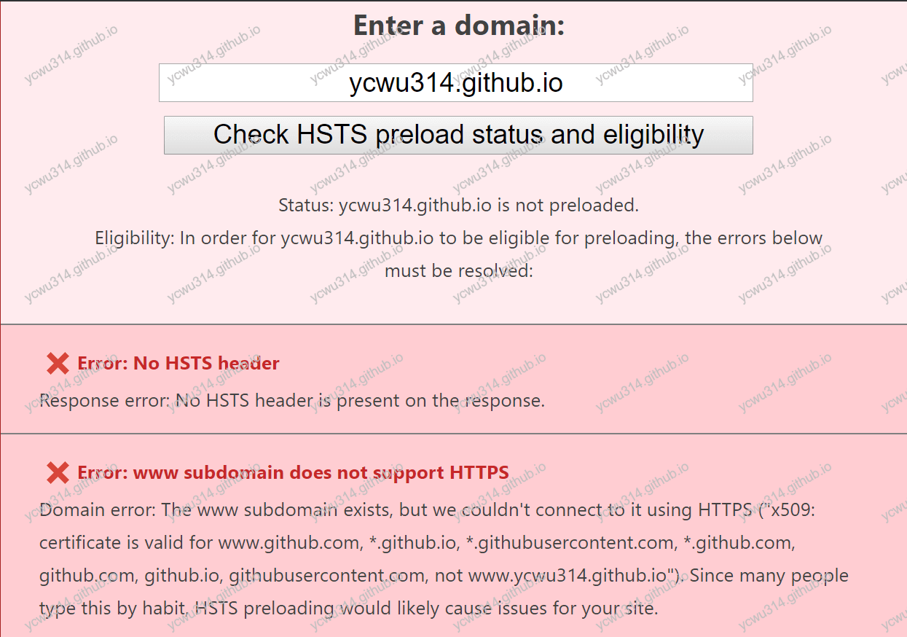
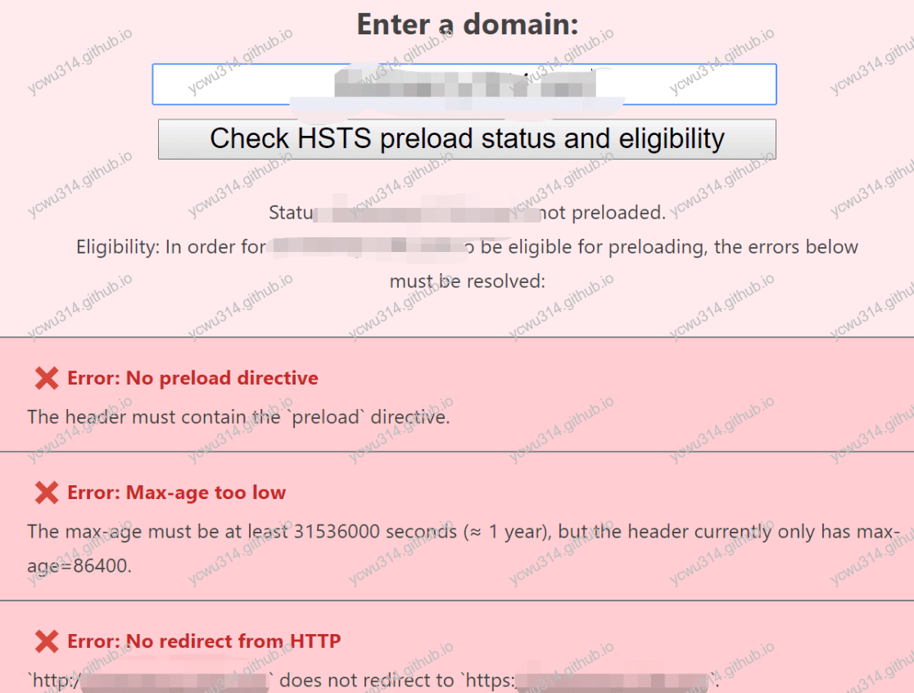
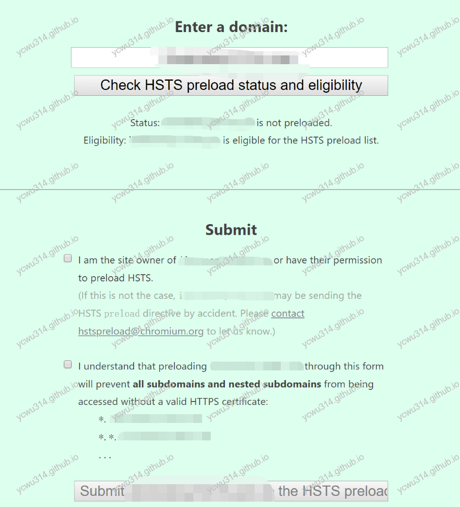

# SSL strip（SSL剥离攻击）

一个站点`xyz.com`，已经开启了https配置。站点期望用户访问的是`https://xyz.com`。
考虑这样的场景：
1. 用户在地址栏输入`xyz.com`。而这个地址，默认情况下会被浏览器解析成`http://xyz.com`。并没有走https配置！
2. 通常我们会在nginx做https永久强制跳转。permanent表示 301 permanently redirect
```nginx
rewrite  ^(.*)  https://$server_name$1 permanent;
```
因为返回了301状态码，以后浏览器访问`xyz.com`都会自动变成`https://xyz.com`。
<!-- more -->
So far so good！但是，如果step1和step2之间有个不怀好意的中间人呢？浏览器以为是直接连接上`xyz.com`，并且建立了https连接。实际上却是浏览器和中间人建立了连接，中间人代替浏览器和`xyz.com`建立https连接。那么浏览器和`xyz.com`的所有交互都会被中间人窥探。
这就是**SSL中间人剥离攻击**。


<a href="https://miro.medium.com/max/1313/0*Bvk4k7v6AfaCTyoT.png" rel="nofollow">图片来源</a>

# HTTP Strict Transport Security

>SSL剥离攻击是中间人攻击的一种，由Moxie Marlinspike于2009年发明。 他在当年的黑帽大会上发表的题为《New Tricks For Defeating SSL In Practice》的演讲中将这种攻击方式公开。 SSL剥离的实施方法是阻止浏览器与服务器创建HTTPS连接。

**问题的根源在于用户发起的第一请求不是https请求，并且被中间人截获**。RFC小组对此提出一个新的规范，HSTS(HTTP Strict Transport Security)。**对于第一次访问站站点的https请求**，可以增加返回一个header：`Strict-Transport-Security`，告诉浏览器这个域名的请求在指定时间内要使用https去连接。

注意浏览器会忽略非https响应的`Strict-Transport-Security`字段，因为这个字段可以被中间人篡改。

HSTS的配置选项有：
- max-age=\<expire-time\>
设置在浏览器收到这个请求后的<expire-time>秒的时间内凡是访问这个域名下的请求都使用HTTPS请求。
- includeSubDomains 可选
如果这个可选的参数被指定，那么说明此规则也适用于该网站的所有子域名。
- preload 可选
使用浏览器的预加载HSTS机制。

# 预加载HSTS

HSTS机制要在目标服务器第一个https响应后才生效。这还是留给中间人攻击机会。
更好的方式是，开启了https服务的`xyz.com`，浏览器只要见到`xyz.com`都会自动访问`https://xyz.com`。
这就是浏览器的预加载HSTS。chrome浏览器维护了一份预加载HSTS名单，只要向<a href="https://hstspreload.org/" rel="nofollow">hstspreload.org</a>提交了站点，那么所有浏览器会强制使用https访问该站点。
>HSTS is supported in Google Chrome, Firefox, Safari, Opera, Edge and IE

我的站点托管在GitHub Pages上，查看状态是





换我的项目地址试试





由此可见，申请加入预加载HSTS的条件是：
- 对于http请求，必须跳转到https
- 返回`Strict-Transport-Security` header字段
- `max-age`不能少于一年
- 子域名也要开启HSTS，即`includeSubDomains`是必须的
- 必须包含`preload`指令

更新nginx配置，在server节点增加
```nginx
server {
    listen 80 default;
    server_name <域名>;
    return 301 https://<域名>;
}

server {
    listen 443 ssl;
    server_name <域名>;
    add_header Strict-Transport-Security "max-age=31536000; includeSubDomains; preload" always;
    # 其他省略
}
```

再次提交，提示可以加入预加载HSTS名单了





# 副作用

开启HSTS，会强制该站点的请求都必须是https，会有一定的副作用：
- SL证书过期了，那么就不能正常访问。
- 该站点的静态资源例如js，css也必须走https访问，有修改成本

# 参考资料

- [RFC 6797 - HTTP Strict Transport Security (HSTS)](https://tools.ietf.org/html/rfc6797)
- [New Tricks For Defeating SSL In Practice - Black Hat](https://www.blackhat.com/presentations/bh-dc-09/Marlinspike/BlackHat-DC-09-Marlinspike-Defeating-SSL.pdf)
- [HTTP Strict Transport Security](https://developer.mozilla.org/zh-CN/docs/Security/HTTP_Strict_Transport_Security)


