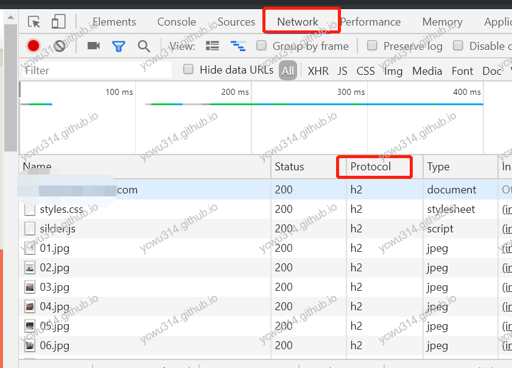
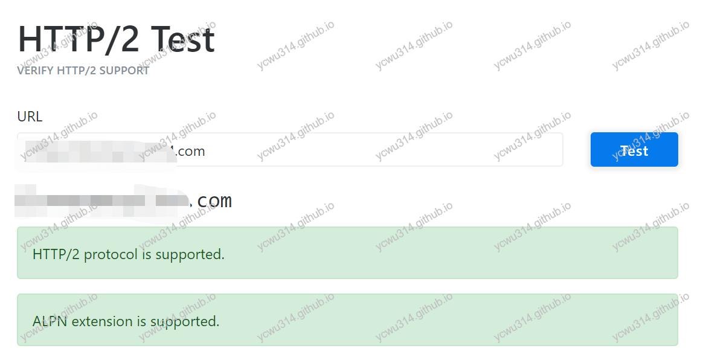

都9102年，不开启http2都凹凸曼了。

# 配置要求

1. nginx版本》1.9.5且带有http2模块
```
# nginx -V
```

2. openssl版本》1.0.2。
```
# openssl version
OpenSSL 1.1.1c  28 May 2019
```

# 配置nginx
```nginx
server{
    listen 443 ssl http2;
}
```
http2支持加密（h2）和非加密（h2c，HTTP/2 cleartext）协议。但浏览器上的实现都是h2。因此要配置ssl。

然后
```
# nginx -s reload
```

# 测试http2

1. chrome浏览器，`F12`、`Network`、选择`Protocol`，显示为`h2`则开启成功





2. https://tools.keycdn.com/http2-test 提供了在线测试工具





# 兼容性

http2向下兼容http1.1。