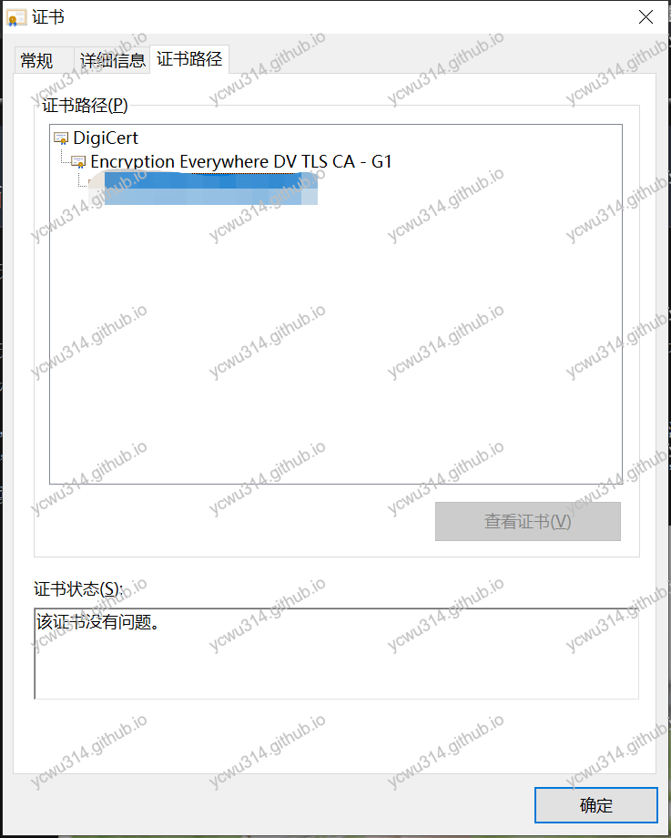
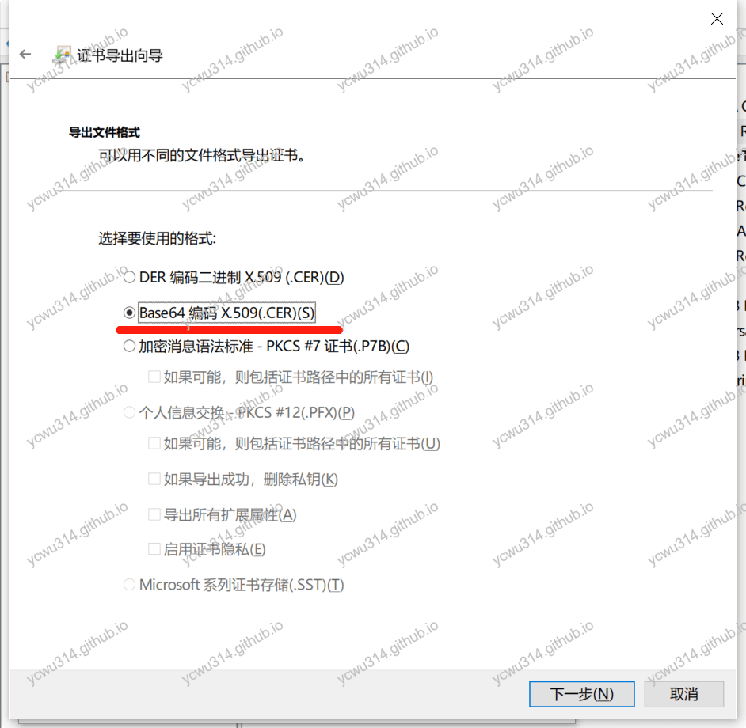

# OCSP stapling

**客户端建立tls连接时，会发起完整的http请求，查询证书的状态（有效、撤销revoke），这个操作是阻塞的**。
开启服务器的OCSP stapling功能，服务器会代替客户端查询证书状态，并且缓存响应结果，直接返回给客户端，从而省去客户端主动查询OCSP的耗时。
<!-- more -->

OCSP(Online Certificate Status Protocol):在线证书状态协议。
一张SSL证书（例如DigiCert签发的）有有效期，但是在有效期内可能会被撤销（revoke）。因此客户端需要有办法知道证书是否有效。
一种做法是CRL（Certificate Revocation List），维护一个证书撤销列表，浏览器定时去从指定网址下载。CRL有明显的不足：
- 列表越来越大
- 更新不及时

（ps. Chrome自己维护一份[CRLSet](https://github.com/agl/crlset-tools)）
就这样诞生了OCSP，在线查询证书的状态，解决了证书有效的实时问题——客户端拿到证书，去CA服务器查询证书是不是有效。但是新的问题又产生了：
- 大家都去CA服务器查询OCSP，流量太大了
- 客户端发起的CA OCSP的查询，是一个http同步请求，必须等待结果返回才进行下一步握手操作
- 隐私问题。因为客户端直接查询CA服务器，暴露ip地址

于是就诞生了OCSP stapling。由服务器端主动向CA OCSP主动查询证书，缓存结果，并且返回给客户端，加快客户端


# 生成OCSP证书链

思路：
1. 获取中间证书和根证书
2. 把证书粘贴在一起。注意顺序是**中间证书在上面，根证书在下面**

可以在Windows上操作，也可以使用openssl工具。

## Windows操作

1. 打开网页，点击地址栏的证书





中间证书是`Encryption Everywhere DV TLS CA - G1`，根证书是`DigiCert`。

2. 使用导出证书向导，注意格式是**Base64编码X.509**





分别得到middle.cer，root.cer。

3. 按照midle.cer、root.cer的顺序，把文件内容粘贴到新文件ocsp.cer，并且上传到nginx可以访问的路径。

## openssl

对openssl操作不熟悉，因此参考了[从无法开启 OCSP Stapling 说起](https://imququ.com/post/why-can-not-turn-on-ocsp-stapling.html)

### 获取证书链

证书链一般由根证书、一个或多个中间证书、站点证书组成。
```bash
$ openssl s_client -connect <your host>:443 -showcerts < /dev/null 2>&1

CONNECTED(00000003)
depth=2 C = US, O = DigiCert Inc, OU = www.digicert.com, CN = DigiCert Global Root CA
verify return:1
depth=1 C = US, O = DigiCert Inc, OU = www.digicert.com, CN = Encryption Everywhere DV TLS CA - G1
verify return:1
depth=0 CN = www.ilovenancy1314.com
verify return:1
---
Certificate chain
 0 s:/CN=www.ilovenancy1314.com
   i:/C=US/O=DigiCert Inc/OU=www.digicert.com/CN=Encryption Everywhere DV TLS CA - G1
-----BEGIN CERTIFICATE-----
MIIFqTCCBJGgAwIBAgIQCaWHzDxuO5/QR+N2QZbpTjANBgkqhkiG9w0BAQsFADBu
MQswCQYDVQQGEwJVUzEVMBMGA1UEChMMRGlnaUNlcnQgSW5jMRkwFwYDVQQLExB3
d3cuZGlnaWNlcnQuY29tMS0wKwYDVQQDEyRFbmNyeXB0aW9uIEV2ZXJ5d2hlcmUg
RFYgVExTIENBIC0gRzEwHhcNMTkwNzE4MDAwMDAwWhcNMjAwNzE3MTIwMDAwWjAh
MR8wHQYDVQQDExZ3d3cuaWxvdmVuYW5jeTEzMTQuY29tMIIBIjANBgkqhkiG9w0B
AQEFAAOCAQ8AMIIBCgKCAQEAmUQOTRCw+AUqxn7W3j+juu2FbIbRdDAX5NC0DOso
tPVF8//w5iyafxTGz9SiBdYG6Ua9fB4YLaVYxYayn2+qIqIwQfYh9w0DXDE8F/4N
Nl3+dLf3HUK2PJ9qWxpNie61m3q4CTNmJjmSF37iULsS36eTyKdv3S3bqCixBz9t
b9Boc8xIvwmeSma+DOvBrd7HDj2wbeDrcJ3Y9g49Fl97vu/VCHLncLJIEepJsDIH
1Vm8nMeBS6z71JtC76RPUX0gUmBYdA3cLuUOWDV9zML18SMXtNa5svIfzirP0Wth
Z+OwF5SJsYxY9/wJRf3vfZLA6uwieJ0P4UlOHO3BxR4zkwIDAQABo4ICjjCCAoow
HwYDVR0jBBgwFoAUVXRPsnJP9WC6UNHX5lFcmgGHGtcwHQYDVR0OBBYEFNpOCUes
Fuc9/TBD+oEYvbfFE9bbMDUGA1UdEQQuMCyCFnd3dy5pbG92ZW5hbmN5MTMxNC5j
b22CEmlsb3ZlbmFuY3kxMzE0LmNvbTAOBgNVHQ8BAf8EBAMCBaAwHQYDVR0lBBYw
FAYIKwYBBQUHAwEGCCsGAQUFBwMCMEwGA1UdIARFMEMwNwYJYIZIAYb9bAECMCow
KAYIKwYBBQUHAgEWHGh0dHBzOi8vd3d3LmRpZ2ljZXJ0LmNvbS9DUFMwCAYGZ4EM
AQIBMIGABggrBgEFBQcBAQR0MHIwJAYIKwYBBQUHMAGGGGh0dHA6Ly9vY3NwLmRp
Z2ljZXJ0LmNvbTBKBggrBgEFBQcwAoY+aHR0cDovL2NhY2VydHMuZGlnaWNlcnQu
Y29tL0VuY3J5cHRpb25FdmVyeXdoZXJlRFZUTFNDQS1HMS5jcnQwCQYDVR0TBAIw
ADCCAQQGCisGAQQB1nkCBAIEgfUEgfIA8AB2AKS5CZC0GFgUh7sTosxncAo8NZgE
+RvfuON3zQ7IDdwQAAABbAVQ4ysAAAQDAEcwRQIgCRzYPNZC/ZpuT4qLLSKhAnby
eulGxR3pbi42Y41STS8CIQC0tQXg6OKZtEfssp3lf+go0qyzTiInh4u9bn/8q9Xl
NAB2AF6nc/nfVsDntTZIfdBJ4DJ6kZoMhKESEoQYdZaBcUVYAAABbAVQ4tYAAAQD
AEcwRQIgRWyssfENvdOdSeXhMILRyGyPmFQQOjBLj7IuM07Fs7ACIQDVvY7R7V9v
7VMBTA0kyiBFLlGmk1Rt2Fj/ioRPCaabyTANBgkqhkiG9w0BAQsFAAOCAQEACtbU
90Lw2Ob+TbLV3bEsnm5zbcXBQa6eUVR1AANNOeTsONWwz6rm8c5svrk+51ipuHmx
1DlBkE8DmcgKjb5jbY3pLl2bxqMi63jlIoBRnKIHJcNtwamyj0bIbuVTa7p9vf7U
PGm12pFC5mD0ILRUB0m8xAKByrhAeYNNMLv7dAfru60HxuD9I/zmsTrgPC8/tl1V
41MZnGmlodimNu487WH1P5TliSylMBn1iSs+ZmYLxbmsolnjUP+fpxl9TEcs51Tr
fSBJSTNVQsTo6dteKY69BlorsSTkeX4FLKFFAvTYsFsMm4WqQK6vnUuS+OfWC/tp
T8KM6qDZOB5AqlRPhQ==
-----END CERTIFICATE-----
 1 s:/C=US/O=DigiCert Inc/OU=www.digicert.com/CN=Encryption Everywhere DV TLS CA - G1
   i:/C=US/O=DigiCert Inc/OU=www.digicert.com/CN=DigiCert Global Root CA
-----BEGIN CERTIFICATE-----
MIIEqjCCA5KgAwIBAgIQAnmsRYvBskWr+YBTzSybsTANBgkqhkiG9w0BAQsFADBh
MQswCQYDVQQGEwJVUzEVMBMGA1UEChMMRGlnaUNlcnQgSW5jMRkwFwYDVQQLExB3
d3cuZGlnaWNlcnQuY29tMSAwHgYDVQQDExdEaWdpQ2VydCBHbG9iYWwgUm9vdCBD
QTAeFw0xNzExMjcxMjQ2MTBaFw0yNzExMjcxMjQ2MTBaMG4xCzAJBgNVBAYTAlVT
MRUwEwYDVQQKEwxEaWdpQ2VydCBJbmMxGTAXBgNVBAsTEHd3dy5kaWdpY2VydC5j
b20xLTArBgNVBAMTJEVuY3J5cHRpb24gRXZlcnl3aGVyZSBEViBUTFMgQ0EgLSBH
MTCCASIwDQYJKoZIhvcNAQEBBQADggEPADCCAQoCggEBALPeP6wkab41dyQh6mKc
oHqt3jRIxW5MDvf9QyiOR7VfFwK656es0UFiIb74N9pRntzF1UgYzDGu3ppZVMdo
lbxhm6dWS9OK/lFehKNT0OYI9aqk6F+U7cA6jxSC+iDBPXwdF4rs3KRyp3aQn6pj
pp1yr7IB6Y4zv72Ee/PlZ/6rK6InC6WpK0nPVOYR7n9iDuPe1E4IxUMBH/T33+3h
yuH3dvfgiWUOUkjdpMbyxX+XNle5uEIiyBsi4IvbcTCh8ruifCIi5mDXkZrnMT8n
wfYCV6v6kDdXkbgGRLKsR4pucbJtbKqIkUGxuZI2t7pfewKRc5nWecvDBZf3+p1M
pA8CAwEAAaOCAU8wggFLMB0GA1UdDgQWBBRVdE+yck/1YLpQ0dfmUVyaAYca1zAf
BgNVHSMEGDAWgBQD3lA1VtFMu2bwo+IbG8OXsj3RVTAOBgNVHQ8BAf8EBAMCAYYw
HQYDVR0lBBYwFAYIKwYBBQUHAwEGCCsGAQUFBwMCMBIGA1UdEwEB/wQIMAYBAf8C
AQAwNAYIKwYBBQUHAQEEKDAmMCQGCCsGAQUFBzABhhhodHRwOi8vb2NzcC5kaWdp
Y2VydC5jb20wQgYDVR0fBDswOTA3oDWgM4YxaHR0cDovL2NybDMuZGlnaWNlcnQu
Y29tL0RpZ2lDZXJ0R2xvYmFsUm9vdENBLmNybDBMBgNVHSAERTBDMDcGCWCGSAGG
/WwBAjAqMCgGCCsGAQUFBwIBFhxodHRwczovL3d3dy5kaWdpY2VydC5jb20vQ1BT
MAgGBmeBDAECATANBgkqhkiG9w0BAQsFAAOCAQEAK3Gp6/aGq7aBZsxf/oQ+TD/B
SwW3AU4ETK+GQf2kFzYZkby5SFrHdPomunx2HBzViUchGoofGgg7gHW0W3MlQAXW
M0r5LUvStcr82QDWYNPaUy4taCQmyaJ+VB+6wxHstSigOlSNF2a6vg4rgexixeiV
4YSB03Yqp2t3TeZHM9ESfkus74nQyW7pRGezj+TC44xCagCQQOzzNmzEAP2SnCrJ
sNE2DpRVMnL8J6xBRdjmOsC3N6cQuKuRXbzByVBjCqAA8t1L0I+9wXJerLPyErjy
rMKWaBFLmfK/AHNF4ZihwPGOc7w6UHczBZXH5RFzJNnww+WnKuTPI0HfnVH8lg==
-----END CERTIFICATE-----
---
Server certificate
subject=/CN=www.ilovenancy1314.com
issuer=/C=US/O=DigiCert Inc/OU=www.digicert.com/CN=Encryption Everywhere DV TLS CA - G1
---
No client certificate CA names sent
Peer signing digest: SHA512
Server Temp Key: X25519, 253 bits
---
SSL handshake has read 3295 bytes and written 269 bytes
Verification: OK
---
New, TLSv1.2, Cipher is ECDHE-RSA-AES128-GCM-SHA256
Server public key is 2048 bit
Secure Renegotiation IS supported
Compression: NONE
Expansion: NONE
No ALPN negotiated
SSL-Session:
    Protocol  : TLSv1.2
    Cipher    : ECDHE-RSA-AES128-GCM-SHA256
    Session-ID: 0499074C6EEEDE1BB2810F7535655F965ADE964C182D2CD8E196AC1B9B187E66
    Session-ID-ctx: 
    Master-Key: A9139C9234D8DEEBA74194AF62AA52EEB942CF671B79793897F352103EC335347AB4ECEA3FF495C3404555F21C4DCD8E
    PSK identity: None
    PSK identity hint: None
    SRP username: None
    TLS session ticket lifetime hint: 300 (seconds)
    TLS session ticket:
    0000 - 83 b7 6e 18 91 58 5f 46-f3 d5 e6 49 e5 7f 76 2a   ..n..X_F...I..v*
    0010 - 99 77 51 ed e6 ba b3 b1-41 e7 bd 1a 79 6f 68 be   .wQ.....A...yoh.
    0020 - 0c b9 60 ba 29 a1 73 e8-92 b4 71 34 eb ab cd 72   ..`.).s...q4...r
    0030 - 1d 97 a1 aa c7 d3 09 2b-be ea d5 9e 31 35 82 e1   .......+....15..
    0040 - 4b d7 7a 92 b8 4e 23 05-65 18 d5 b2 39 da da 85   K.z..N#.e...9...
    0050 - 8c f4 28 50 83 cb 59 0c-41 0a ec 2b 8b 2d 2e 61   ..(P..Y.A..+.-.a
    0060 - 35 66 95 23 0e 25 ca f9-29 5b 6a d1 9e 32 5c 0d   5f.#.%..)[j..2\.
    0070 - 1f 2e 7e 35 7e 71 6b f6-6c 63 df 06 7b 09 02 46   ..~5~qk.lc..{..F
    0080 - 88 ae ba 6f 77 53 1c 6c-fb 8f 26 2e fc c9 b8 e3   ...owS.l..&.....
    0090 - 98 cc 55 58 4e 62 52 cb-58 6f 1c 55 51 97 67 74   ..UXNbR.Xo.UQ.gt
    00a0 - 4c 7b c3 02 ca d7 7f 9e-dc 05 c7 4d dd f2 6c b8   L{.........M..l.

    Start Time: 1563886499
    Timeout   : 7200 (sec)
    Verify return code: 0 (ok)
    Extended master secret: yes
---
DONE
```
上面的`depth`部分是证书层次。

`Certificate chain`开始，分别把`-----BEGIN CERTIFICATE-----`到`-----END CERTIFICATE-----`站点证书、中间证书都保存到site.perm、middle.pem。

然后查看Linux系统安装的根证书
```bash
ls /usr/share/ca-certificates/mozilla/
```
找到对应的根证书，我的是`DigiCert_Global_Root_CA.crt`。

### 验证ocsp响应

首先获取根证书的ocsp查询地址
```bash
$ openssl x509 -in site.pem -noout -ocsp_uri
http://ocsp.digicert.com
```

```bash
$ openssl ocsp -issuer middle.pem -cert site.pem -no_nonce -text -url http://ocsp.digicert.com

OCSP Request Data:
    Version: 1 (0x0)
    Requestor List:
        Certificate ID:
          Hash Algorithm: sha1
          Issuer Name Hash: 978B4716E5B0F658BAE69DAB1689B8363AE3C3A6
          Issuer Key Hash: 55744FB2724FF560BA50D1D7E6515C9A01871AD7
          Serial Number: 09A587CC3C6E3B9FD047E3764196E94E
OCSP Response Data:
    OCSP Response Status: successful (0x0)
    Response Type: Basic OCSP Response
    Version: 1 (0x0)
    Responder Id: 55744FB2724FF560BA50D1D7E6515C9A01871AD7
    Produced At: Jul 22 19:32:58 2019 GMT
    Responses:
    Certificate ID:
      Hash Algorithm: sha1
      Issuer Name Hash: 978B4716E5B0F658BAE69DAB1689B8363AE3C3A6
      Issuer Key Hash: 55744FB2724FF560BA50D1D7E6515C9A01871AD7
      Serial Number: 09A587CC3C6E3B9FD047E3764196E94E
    Cert Status: good
    This Update: Jul 22 19:32:58 2019 GMT
    Next Update: Jul 29 18:47:58 2019 GMT

    Signature Algorithm: sha256WithRSAEncryption
         94:5f:bc:8b:d7:94:18:90:a0:e4:08:51:53:40:56:9f:b6:a8:
         64:8a:c1:0b:e6:a6:18:c7:2c:5e:34:64:76:be:99:60:e9:72:
         b0:8e:e6:85:19:fa:53:72:83:8d:7d:57:67:62:3e:0d:e6:56:
         fd:f1:c6:f4:f0:5b:a6:44:af:c0:0d:96:c1:fa:86:35:1c:ce:
         a8:6c:59:a2:21:51:0c:45:e8:04:e7:b9:2f:f1:a9:61:01:bb:
         ce:7c:1e:a9:d4:fe:85:bf:ff:a9:44:fb:86:e9:f9:36:1d:4f:
         eb:fd:69:a3:c5:a4:4f:eb:f7:f1:ae:70:ad:0a:e9:a9:4e:0d:
         33:ae:8f:b3:a9:af:e1:6d:77:fb:76:c1:42:33:ba:f9:ef:ed:
         73:8d:ff:95:26:c6:07:2a:42:e5:a5:e5:02:95:b1:41:76:af:
         34:90:53:6f:98:46:53:6a:eb:69:b0:03:ff:71:01:00:12:43:
         c2:55:61:52:a9:81:7c:73:00:8f:e1:0e:19:04:fe:0d:f8:bc:
         30:47:d4:88:11:85:cb:ed:7d:ae:eb:bf:74:b9:cb:d6:d4:67:
         c0:7e:c5:a9:4d:f2:80:55:ae:95:4c:27:d2:2e:dc:f5:e3:5c:
         b0:99:92:a1:95:22:f4:0e:42:72:7e:49:f2:95:af:8e:c5:71:
         6b:1e:fe:59
Response verify OK
site.pem: good
	This Update: Jul 22 19:32:58 2019 GMT
	Next Update: Jul 29 18:47:58 2019 GMT
```


### 合成ocsp证书，并且验证

按照中间证书、根证书的顺序，合并成mix.pem
```bash
cat middle.pem >> mix.pem
cat root.pem >> mix.pem
```

再次验证
```
$ openssl ocsp -CAfile mix.pem -issuer middle.pem -cert site.pem -no_nonce -text -url http://ocsp.digicert.com

OCSP Request Data:
    Version: 1 (0x0)
    Requestor List:
        Certificate ID:
          Hash Algorithm: sha1
          Issuer Name Hash: 978B4716E5B0F658BAE69DAB1689B8363AE3C3A6
          Issuer Key Hash: 55744FB2724FF560BA50D1D7E6515C9A01871AD7
          Serial Number: 09A587CC3C6E3B9FD047E3764196E94E
OCSP Response Data:
    OCSP Response Status: successful (0x0)
    Response Type: Basic OCSP Response
    Version: 1 (0x0)
    Responder Id: 55744FB2724FF560BA50D1D7E6515C9A01871AD7
    Produced At: Jul 22 19:32:58 2019 GMT
    Responses:
    Certificate ID:
      Hash Algorithm: sha1
      Issuer Name Hash: 978B4716E5B0F658BAE69DAB1689B8363AE3C3A6
      Issuer Key Hash: 55744FB2724FF560BA50D1D7E6515C9A01871AD7
      Serial Number: 09A587CC3C6E3B9FD047E3764196E94E
    Cert Status: good
    This Update: Jul 22 19:32:58 2019 GMT
    Next Update: Jul 29 18:47:58 2019 GMT

    Signature Algorithm: sha256WithRSAEncryption
         94:5f:bc:8b:d7:94:18:90:a0:e4:08:51:53:40:56:9f:b6:a8:
         64:8a:c1:0b:e6:a6:18:c7:2c:5e:34:64:76:be:99:60:e9:72:
         b0:8e:e6:85:19:fa:53:72:83:8d:7d:57:67:62:3e:0d:e6:56:
         fd:f1:c6:f4:f0:5b:a6:44:af:c0:0d:96:c1:fa:86:35:1c:ce:
         a8:6c:59:a2:21:51:0c:45:e8:04:e7:b9:2f:f1:a9:61:01:bb:
         ce:7c:1e:a9:d4:fe:85:bf:ff:a9:44:fb:86:e9:f9:36:1d:4f:
         eb:fd:69:a3:c5:a4:4f:eb:f7:f1:ae:70:ad:0a:e9:a9:4e:0d:
         33:ae:8f:b3:a9:af:e1:6d:77:fb:76:c1:42:33:ba:f9:ef:ed:
         73:8d:ff:95:26:c6:07:2a:42:e5:a5:e5:02:95:b1:41:76:af:
         34:90:53:6f:98:46:53:6a:eb:69:b0:03:ff:71:01:00:12:43:
         c2:55:61:52:a9:81:7c:73:00:8f:e1:0e:19:04:fe:0d:f8:bc:
         30:47:d4:88:11:85:cb:ed:7d:ae:eb:bf:74:b9:cb:d6:d4:67:
         c0:7e:c5:a9:4d:f2:80:55:ae:95:4c:27:d2:2e:dc:f5:e3:5c:
         b0:99:92:a1:95:22:f4:0e:42:72:7e:49:f2:95:af:8e:c5:71:
         6b:1e:fe:59
Response verify OK
site.pem: good
	This Update: Jul 22 19:32:58 2019 GMT
	Next Update: Jul 29 18:47:58 2019 GMT
```

# nginx配置

在server节点增加
```nginx
server {
  ssl_stapling               on;
  ssl_stapling_verify        on;
  ssl_trusted_certificate    cert/ocsp/ocsp.cer;
}
```
`nginx -t`测试没问题后，`nginx -s reload`更新。

# 验证

ssllabs.com再次测试，查找ocsp。


或者直接使用openssl验证
```bash
$ openssl s_client -connect <your host>:443 -status -tlsextdebug < /dev/null 2>&1 | grep -i "OCSP response"
OCSP response: 
OCSP Response Data:
    OCSP Response Status: successful (0x0)
    Response Type: Basic OCSP Response
```
表明配置通过。

# OCSP Must-Staple

ssllabs.com证书页面，还有一个属性`OCSP Must-Staple`。
浏览器可能不知道服务器端支持OCSP stapling特性，或者浏览器不响应OCSP stapling的结果。导致OCSP stapling没有发挥作用。
因此证书扩展了一个新特性，OCSP Must-Staple，强制浏览器必须对OCSP stapling结果做出响应。详细内容可以参考资料。

# 参考资料

- [从无法开启 OCSP Stapling 说起](https://imququ.com/post/why-can-not-turn-on-ocsp-stapling.html)
- [OCSP Must-Staple](https://blog.myssl.com/ocsp-must-staple/)

