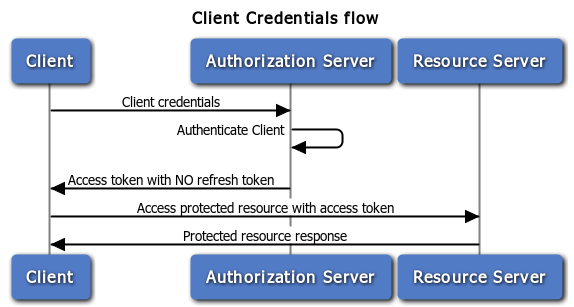

整理oauth2认证资料。
<!-- more -->

# 问题背景

在传统的客户端-服务器身份验证模式中，客户端请求服务器上限制访问的资源（受保护资源）时，需要使用资源所有者的凭据在服务器上进行身份验证。
资源所有者为了给第三方应用提供受限资源的访问，需要与第三方共享它的凭据。 这造成一些问题和局限：
- 需要第三方应用存储资源所有者的凭据，以供将来使用，通常是明文密码。
- 需要服务器支持密码身份认证，尽管密码认证天生就有安全缺陷。
- 第三方应用获得的资源所有者的受保护资源的访问权限过于宽泛，从而导致资源所有者失去对资源使用时限或使用范围的控制。
- 资源所有者不能仅撤销某个第三方的访问权限而不影响其它，并且，资源所有者只有通过改变第三方的密码，才能单独撤销这第三方的访问权限。
- 与任何第三方应用的让步导致对终端用户的密码及该密码所保护的所有数据的让步。

>软件开发中遇到的所有问题，都可以通过增加一层抽象而得以解决

OAuth通过引入**授权层**以及分离客户端角色和资源所有者角色来解决这些问题。

在OAuth中，客户端在请求受资源所有者控制并托管在资源服务器上的资源的访问权限时，将被颁发一组不同于资源所有者所拥有凭据的凭据。
客户端获得一个访问令牌（一个代表特定作用域、生命期以及其他访问属性的字符串），用以代替使用资源所有者的凭据来访问受保护资源。
访问令牌由授权服务器在资源所有者认可的情况下颁发给第三方客户端。客户端使用访问令牌访问托管在资源服务器的受保护资源。

小结：
- OAuth解决第三方授权问题：委托第三方来对既定的用户进行鉴定，鉴定成功之后，下发信任凭证，信任凭证和用户挂钩，同时可以使用此凭证来去第三方平台，获得该用户开放的部分信息。

# OAuth2的角色

OAuth 2.0 主要有4类角色：
- resource owner：资源所有者，指终端的“用户”（user）。
- resource server：资源服务器，即服务提供商存放受保护资源。访问这些资源，需要获得访问令牌（access token）。它与认证服务器，可以是同一台服务器，也可以是不同的服务器。
- client：客户端，代表向受保护资源进行资源请求的第三方应用程序。
- authorization server： 授权服务器， 在验证资源所有者并获得授权成功后，将发放访问令牌给客户端。

# OAuth2的抽象流程


```
（A）客户端向从资源所有者请求授权。授权请求可以直接向资源所有者发起（如图所示），或者更可取的是通过作为中介的授权服务器间接发起。

（B）客户端收到授权许可，这是一个代表资源所有者的授权的凭据，使用本规范中定义的四种许可类型之一或 者使用扩展许可类型表示。授权许可类型取决于客户端请求授权所使用的方式以及授权服务器支持的类型。

（C）客户端与授权服务器进行身份认证并出示授权许可请求访问令牌。

（D）授权服务器验证客户端身份并验证授权许可，若有效则颁发访问令牌。

（E）客户端从资源服务器请求受保护资源并出示访问令牌进行身份验证。

（F）资源服务器验证访问令牌，若有效则满足该请求。
```

其中，用户授权有四种模式：
- 授权码模式（authorization code）
- 简化模式（implicit）
- 密码模式（resource owner password credentials）
- 客户端凭证模式（client credentials）


# 授权码模式

>授权码（authorization code）方式，指的是第三方应用先申请一个授权码，然后再用该码获取令牌。
>这种方式是最常用的流程，安全性也最高，它适用于那些有后端的 Web 应用。授权码通过前端传送，令牌则是储存在后端，而且所有与资源服务器的通信都在后端完成。这样的前后端分离，可以避免令牌泄漏。


# 简化模式

>有些 Web 应用是纯前端应用，没有后端。这时就不能用上面的方式了，必须将令牌储存在前端。
>RFC 6749 就规定了第二种方式，允许直接向前端颁发令牌。这种方式没有授权码这个中间步骤，所以称为（授权码）"隐藏式"（implicit）。


# 密码模式

>如果你高度信任某个应用，RFC 6749 也允许用户把用户名和密码，直接告诉该应用。该应用就使用你的密码，申请令牌，这种方式称为"密码式"（password）。


# 客户端凭证模式

>最后一种方式是凭证式（client credentials），适用于没有前端的命令行应用，即在命令行下请求令牌。





# 参考资料

- [OAuth2.0 RFC 6749 中文](https://www.cnblogs.com/ctxsdhy/p/8355110.html)
- [理解OAuth 2.0](https://www.ruanyifeng.com/blog/2014/05/oauth_2_0.html)
- [OAuth 2.0 的四种方式](http://www.ruanyifeng.com/blog/2019/04/oauth-grant-types.html)
- [OAuth2.0原理和验证流程分析](https://www.jianshu.com/p/d74ce6ca0c33)
- [An Introduction to OAuth 2](https://www.digitalocean.com/community/tutorials/an-introduction-to-oauth-2)