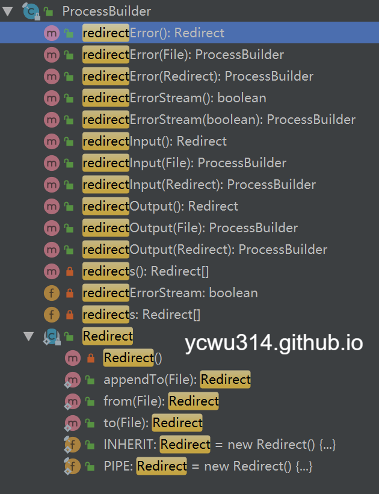

小程序项目最初使用ffmpeg转换微信录音文件为wav格式，再交给阿里云asr识别成文字。视频音频转换最常用是ffmpeg。
```
ffmpeg -i a.mp3 b.wav
```
相关文章：
- [miniapp-speech-to-text-experience](/posts/miniapp-speech-to-text-experience)

问题变成怎样使用java调用系统的ffmpeg工具。在java中，封装了进程Process类，可以使用`Runtime.getRuntime().exec()`或者`ProcessBuilder`新建进程。
<!-- more -->
# 从Runtime.getRuntime().exec()说起

最简单启动进程的方式，是直接把完整的命令作为`exec()`的参数。
```java
try {
    log.info("ping 10 times");
    Runtime.getRuntime().exec("ping -n 10 127.0.0.1");
    log.info("done");
} catch (IOException e) {
    e.printStackTrace();
}
```
输出结果
```
17:12:37.262 [main] INFO com.godzilla.Test - ping 10 times
17:12:37.272 [main] INFO com.godzilla.Test - done
```
我期望的是执行命令结束后再打印done，但是明显不是。

# waitFor阻塞等待子进程返回

Process类提供了`waitFor`方法。可以阻塞调用者线程，并且返回码。0表示子进程执行正常。
```java
    /**
     * Causes the current thread to wait, if necessary, until the
     * process represented by this {@code Process} object has
     * terminated.  This method returns immediately if the subprocess
     * has already terminated.  If the subprocess has not yet
     * terminated, the calling thread will be blocked until the
     * subprocess exits.
     *
     * @return the exit value of the subprocess represented by this
     *         {@code Process} object.  By convention, the value
     *         {@code 0} indicates normal termination.
     * @throws InterruptedException if the current thread is
     *         {@linkplain Thread#interrupt() interrupted} by another
     *         thread while it is waiting, then the wait is ended and
     *         an {@link InterruptedException} is thrown.
     */
    public abstract int waitFor() throws InterruptedException;
```

```java
try {
    log.info("ping 10 times");
    Process p =  Runtime.getRuntime().exec("ping -n 10 127.0.0.1");
    int code = p.waitFor();
    if(code == 0){
        log.info("done");
    }
} catch (IOException e) {
    e.printStackTrace();
} catch (InterruptedException e) {
    e.printStackTrace();
}
```
输出结果
```
17:15:28.557 [main] INFO com.godzilla.Test - ping 10 times
17:15:37.615 [main] INFO com.godzilla.Test - done
```
似乎满足需要了。但是，如果子进程发生问题一直不返回，那么java主进程就会一直block，这是非常危险的事情。
对此，java8提供了一个新接口，支持等待超时。注意接口的返回值是boolean，不是int。当子进程在规定时间内退出，则返回true。
```java
public boolean waitFor(long timeout, TimeUnit unit)
```

测试代码
```java
try {
    log.info("ping 10 times");
    Process p = Runtime.getRuntime().exec("ping -n 10 127.0.0.1");
    boolean exit = p.waitFor(1, TimeUnit.SECONDS);
    if (exit) {
        log.info("done");
    } else {
        log.info("timeout");
    }
} catch (IOException e) {
    e.printStackTrace();
} catch (InterruptedException e) {
    e.printStackTrace();
}
```
输出结果
```
17:43:47.340 [main] INFO com.godzilla.Test - ping 10 times
17:43:48.352 [main] INFO com.godzilla.Test - timeout
```

# 获取输入、输出和错误流

要获取子进程的执行输出，可以使用Process类的`getInputStream()`。类似的有`getOutputStream()`、`getErrorStream()`。
```java
try {
    log.info("ping");
    Process p = Runtime.getRuntime().exec("ping -n 1 127.0.0.1");
    p.waitFor();
    BufferedReader bw = new BufferedReader(new InputStreamReader(p.getInputStream(), "GBK"));
    String line = null;
    while ((line = bw.readLine()) != null) {
        System.out.println(line);
    }
    bw.close();
    log.info("done")
} catch (IOException e) {
    e.printStackTrace();
} catch (InterruptedException e) {
    e.printStackTrace();
}
```
注意，GBK是Windows平台的字符编码。
输出结果
```
18:28:21.396 [main] INFO com.godzilla.Test - ping

正在 Ping 127.0.0.1 具有 32 字节的数据:
来自 127.0.0.1 的回复: 字节=32 时间<1ms TTL=128

127.0.0.1 的 Ping 统计信息:
    数据包: 已发送 = 1，已接收 = 1，丢失 = 0 (0% 丢失)，
往返行程的估计时间(以毫秒为单位):
    最短 = 0ms，最长 = 0ms，平均 = 0ms
18:28:21.444 [main] INFO com.godzilla.Test - done
```

这里牵涉到一个技术细节，参考Process类的javadoc
```
 * <p>By default, the created subprocess does not have its own terminal
 * or console.  All its standard I/O (i.e. stdin, stdout, stderr)
 * operations will be redirected to the parent process, where they can
 * be accessed via the streams obtained using the methods
 * {@link #getOutputStream()},
 * {@link #getInputStream()}, and
 * {@link #getErrorStream()}.
 * The parent process uses these streams to feed input to and get output
 * from the subprocess.  Because some native platforms only provide
 * limited buffer size for standard input and output streams, failure
 * to promptly write the input stream or read the output stream of
 * the subprocess may cause the subprocess to block, or even deadlock.
```
翻译过来是，子进程默认没有自己的stdin、stdout、stderr，涉及这些流的操作，到会重定向到父进程。由于平台限制，可能导致缓冲区消耗完了，导致阻塞甚至死锁！

网上有的说法是，开启2个线程，分别读取子进程的stdout、stderr。
不过，既然说是`By default`，就是有非默认的方式，其实就是使用`ProcessBuilder`类，重定向流。此功能从java7开始支持。





# ProcessBuilder和redirect

```java
try {
    log.info("ping");
    Process p = new ProcessBuilder().command("ping -n 1 127.0.0.1").start();
    p.waitFor();
    log.info("done")
}  catch (IOException | InterruptedException e) {
    e.printStackTrace();
}       
```
输出结果
```java
19:01:53.027 [main] INFO com.godzilla.Test - ping
java.io.IOException: Cannot run program "ping -n 1 127.0.0.1": CreateProcess error=2, 系统找不到指定的文件。
	at java.lang.ProcessBuilder.start(ProcessBuilder.java:1048)
	at com.godzilla.Test.main(Test.java:13)
Caused by: java.io.IOException: CreateProcess error=2, 系统找不到指定的文件。
	at java.lang.ProcessImpl.create(Native Method)
	at java.lang.ProcessImpl.<init>(ProcessImpl.java:386)
	at java.lang.ProcessImpl.start(ProcessImpl.java:137)
	at java.lang.ProcessBuilder.start(ProcessBuilder.java:1029)
	... 1 more
```

此处有坑：**ProcessBuilder的command列表要用字符串数组或者list形式传入**！
ps. 在小程序项目上，一开始把`ffmpeg -i a.mp3 b.wav`传入ProcessBuilder，却看不到生成的wav文件，查了日志`CreateProcess error=2, 系统找不到指定的文件。`还以为是ffmpeg路径问题。后来查了api才发现掉坑了。
正确的写法
```java
Process p = new ProcessBuilder().command("ping", "-n", "1", "127.0.0.1").start();
```
刚才说的重定向问题，可以这样写
```java
Process p = new ProcessBuilder().command("ping", "-n", "1", "127.0.0.1")
        .redirectError(new File("stderr.txt"))
        .start();
```

# 工作目录

默认子进程的工作目录继承于父进程。可以通过`ProcessBuilder.directory()`修改。

# 一些代码细节

## ProcessBuilder.Redirect

java7增加了`ProcessBuilder.Redirect`抽象，实现子进程的流重定向。Redirect类有个Type枚举
```java
public enum Type {
    PIPE,
    INHERIT,
    READ,
    WRITE,
    APPEND
};
```
其中
- PIPE: 表示子流程IO将通过管道连接到当前的Java进程。 这是子进程标准IO的默认处理。
- INHERIT: 表示子进程IO源或目标将与当前进程的相同。 这是大多数操作系统命令解释器（shell）的正常行为。

对于不同类型的Redirect，覆盖下面的方法
- append
- appendTo
- file
- from
- to

## Runtime.exec()的实现

Runtime类的exec()底层也是用ProcessBuilder实现
```java
public Process exec(String[] cmdarray, String[] envp, File dir)
    throws IOException {
        return new ProcessBuilder(cmdarray)
        .environment(envp)
        .directory(dir)
        .start();
}
```

## ProcessImpl

Process的底层实现类是ProcessImpl。
上面讲到流和Redirect，具体在`ProcessImpl.start()`方法
```java
FileInputStream  f0 = null;
FileOutputStream f1 = null;
FileOutputStream f2 = null;
```
然后是一堆繁琐的if...else判断是Redirect.INHERIT、Redirect.PIPE，是输入还是输出流。

# 总结

- Process类是java对进程的抽象。ProcessImpl是具体的实现。
- Runtime.getRuntime().exec()和ProcessBuilder.start()都能启动子进程。Runtime.getRuntime().exec()底层也是ProcessBuilder构造的
- Runtime.getRuntime().exec()可以直接消费一整串带空格的命令。但是ProcessBuilder.command()必须要以字符串数组或者list形式传入参数
- 默认子进程的执行和父进程是异步的。可以通过`Process.waitFor()`实现阻塞等待。
- 默认情况下，子进程和父进程共享stdin、stdout、stderr。ProcessBuilder支持对流的重定向（since java7）
- 流的重定向，是通过`ProcessBuilder.Redirect`类实现。

