使用gpt整理。

# 乘积量化（Product Quantization）

这里的乘积，是笛卡尔积。

将向量分解为多个子向量，然后对每个子向量独立进行量化是一种有效的降维和减小内存占用的方法。这种方法常被称为乘积量化（Product Quantization）。

基本思想是将原始向量分解为多个子向量，每个子向量可以看作是原始向量在不同方向上的投影。然后，对每个子向量进行独立的量化，将其映射到一个有限的离散值集合。最终，通过将每个子向量的量化结果合并，重建原始向量的量化表示。

下面是乘积量化的基本步骤：

1. **向量分解：** 将原始向量分解为多个子向量，可以通过随机选择或者使用一些分解方法（如主成分分析）。

2. **子向量独立量化：** 对每个子向量进行独立的量化。这可以使用类似K-means的方法，将每个子向量映射到最近的簇中心，用簇中心的索引来表示。

3. **量化结果合并：** 将每个子向量的量化结果合并，形成最终的向量量化表示。

乘积量化的优势在于它能够降低数据的维度，从而减小了聚类中心的数量，同时保留了一定的数据结构信息。这对于大规模高维数据的聚类任务非常有用，特别是在需要保持较低内存占用的情况下。

使用乘积量化时，需要根据数据的特性和任务需求来选择适当的分解方式和量化方法。在实际应用中，乘积量化通常能够在一定程度上缓解维度灾难问题。

# PQ 的原理

## 向量分解：

假设有一个d维的原始向量 \(\mathbf{x}\)，可以将其分解为 \(m\) 个子向量：

\[ \mathbf{x} = \mathbf{v}_1 \oplus \mathbf{v}_2 \oplus \ldots \oplus \mathbf{v}_m \]

其中，\(\oplus\) 表示向量的连接操作，\(\mathbf{v}_i\) 是第 \(i\) 个子向量。

## 独立量化：

对每个子向量 \(\mathbf{v}_i\) 进行独立的量化。假设使用K-means算法，将每个子向量映射到 \(K\) 个簇中心中的一个：

\[ \mathbf{v}_i' = \text{argmin}_{\mathbf{c} \in \mathcal{C}} \|\mathbf{v}_i - \mathbf{c}\| \]

其中，\(\mathbf{v}_i'\) 是第 \(i\) 个子向量的量化结果，\(\mathcal{C}\) 表示簇中心的集合。

## 量化结果合并：

将每个子向量的量化结果合并成最终的向量量化表示：

\[ \text{Quantized}(\mathbf{x}) = \text{Quantized}(\mathbf{v}_1') \oplus \text{Quantized}(\mathbf{v}_2') \oplus \ldots \oplus \text{Quantized}(\mathbf{v}_m') \]

这里，\(\text{Quantized}(\mathbf{v}_i')\) 表示对第 \(i\) 个子向量的独立量化结果。

## 总结

为每个子量化器分配了一个codebook，假设为量化器 \( q_i \)，分配的codebook是 \( c_i \)。则原向量最终的量化空间将是这些codebook的笛卡尔乘积
\[ \mathcal{C}=\mathcal{C}_1 \times ... \times \mathcal{C}_m \]

假设每个子量化器都有 \(k^*\)个code word，则对于原向量，可选的codeword一共有 \(k=(k^ \ast)^m\)。

可以看到 m=1 或者 m=D 是PQ算法的2种极端情况。

对 m=1，PQ算法就回退到vector quantization。

对 m=D，PQ算法相当于对原始向量的每一维都用k-means算出码本。

PQ 的优势在于，通过对将较小的几个code book连接形成一个规模足够大的codebook。而且对于小的codebook，训练复杂度相对直接训练大的codebook是低得多的。所以根据这个原理，直接存储codebook是没必要的，且相反会降低最终的量化速率。

# PQ 编码例子

这个例子翻译来源于： [Product Quantizers for k-NN Tutorial Part 1](https://mccormickml.com/2017/10/13/product-quantizer-tutorial-part-1/)

假设有一个数据集为，50K个特征向量，每个向量有1024维。

把向量切分为8个子向量，每个子向量维度为128维。

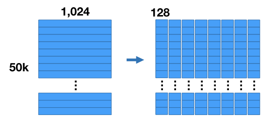

然后执行k-means流程，令k=256。对于每个分段，都有256个centroid。因此有8组，每组256个centroid。

**我们将用最接近的匹配centroid来替换向量的每个子区域，从而得到一个与原始向量不同，但希望仍然接近的向量。**

**这样我们就能更高效地存储向量--我们不存储原始浮点数值，而只存储群集 id。对于每个子向量，我们会找到最接近的centroid，并存储该centroid的 id。**

由于只有 256 个centroid，我们只需要 8 位来存储一个centroid ID。每个向量最初是由 1024 个 32 位浮点数（4096 字节）组成的向量，现在则是由 8 个 8 位整数（每个向量共 8 字节！）组成的序列。

centroid的集合成为codebook（码本）。

centroid也被称为reproduction values（重现值），因为它们可以用来通过串联每个分段的各自中心点来近似重构矢量。不过，重建后的矢量与原始矢量并不完全相同，因为乘积量化是一种有损压缩。

PQ 的优势在于，通过对将较小的几个codebook连接形成一个规模足够大的codebook。而且对于小的codebook，训练复杂度相对直接训练大的codebook是低得多的。所以根据这个原理，直接存储
codebook是没必要的，且相反会降低最终的量化速率。

# 利用PQ进行检索: SDC 和 ADC

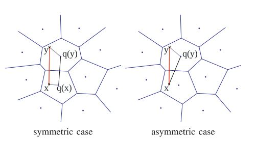

## SDC

SDC: Symmetric distance computation

先将待查询向量进行量化，然后计算对应的量化子和数据库中的量化子的距离

\[ \hat d(x,y)=d(q(x),q(y))=\sqrt{\sum_jd(q_j(x),q_j(y))^2} \]

1. 为提高计算速度，一般会提前算好 \( d(c_{j,i}, c_{j,i’})^2 \) ，然后在检索时就是查表，以 O(1)的复杂度查出结果。
2. \( \hat{d}(x,y) \)是 \( d(x,y) \) 的近似计算，一般会先用相似计算方法选出top N近邻，然后再做rerank以拿到最终的近邻排序结果。

## ADC

ADC: Asymmetric distance computation

不需要对待查询向量进行量化，而直接计算它和数据库中的量化子的距离

\[ \tilde d(x,y)=d(x,q(y))=\sqrt{\sum_jd(u_j(x),q_j(u_j(y)))^2} \]

1. 为提高计算速度，一般会在检索前提前算好 \( d(u_j(x), c_{j,i})^2 : j=1,\cdots, m, i=1,\cdots, k^\ast \)，然后在检索时就是查表，以 O(1) 的复杂度查出结果。

首先将查询向量分割成相同数量的段。

对于每个查询向量段，我们会预先计算与编码本中同一向量段所有中心点的部分平方欧氏距离。

现在我们有了距离表，只需查找部分距离并求和，就能轻松获得 PQ 代码每一行的距离。

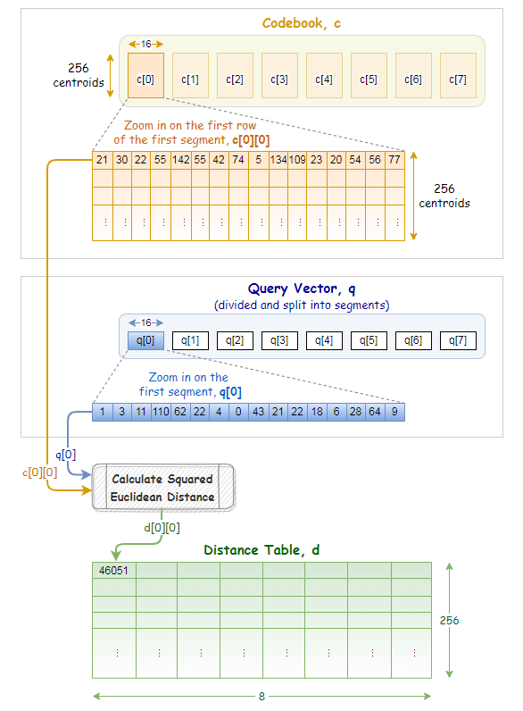

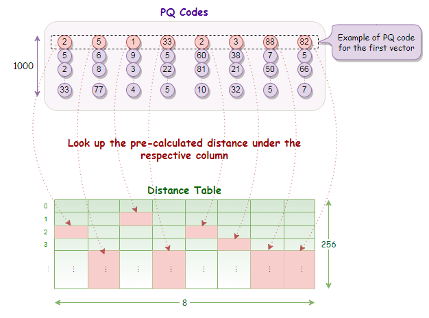

2. \( \widetilde{d}(x,y) \)也是 \( d(x,y) \) 的近似计算，与SDC类似，一般会先用相似计算方法选出top N近邻，然后再做rerank以拿到最终的近邻排序结果。

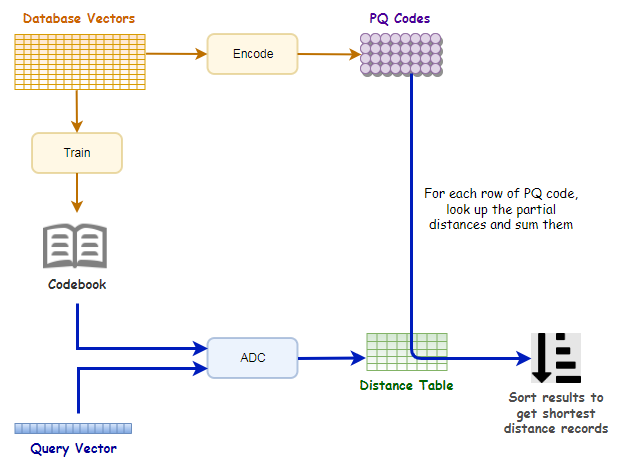

# SDC vs ADC

## 复杂度

对比了SDC算法和ADC算法的各阶段复杂度，当 `n>k*D` 时，计算瓶颈存在于公式1和公式2的计算上，它们的复杂度都是 `O(n*m)`。

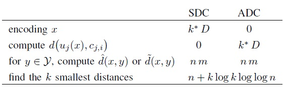

## 误差

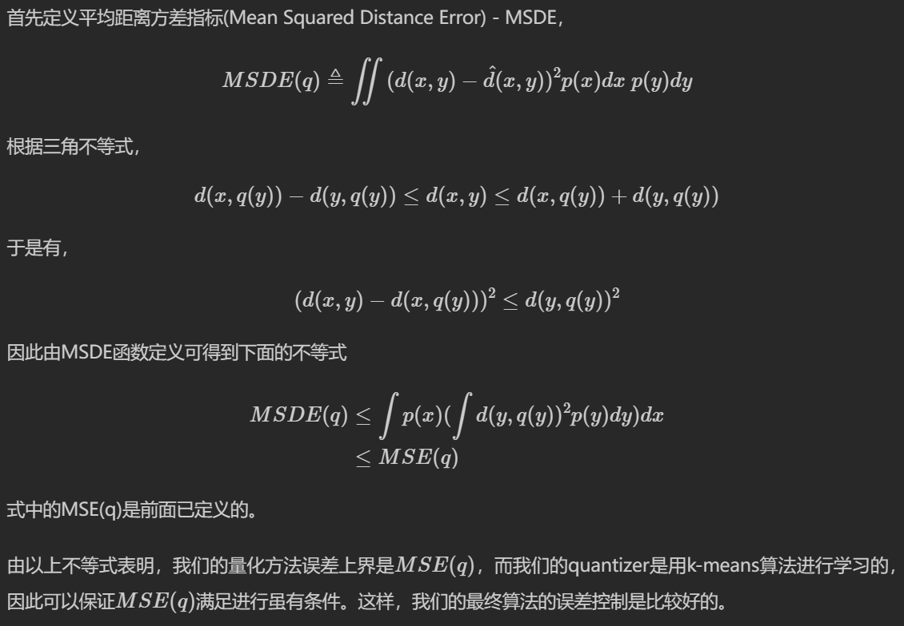

对ADC算法而言，距离的期望误差的上界只与量化误差有关，与输入的x无关，而对SDC算法而言，距离的期望误差的上界是ADC距离的期望误差的上界的两倍，所以作者建议在应用时倾向于用ADC算法。

## 实用性

SDC与ADC的整体复杂度为`O(n*m)`， 此时的近邻计算是对整体的N来计算，实际中的N在现实应用中可能在千万量级以上， 虽然相较于暴力计算已经减少了计算量， 但计算量依然很大并不实用。

# 优化： IVFPQ

IVFPQ（inverted file with product quantization）算法是一种用于高维向量索引和相似度搜索的算法。它结合了倒排文件和乘积量化（Product Quantization）的思想，能够在大规模高维向量数据集上进行快速的近似最近邻搜索。

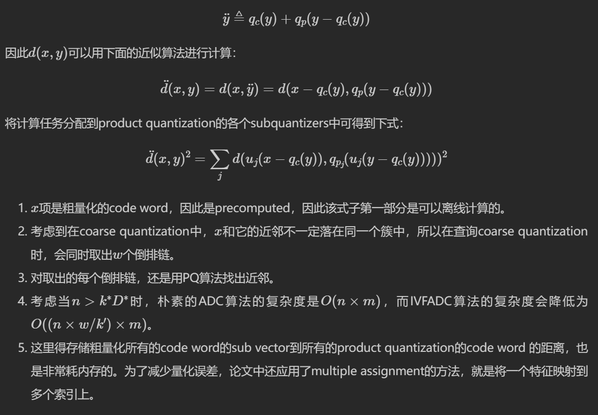

>该算法包含2层量化，第1层被称为coarse quantizer，粗粒度量化器，在原始的向量空间中，基于kmeans聚类出\(k’\)个簇（文献建议\(k’=\sqrt{n}\)）。
>
>第2层是上文讲的PQ量化器，不过这个PQ量化器不是直接在原始数据上做，而是经过第1层量化后，**计算出每个数据与其量化中心的残差**后，对这个残差数据集进行PQ量化。
>
>用PQ处理残差，而不是原始数据的原因是残差的方差或者能量比原始数据的方差或者能量要小。

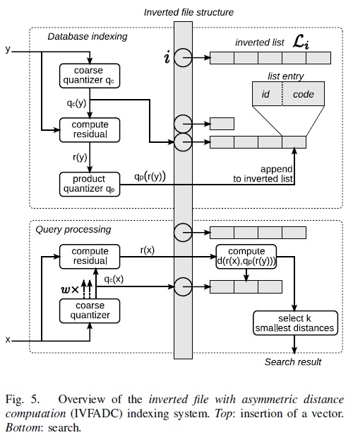

这里会建立一个反转文件索引，用于将向量列表（即反转列表）映射到相应的分区。

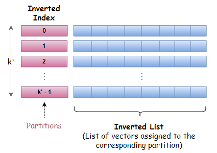

每个分区由一个分区中心点表示和定义，每个向量只能属于一个分区。这种结构有时被称为 Voronoi 单元，因此基于分区的搜索策略也被称为单元探测法。

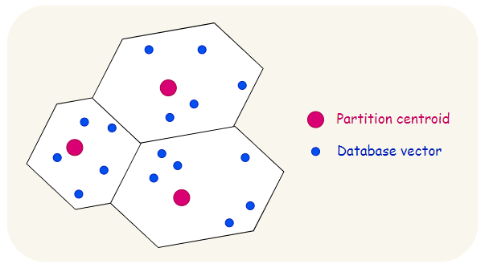

残差矢量只是矢量与其分区中心点的偏移量，即原始矢量与其相关分区中心点之间的差值。

要计算残差，我们只需从原始向量中减去中心点。

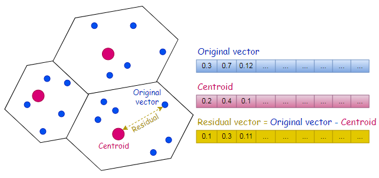

由于有了反转文件索引，PQ 代码现在被列为反转列表条目的一部分。如下图所示，反转列表条目由矢量标识符（矢量 Id）和编码残差（PQ 代码）组成。

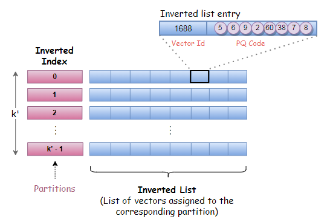

# 使用 IVFPQ 进行搜索

粗量化器保存分区列表和分区中心点的信息。在给定查询向量 q 的情况下，粗量化器用于找到与 q 最接近的分区中心点。

在获得离 q 最近的分区中心点后，就可以计算查询向量的残差。

与 "相似性搜索的乘积量化 "中描述的搜索过程类似，我们使用编码本和查询向量的残差预先计算部分平方欧氏距离。

这些部分欧氏平方距离记录在一个有 k 行和 M 列的距离表中，其中 M 表示矢量段的数量，k 表示在训练过程中执行 k 均值聚类时选择的值。

现在，有了倒置文件索引，我们就可以有选择地查找部分距离，并只对倒置列表中标记为分区中心点与 q 最接近的分区的条目进行求和。

要找到并返回 K 个最近的邻居，一种有效的方法是使用固定容量的 Max-Heap。这是一种基于树的结构，根节点总是包含最大值，每个节点的值都等于或小于父节点。

每次距离计算后，只有当矢量标识符的距离小于 Max-Heap 结构中的最大距离时，才会将其添加到 Max-Heap 结构中。

# 改进查询结果

查询矢量及其最近的邻近矢量往往不是量化到同一个分区中心点，而是量化到附近的分区中心点。

如果搜索只局限于查询向量与该分区中心点最接近的分区，那么我们可能会错过许多位于附近分区的潜在近邻。

当查询矢量非常靠近单元或分区的边界时，效果会更加明显。

特别是，我们将对 W 个分区进行搜索，其中 W 个分区的中心点与查询向量最为接近。W 通常是一个可配置的参数。

那么，如果加入更多的分区，我们就需要根据每个分区的中心点分别计算查询向量的残差。每个查询向量的残差都需要计算一个单独的距离表。

最终，对 W 个分区进行搜索的意图将导致计算 W 个剩余查询向量和 W 个距离表。

使用倒置文件索引和乘积量化（IVFPQ）的相似性搜索：

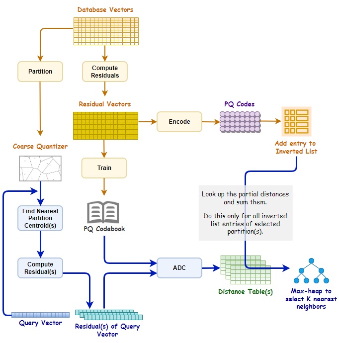

# 资料

- [Product Quantization乘积量化](https://blog.rexking6.top/2018/10/21/Product-Quantization%E4%B9%98%E7%A7%AF%E9%87%8F%E5%8C%96/)
- [ANN 之 Product Quantization](https://zhuanlan.zhihu.com/p/140548922)
- [faiss原理（Product Quantization）](https://zhuanlan.zhihu.com/p/534004381)
- [Similarity Search with IVFPQ](https://towardsdatascience.com/similarity-search-with-ivfpq-9c6348fd4db3)
- [Product Quantizers for k-NN Tutorial Part 1](https://mccormickml.com/2017/10/13/product-quantizer-tutorial-part-1/)
- [Product Quantization for Similarity Search](https://towardsdatascience.com/product-quantization-for-similarity-search-2f1f67c5fddd)

