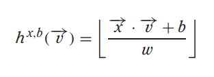

# 问题背景

高维数据集中的直接搜索可能会遇到维数灾难，即数据点之间的距离计算变得非常昂贵。通过使用随机森林投影，可以将数据映射到更低的维度，从而降低了计算复杂度，同时在低维空间中仍然保持了一定的相似性。

# 原理

随机投影背后的基本思想是使用随机投影矩阵将高维向量投影到低维空间中。创建一个由随机数构成的矩阵，其大小将是所需的目标低维值。然后，计算输入向量和矩阵之间的点积，得到一个被投影的矩阵，它比原始向量具有更少的维度但仍保留了它们之间的相似性。

# LSH 发展

这篇文章整理了LSH家族的演化历史：
https://www.cnblogs.com/LittleHann/p/11002030.html

LSH家族的演变史如下：
- 基于Stable Distribution投影方法
- 基于随机超平面投影的方法
- 球哈希Spherical Hashing算法
- SimHash
- Kernel LSH
- SSDEEP模糊化哈希

这部分内容源于上面文章的摘抄和整理。

# 基于Stable Distribution投影方法

论文介绍：[Locality-Sensitive Hashing for Finding Nearest Neighbors](http://www.slaney.org/malcolm/yahoo/Slaney2008-LSHTutorial.pdf)

核心思想：高维空间中相近的物体，投影（降维）后也相近。

给定特征向量v，投影的数学形式如下：

- x 是一个随机数，从满足Stable Distribution的分布中抽样而来（通常从高斯或柯西分布中抽样而来）
- x ⋅ v就是投影（和单位向量的内积就是投影）
- w 值可以控制量化误差
- b 是随机扰动，避免极端情况产生

如果 x 抽样于高斯分布，那么ϕ(u,v)衡量的是L2 norm；如果 x 抽样于柯西分布，那么ϕ(u,v)衡量的是L1 norm。

## 缺点

- 需要同时人工指定两个参数：w和b
- 量化后的哈希值是一个整数而不是bit形式的0和1，还需要再变换一次

# 基于随机超平面（hyperplane projection）投影的方法

随机超平面投影LSH改进了Stable Distribution投影的缺点。

论文：[Multi-probe LSH: efficient indexing for high-dimensional similarity search](http://dl.acm.org/citation.cfm?id=1325958)

>假设有一个M维高维数据向量x，我们在M维空间中随机选择一个超平面，通过这个超平面来对数据进行切分。
>
>这个动作总共进行N次，即通过N个随机超平面单位向量来对原始数据集进行切分，这里N就是降维后的向量维度。
>
>超平面的选择是随机过程，不需要提前参数设定。

hyperplane projection的核心假设就是，两个向量越相似，则它们的cosine距离越小。
基于sgn符号函数将cosine距离归一化为“方向是否相同”的0/1二值信息。

定义hash函数：

x 是随机超平面单位向量，sgn是符号函数：

通过随机超平面划分空间：

## 基本步骤

1. 从高维空间中随机选择一个超平面，将数据点投影到该超平面上。
2. 重复步骤 1，选择多个超平面，将数据点投影到多个超平面上。
3. 将多个超平面的投影结果组合成一个向量，作为低维空间中的表示。
4. 使用哈希函数将低维空间中的向量映射到哈希桶中。

## 投影过程

生成投影矩阵：
- 对于每一个投影矩阵，从某种分布（例如，高斯分布或均匀分布）中随机生成矩阵的元素。这可以通过随机数生成器完成。

高维数据投影：
- 对于一个高维数据点（向量），将其与投影矩阵相乘，得到一个低维的投影。

## 缺点

- 空间封闭性：hyperplane不容易形成一个closed region（封闭区间），如果我们要在一个d维空间中“切割”出一个closed region，我们至少需要d + 1个hyperplanes。而且这还是在这d+1个hyperplane都线性无关的情况下。
- 算法下界收敛性（Bounding Powrer）：hyperplane切割得到的closed region不算非常紧凑（bounding），每个closed region内部，样本间距离的bounding往往过大。这种情况下，降维哈希函数的收敛性就会受影响，进而也影响后续近邻搜索的效果。
- 超平面线性相关性（hyperplane Independence）：hyperplane-based hash算法中，hyperplane是基于随机过程随机采样的，存在一定的可能性两个hyperplane之间线性相关。通过线性代数的知识我们知道，线性相关性是空间中的冗余结构，是可以被忽略的。
- 分界面信息增益（Balanced partitioning）：分界面信息增益，指的是通过加入一个分界面，将分界面两边的数据分成0/1两类，对最终的目标函数的提升度量。这个概念我们并不陌生，在决策树的每个节点特征选择中，都是基于信息增益最大的原则进行的。

# Spherical hashing算法

论文：https://sglab.kaist.ac.kr/Spherical_Hashing/Spherical_Hashing.pdf

ppt: https://sglab.kaist.ac.kr/Spherical_Hashing/SphericalHashing_Slide.pdf

## 用hypersphere超球面代替hyperplane超平面

因为球平面天生的封闭性，可以直接对高维空间进行partition分类，并获得比non-linear hyperplane更好的效果。

理论上说，如果需要切割出一个d维封闭空间，至少需要d+1个超平面，但是如果使用超球体，则最少值需要1个超球体即可。

c个超球体划分出的有界封闭区域数是可以计算的:

同时，球哈希划分的区域是封闭且更紧凑的，每个区域内样本的最大距离的平均值（bounding power）会更小，说明各个区域的样本是更紧凑的：

## 通过Iterative Optimization过程实现hyperplane Independent和Balanced partitioning

通过渐进逼近的方法，迭代优化算法超参数，得到符合算法约束条件的近似最优解。

这里的约束条件指的是：

1. 我们希望每个超球体把样本都是均分的，就是球内球外各占一半
2. 希望每个超球体的交叉部分不要太多，最多1/4，也就是每个哈希函数相对独立

设 $ h_k $ 为数据向量在单个超球体（单个hash function）内部（+1）还是外部（-1）的概率。
设 $ t_k $ 为单个超球体的半径。

Spherical Hashing是由c个不同位置，不同的大小的超球体组成的，对于c个超球体的总约束条件如下
- Balanced partitioning，数据向量在球内和求外的概率相等

- hyperplane Independent，任意两个球的交叉概率等于1/4

## 优化过程

# 资料

- [Random Projection for Locality Sensitive Hashing](https://www.pinecone.io/learn/series/faiss/locality-sensitive-hashing-random-projection/)
- [向量数据库](https://guangzhengli.com/blog/zh/vector-database/#locality-sensitive-hashing-lsh)
- 斯坦福大学cs468-06-fall课件: [Main topic: Geometric Proximity Problems](https://graphics.stanford.edu/courses/cs468-06-fall/)
- 球哈希论文，ppt: https://sglab.kaist.ac.kr/Spherical_Hashing/