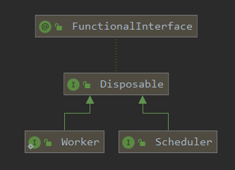
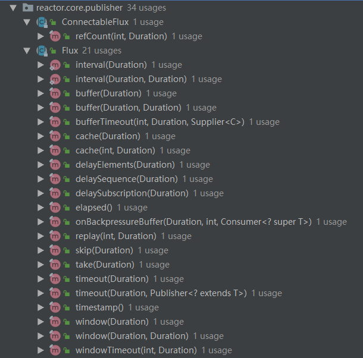

reactive是生产者-消费者模式，支持但是不强制多线程环境运行。
<!-- more -->

# Scheduler抽象

Scheduler是reactive的调度器，屏蔽了底层多线程交互的复杂性。





`Disposable`代表一个任务或者资源可以取消或者丢弃。
`Scheduler`本质是一个线程池，其实现类通常使用`ExecutorService`或者`ScheduledExecutorService`。 
`Worker`代表一个异步执行的任务。 


通常使用`Schedulers`工具类，类似`Executors`，提供了创建Scheduler的快捷方法：
- a) 没有执行上下文(Schedulers.immediate()): 在处理时，将直接执行提交的Runnable，从而在当前线程上有效地运行它们（可以视为“空对象”或无操作调度程序）。
- b) 单个可重用线程(Schedulers.single())。请注意，此方法对所有调用方都使用相同的线程，直到调度程序被释放为止。如果您需要每次调用一个专用线程，请对每个调用使用Schedulers.newSingle()。
- c) 无限制的弹性线程池(Schedulers.elastic())。随着Schedulers.boundedElastic()的引入，Schedulers.boundedElastic()不再是首选方法，因为它倾向于隐藏背压问题并导致线程过多（请参见下文）。
- d) 有界弹性线程池(Schedulers.boundedElastic())。像其前身elastic()一样，它根据需要创建新的工作池并重用空闲的工作池。闲置时间过长（默认值为60s）的工作池也将被丢弃。与其前身的elastic()有所不同，它对可以创建的线程数进行限制（默认为CPU核心数x 10）。达到上限后，最多可再提交10万个任务，并在有线程可用时重新调度（当任务被设置延迟执行时，延迟计时是在线程可用时开始）。这是I/O阻塞任务的更好选择。Schedulers.boundedElastic()是一种为阻塞处理提供自己的线程的简便方法，这样它就不会占用其他资源。
- e) 为并行工作而调整的固定工作线程池(Schedulers.parallel())。它创建的工作线程数量与CPU内核数量一样多。

# publishOn和subscribeOn方法

reactive stream的`publishOn`和`subscribeOn`方法可以切换执行operator的线程。

## 不指定Scheduler

默认情况下，publish和subscribe都使用主线程。
```java
@Test
public void testPubSubByDefault() {
    Flux.defer(() -> {
        log.info("defer thread {}", Thread.currentThread().getName());
        return Flux.range(1, 3);
    }).map(i -> {
        log.info("data({}) map thread {}", i, Thread.currentThread().getName());
        return i;
    }).subscribe(i -> log.info("data({}) subscribe thread {}", i, Thread.currentThread().getName()));
}
```

```
16:45:30.706 [main] INFO com.example.reactive.FluxMonoTest - defer thread main
16:45:30.709 [main] INFO com.example.reactive.FluxMonoTest - data(1) map thread main
16:45:30.709 [main] INFO com.example.reactive.FluxMonoTest - data(1) subscribe thread main
16:45:30.709 [main] INFO com.example.reactive.FluxMonoTest - data(2) map thread main
16:45:30.709 [main] INFO com.example.reactive.FluxMonoTest - data(2) subscribe thread main
16:45:30.709 [main] INFO com.example.reactive.FluxMonoTest - data(3) map thread main
16:45:30.709 [main] INFO com.example.reactive.FluxMonoTest - data(3) subscribe thread main
```

## 只有publishOn

>Run onNext, onComplete and onError on a supplied Scheduler Worker.
This operator influences the threading context where the rest of the operators in the chain below it will execute, up to a new occurrence of publishOn.
>
>Typically used for fast publisher, slow consumer(s) scenarios.

`publishOn`影响在其之后的operator执行的线程池。
```java
    @Test
    public void testPublishOnOnly() {
        Scheduler s1 = Schedulers.newParallel("s1", 2);
        Scheduler s2 = Schedulers.newParallel("s2", 2);
        Flux.defer(() -> {
            log.info("defer thread {}", Thread.currentThread().getName());
            return Flux.range(1, 3);
        }).publishOn(s1)
                .map(i -> {
                    log.info("data({}) map v1 thread {}", i, Thread.currentThread().getName());
                    return i;
                })
                .map(i -> {
                    log.info("data({}) map v2 thread {}", i, Thread.currentThread().getName());
                    return i;
                }).publishOn(s2).filter(i -> {
            log.info("data({}) map v3 thread {}", i, Thread.currentThread().getName());
            return i > 2;
        }).subscribe(i -> log.info("data({}) subscribe thread {}", i, Thread.currentThread().getName()));
    }
```

```
17:24:02.439 [main] INFO com.example.reactive.FluxMonoTest - defer thread main
17:24:02.449 [s1-2] INFO com.example.reactive.FluxMonoTest - data(1) map v1 thread s1-2
17:24:02.449 [s1-2] INFO com.example.reactive.FluxMonoTest - data(1) map v2 thread s1-2
17:24:02.449 [s1-2] INFO com.example.reactive.FluxMonoTest - data(2) map v1 thread s1-2
17:24:02.449 [s1-2] INFO com.example.reactive.FluxMonoTest - data(2) map v2 thread s1-2
17:24:02.449 [s1-2] INFO com.example.reactive.FluxMonoTest - data(3) map v1 thread s1-2
17:24:02.449 [s1-2] INFO com.example.reactive.FluxMonoTest - data(3) map v2 thread s1-2
17:24:02.449 [s2-1] INFO com.example.reactive.FluxMonoTest - data(1) map v3 thread s2-1
17:24:02.449 [s2-1] INFO com.example.reactive.FluxMonoTest - data(2) map v3 thread s2-1
17:24:02.449 [s2-1] INFO com.example.reactive.FluxMonoTest - data(3) map v3 thread s2-1
17:24:02.449 [s2-1] INFO com.example.reactive.FluxMonoTest - data(3) subscribe thread s2-1
```

1. 最初是在main线程执行defer函数
2. 第一次publishOn，切换到自定义的s1线程池，并且影响后续第一、第二个map操作
3. 第二次publishOn，切换到自定义的s2线程池，并且影响后续第三个map操作
4. subscribe使用了publishOn的线程池


## subscribeOn

`subscribeOn`会从源头影响整个执行过程。

>Run subscribe, onSubscribe and request on a specified Scheduler's Scheduler.Worker. As such, placing this operator anywhere in the chain will also impact the execution context of onNext/onError/onComplete signals from the beginning of the chain up to the next occurrence of a publishOn.
>
>Typically used for slow publisher e.g., blocking IO, fast consumer(s) scenarios.

```java
        Scheduler s1 = Schedulers.newParallel("s1", 2);
        Flux.defer(() -> {
            log.info("defer thread {}", Thread.currentThread().getName());
            return Flux.range(1, 5);
        }).map(i -> {
            log.info("data({}) map v1 thread {}", i, Thread.currentThread().getName());
            return i;
        }).subscribeOn(s1)
                .subscribe(i -> log.info("data({}) subscribe thread {}", i, Thread.currentThread().getName()));
```

```
17:59:55.644 [s1-1] INFO com.example.reactive.FluxMonoTest - defer thread s1-1
17:59:55.649 [s1-1] INFO com.example.reactive.FluxMonoTest - data(1) map v1 thread s1-1
17:59:55.649 [s1-1] INFO com.example.reactive.FluxMonoTest - data(1) subscribe thread s1-1
17:59:55.649 [s1-1] INFO com.example.reactive.FluxMonoTest - data(2) map v1 thread s1-1
17:59:55.649 [s1-1] INFO com.example.reactive.FluxMonoTest - data(2) subscribe thread s1-1
17:59:55.649 [s1-1] INFO com.example.reactive.FluxMonoTest - data(3) map v1 thread s1-1
17:59:55.649 [s1-1] INFO com.example.reactive.FluxMonoTest - data(3) subscribe thread s1-1
17:59:55.649 [s1-1] INFO com.example.reactive.FluxMonoTest - data(4) map v1 thread s1-1
17:59:55.649 [s1-1] INFO com.example.reactive.FluxMonoTest - data(4) subscribe thread s1-1
17:59:55.649 [s1-1] INFO com.example.reactive.FluxMonoTest - data(5) map v1 thread s1-1
17:59:55.649 [s1-1] INFO com.example.reactive.FluxMonoTest - data(5) subscribe thread s1-1
```

`subscribeOn`虽然在`defer`、`map`等操作后面，但是影响了使用的线程池。

## 混合使用publishOn和subscribeOn

```java
    @Test
    public void testPubSub() {
        Scheduler s1 = Schedulers.newParallel("s1", 2);
        Scheduler s2 = Schedulers.newParallel("s2", 2);
        Flux.defer(() -> {
            log.info("defer thread {}", Thread.currentThread().getName());
            return Flux.range(1, 3);
        }).map(i -> {
            log.info("data({}) map v1 thread {}", i, Thread.currentThread().getName());
            return i;
        }).subscribeOn(s1)
                .map(i -> {
                    log.info("data({}) map v2 thread {}", i, Thread.currentThread().getName());
                    return i;
                })
                .publishOn(s2)
                .map(i -> {
                    log.info("data({}) map v3 thread {}", i, Thread.currentThread().getName());
                    return i;
                })
                .subscribe(i -> log.info("data({}) subscribe thread {}", i, Thread.currentThread().getName()));
    }
```


```
18:11:11.058 [s1-2] INFO com.example.reactive.FluxMonoTest - defer thread s1-2
18:11:11.062 [s1-2] INFO com.example.reactive.FluxMonoTest - data(1) map v1 thread s1-2
18:11:11.062 [s1-2] INFO com.example.reactive.FluxMonoTest - data(1) map v2 thread s1-2
18:11:11.062 [s1-2] INFO com.example.reactive.FluxMonoTest - data(2) map v1 thread s1-2
18:11:11.062 [s1-2] INFO com.example.reactive.FluxMonoTest - data(2) map v2 thread s1-2
18:11:11.062 [s1-2] INFO com.example.reactive.FluxMonoTest - data(3) map v1 thread s1-2
18:11:11.062 [s2-1] INFO com.example.reactive.FluxMonoTest - data(1) map v3 thread s2-1
18:11:11.062 [s1-2] INFO com.example.reactive.FluxMonoTest - data(3) map v2 thread s1-2
18:11:11.062 [s2-1] INFO com.example.reactive.FluxMonoTest - data(1) subscribe thread s2-1
18:11:11.062 [s2-1] INFO com.example.reactive.FluxMonoTest - data(2) map v3 thread s2-1
18:11:11.062 [s2-1] INFO com.example.reactive.FluxMonoTest - data(2) subscribe thread s2-1
18:11:11.062 [s2-1] INFO com.example.reactive.FluxMonoTest - data(3) map v3 thread s2-1
18:11:11.062 [s2-1] INFO com.example.reactive.FluxMonoTest - data(3) subscribe thread s2-1
```

1. subscribeOn 使得defer、第1个、第2个map使用了线程池s1
2. publishOn 之后，第三个map以及subscribe使用了线程池s2

## 内置线程池的函数

和时间相关的函数通常使用额外的线程池处理（`Schedulers.parallel()`），不受`publishOn`和`subscribeOn`约束。
```java
	public final Flux<T> delayElements(Duration delay) {
		return delayElements(delay, Schedulers.parallel());
	}
```





# 小结

- reactive可以在单线程或者多线程模式运行。
- Sheduler是reactive中的调度器，本质是线程池，屏闭了多线程交互的复杂性。
- publishOn 影响在其之后的 operator执行的线程池（直到下一个publishOn调用）。而 subscribeOn 则会从源头影响整个执行过程。
- publishOn 适用于快生产者、慢消费者。
- subscribeOn 适用于慢生产者、快消费者（例如阻塞IO）。
- 在大多数情况下，下一个operator直接使用上一个operator线程执行任务。部分和时间相关的函数使用独立线程池。

# 参考

- [Threading and Schedulers](https://projectreactor.io/docs/core/release/reference/#schedulers)