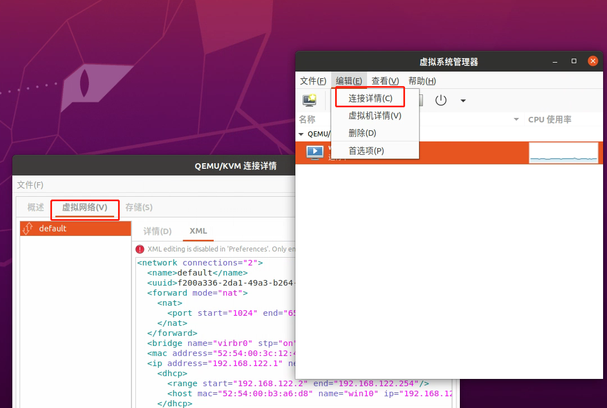

手误删除了default网络，导致虚拟机上不了网。
<!-- more -->


```
virsh net-destroy default
```

1. 从虚拟机管理找回现有default配置





```xml
<network connections="2">
  <name>default</name>
  <uuid>f200a336-2da1-49a3-b264-25dc5c76805e</uuid>
  <forward mode="nat">
    <nat>
      <port start="1024" end="65535"/>
    </nat>
  </forward>
  <bridge name="virbr0" stp="on" delay="0"/>
  <mac address="52:54:00:3c:12:41"/>
  <ip address="192.168.122.1" netmask="255.255.255.0">
    <dhcp>
      <range start="192.168.122.2" end="192.168.122.254"/>
      <host mac="52:54:00:b3:a6:d8" name="win10" ip="192.168.122.100"/>
    </dhcp>
  </ip>
</network>

```

2. 保存到default_network.xml

3. 定义网络 & 重启

```
(base) zj@zj-desktop:~/ycwu$ virsh net-define default_network.xml
Network default defined from default_network.xml

(base) zj@zj-desktop:~/ycwu$ sudo virsh net-start default
Network default started

```


