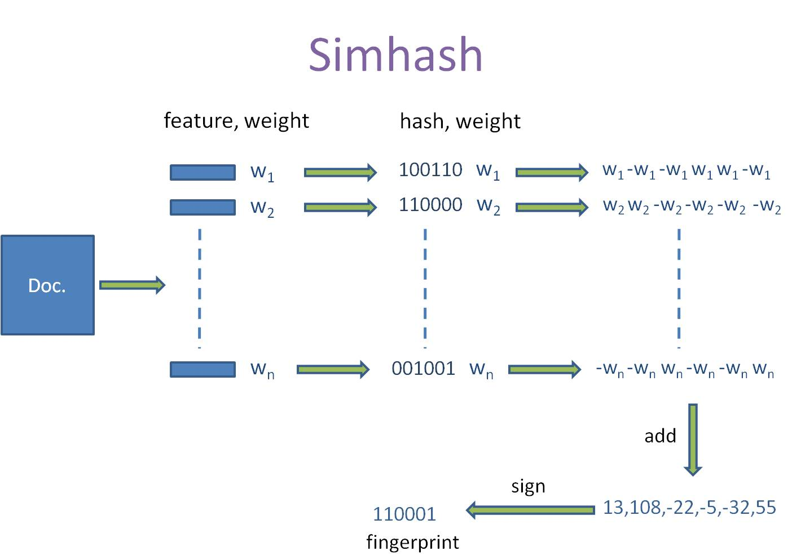
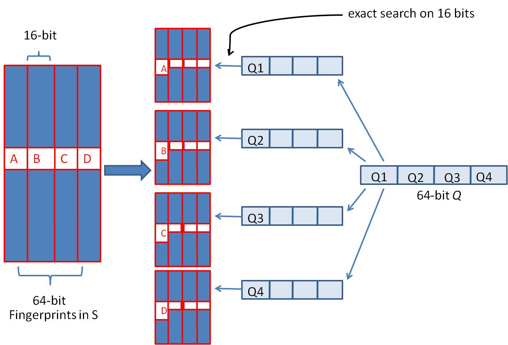
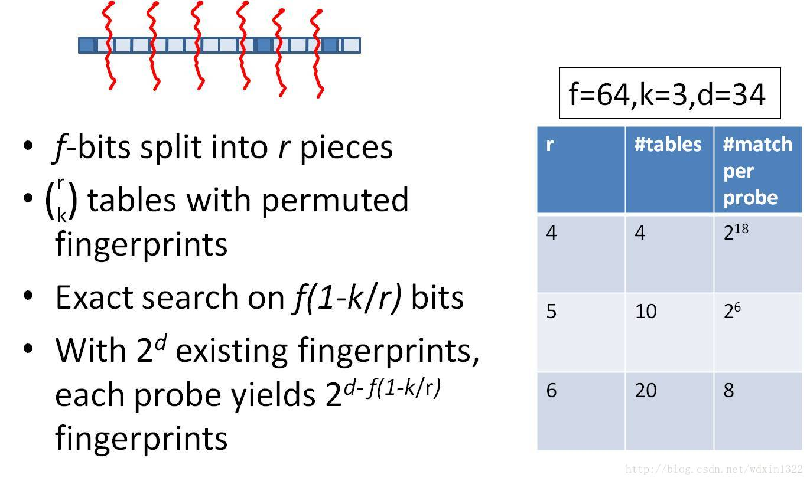

# SimHash算法的基本步骤：

1. 文本或数据集预处理：
   - 将文本或数据集分割为单词或特征。
   - 对每个单词或特征进行词干化、去停用词等预处理步骤。

2. 特征权重计算：
   - 对每个单词或特征计算一个特征权重，可以使用TF-IDF等算法进行计算。

3. SimHash值计算：
   - 初始化一个固定长度的SimHash向量，通常为64位或128位。
   - 对每个特征，通过计算其特征权重乘以一个哈希函数的结果，得到一个加权哈希值。
   - 对加权哈希值的每一位进行判断，如果为1，则在SimHash向量对应位置加上特征权重；如果为0，则在SimHash向量对应位置减去特征权重。
   - 把上面结果按位合并求和。

4. 归一化：
   - 对SimHash向量进行归一化，即将所有位的值大于等于0的置为1，小于0的置为0。

5. 相似度计算：
   - 对于两个SimHash向量，计算它们之间的汉明距离，即两个二进制向量对应位置不同的位数之和。
   - 汉明距离越小，表示两个SimHash向量越相似。



# 特征权重计算

在SimHash中，特征权重计算的目的是为了在计算SimHash值时，给予重要和稀有的特征更大的影响。通过使用TF-IDF作为特征权重，可以提高SimHash算法对文本中重要特征的敏感度。

1. 计算词频（Term Frequency, TF）：

对于每个单词或特征，计算它在文本中的出现次数。
- TF可以使用简单的计数方法，即某个单词在文本中出现的次数。
- 计算逆文档频率（Inverse Document Frequency, IDF）：

2. IDF衡量一个词在整个文本集中的重要性。

对于每个单词或特征，计算它在文本集中的逆文档频率，可以使用以下公式：
- IDF = log(N / (n + 1))
其中，N是文本集的总文档数，n是包含该单词或特征的文档数。

3. 计算TF-IDF值：

- 对于每个单词或特征，将其TF乘以对应的IDF值，得到该单词或特征的TF-IDF值。
- TF-IDF值可以用于衡量一个单词或特征在文本中的重要性和稀有性。


# 汉明距离

汉明距离（Hamming distance）是用于衡量两个等长字符串之间的差异性的度量指标。它定义为在相同位置上，两个字符串中不同字符的个数。

假设有两个等长的字符串A和B，长度为n。汉明距离H(A, B)的计算方式如下：

1. 对于每个位置i（从0到n-1），比较A[i]和B[i]的值：
   - 如果A[i]和B[i]相等，则不做任何操作。
   - 如果A[i]和B[i]不相等，则汉明距离增加1。


2. 统计不相等位置的个数，即为汉明距离。

汉明距离的值越大，表示两个字符串之间的差异性越大；值越小，则表示差异性越小。

汉明距离在许多应用中都有广泛的应用，例如：
- 错误检测和纠错编码：通过比较接收到的编码与原始编码的汉明距离，可以检测和纠正传输中的错误。
- 数据比对和相似性度量：通过计算两个数据表示（如SimHash值）之间的汉明距离，可以衡量它们之间的相似性。
- 基因组比对：在生物信息学中，汉明距离可用于比较DNA序列或蛋白质序列之间的相似性。

在计算汉明距离时，需要注意两个字符串的长度要相等，否则无法进行比较。同时，汉明距离的计算复杂度为O(n)，其中n为字符串的长度，因此在处理大规模数据时需要考虑计算效率。

# 加速汉明距离比较

## 位运算

两个数异或时，只有在两个比较的位不同时其结果是1 ，否则结果为0，两个二进制“异或”后得到1的个数即为海明距离的大小。

## 剪枝策略

通过剪枝策略可以提前终止不必要的比较。例如，在计算汉明距离时，如果当前已经超过了一个预设的阈值，那么可以提前结束比较过程，因为已经确定它们之间的差异超过了预期。

位运算 + 剪枝的例子：
```python
def isEqual(lhs, rhs, n = 3):

    cnt = 0;
    lhs ^= rhs;
    
    while lhs and cnt <= n:
        lhs &= lhs - 1;
        cnt += 1
    
    if cnt <= n:
        return True;
    return False;
```

# 分段计算

以空间换时间的方式。

将字符串分成块，每个块内部进行汉明距离的计算，然后将块之间的差异进行合并。这样可以减少比较的次数和数据量。例如，可以将长字符串划分为多个块，每个块的长度为固定值，然后计算每个块之间的汉明距离，最后将这些块的汉明距离进行累加。

# 分段hash

假如我们认为海明距离在3以内的具有很高的相似性，如果将simhash分成4段的话，那么至少有一段完全相等的情况下才能满足海明距离在3以内。

可以使用相等的部分做为hash的key，然后将具体的simhash值依次链接到value中，方便计算具体汉明距离。

1. 将64位的二进制串等分成四块
2. 调整上述64位二进制，将任意一块作为前16位，总共有四种组合，生成四份table
3. 采用精确匹配的方式查找前16位
4. 如果样本库中存有 2^34(差不多10亿）的哈希指纹，则每个table返回 2^(34−16)=262144 个候选结果，大大减少了海明距离的计算成本




table的数量与每个table返回的结果呈此消彼长的关系，也就是说，时间效率与空间效率不可兼得




# 应用场景

1. 文本去重：SimHash可以用于识别和去重大规模文本数据集中的重复内容。通过计算文本的SimHash值并比较其汉明距离，可以快速确定文本之间的相似度，并去除重复的文本。

2. 相似性搜索：SimHash可用于构建相似性搜索引擎，例如在搜索引擎中，用户可以使用一篇文档或一段文本作为查询，通过计算查询文本的SimHash值并与索引中的文档进行相似度比较，找到相似的文档。

3. 文本聚类：SimHash可用于将大规模文本数据集进行聚类。通过计算文本的SimHash值，并比较SimHash值的汉明距离，可以将相似的文本聚类在一起，从而实现文本的自动分类和归类。

4. 特征提取：SimHash可以用于提取文本或数据集的关键特征。通过计算SimHash值，可以将文本或数据集表示为固定长度的SimHash向量，这些向量可以作为特征输入到其他机器学习算法中，如聚类、分类、推荐等任务中。

5. 大规模数据集处理：SimHash算法具有较好的可扩展性，适用于处理大规模数据集。在需要快速计算文本或数据集相似度的大规模应用中，SimHash可以提供高效的相似性比较和去重功能。


# 资料

- [局部敏感哈希 - SimHash](https://ansvver.github.io/lsh_simhash.html)
