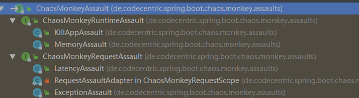

使用混沌工程进行自动化故障演练。
<!-- more -->

# 配置

```xml
<dependency>
    <groupId>de.codecentric</groupId>
    <artifactId>chaos-monkey-spring-boot</artifactId>
    <version>2.2.0</version>
</dependency>
```

配置类详见：
- ChaosMonkeyProperties
- AssaultProperties
- WatcherProperties

一个demo如下：
```yml
chaos:
  monkey:
    enabled: true
    assaults:
      level: 10
      latencyRangeStart: 500
      latencyRangeEnd: 10000
      exceptionsActive: true
      killApplicationActive: false
    watcher:
      repository: true
      restController: true
```

其中level用于判断是否触发request级别攻击，见ChaosMonkeyRequestScope：
```java
private boolean isTrouble() {
    return chaosMonkeySettings.getAssaultProperties().getTroubleRandom() >= chaosMonkeySettings.getAssaultProperties().getLevel();
}
```
level取值区间为`[1, 10000]`。

# Assault 攻击类型

ChaosMonkeyAssault是攻击类型的抽象，包含2个子类：
- ChaosMonkeyRuntimeAssault：运行时攻击，例如退出程序、内存飙升。
- ChaosMonkeyRequestAssault：请求级别攻击，例如延迟、请求异常。





```java
public interface ChaosMonkeyAssault {
    boolean isActive();

    // 攻击方法的实现
    void attack();
}
```

## KillAppAssault

直接退出程序。
```java
System.exit(exit)
```

## MemoryAssault

消耗可用内存。
方法很简单，往Vector填充`byte[]`数组，然后停顿一个间隔，再触发gc。
```java
    private void eatFreeMemory() {
        @SuppressWarnings("MismatchedQueryAndUpdateOfCollection")
        Vector<byte[]> memoryVector = new Vector<>();

        long stolenMemoryTotal = 0L;

        while (isActive()) {
            // overview of memory methods in java https://stackoverflow.com/a/18375641
            long freeMemory = runtime.freeMemory();
            long usedMemory = runtime.totalMemory() - freeMemory;

            if (cannotAllocateMoreMemory()) {
                LOGGER.debug("Cannot allocate more memory");
                break;
            }

            LOGGER.debug("Used memory in bytes: " + usedMemory);

            stolenMemoryTotal = stealMemory(memoryVector, stolenMemoryTotal, getBytesToSteal());
            waitUntil(settings.getAssaultProperties().getMemoryMillisecondsWaitNextIncrease());
        }

        // Hold memory level and cleanUp after, only if experiment is running
        if (isActive()) {
            LOGGER.info("Memory fill reached, now sleeping and holding memory");
            waitUntil(settings.getAssaultProperties().getMemoryMillisecondsHoldFilledMemory());
        }

        // clean Vector
        memoryVector.clear();
        // quickly run gc for reuse
        runtime.gc();

        long stolenAfterComplete = MemoryAssault.stolenMemory.addAndGet(-stolenMemoryTotal);
        metricEventPublisher.publishMetricEvent(MetricType.MEMORY_ASSAULT_MEMORY_STOLEN, stolenAfterComplete);
    }

    private long stealMemory(Vector<byte[]> memoryVector, long stolenMemoryTotal,
                             int bytesToSteal) {
        memoryVector.add(createDirtyMemorySlice(bytesToSteal));

        stolenMemoryTotal += bytesToSteal;
        long newStolenTotal = MemoryAssault.stolenMemory.addAndGet(bytesToSteal);
        metricEventPublisher.publishMetricEvent(MetricType.MEMORY_ASSAULT_MEMORY_STOLEN, newStolenTotal);
        LOGGER.debug("Chaos Monkey - memory assault increase, free memory: " + SizeConverter.toMegabytes(runtime
                .freeMemory()));

        return stolenMemoryTotal;
    }

    private byte[] createDirtyMemorySlice(int size) {
        byte[] b = new byte[size];
        for (int idx = 0; idx < size; idx += 4096) { // 4096
            // is commonly the size of a memory page, forcing a commit
            b[idx] = 19;
        }

        return b;
    }    
```

## LatencyAssault

给请求RT增加延迟。
如果不配置延迟的实践区间，则使用随机数。

```java
    public void attack() {
        LOGGER.debug("Chaos Monkey - timeout");

        atomicTimeoutGauge.set(determineLatency());

        // metrics
        if (metricEventPublisher != null) {
            metricEventPublisher.publishMetricEvent(MetricType.LATENCY_ASSAULT);
            metricEventPublisher.publishMetricEvent(MetricType.LATENCY_ASSAULT, atomicTimeoutGauge);
        }

        assaultExecutor.execute(atomicTimeoutGauge.get());
    }

    private int determineLatency() {
        final int latencyRangeStart =
                settings.getAssaultProperties().getLatencyRangeStart();
        final int latencyRangeEnd =
                settings.getAssaultProperties().getLatencyRangeEnd();

        if (latencyRangeStart == latencyRangeEnd) {
            return latencyRangeStart;
        } else {
            return ThreadLocalRandom.current().nextInt(latencyRangeStart,
                    latencyRangeEnd);
        }
    }
```

请求的执行委派给ChaosMonkeyLatencyAssaultExecutor。
实际上就是`Thread.sleep()`。
```java
public class LatencyAssaultExecutor implements ChaosMonkeyLatencyAssaultExecutor {
    @Override
    public void execute(long durationInMillis) {
        try {
            Thread.sleep(durationInMillis);
        } catch (InterruptedException e) {
            // do nothing
        }
    }
}
```

## ExceptionAssault

抛出指定的异常。
```java
public void attack() {
    LOGGER.info("Chaos Monkey - exception");
    AssaultException assaultException = this.settings.getAssaultProperties().getException();
    // metrics
    if (metricEventPublisher != null)
        metricEventPublisher.publishMetricEvent(MetricType.EXCEPTION_ASSAULT);
    assaultException.throwExceptionInstance();
}
```


# metrics

对接io.micrometer，每个攻击都会发送metrics，很方便在dashboard观察攻击效果。
这里使用spring的事件机制。
MetricEvent转换为ApplicationEvent事件。
```java
public class MetricEvent extends ApplicationEvent {
    private final MetricType metricType;
    private final double metricValue;
    private final String methodSignature;
    private final String[] tags;

    public MetricEvent(Object source, MetricType metricType, long metricValue, String methodSignature, String... tags) {
        super(source);
        this.metricType = metricType;
        this.tags = tags;
        this.methodSignature = methodSignature;
        this.metricValue = metricValue;
    }
}
```

MetricEventPublisher向spring容器发送事件。
```java
public class MetricEventPublisher implements ApplicationEventPublisherAware {
    private ApplicationEventPublisher publisher;

}
```

每个攻击开始，都手动发送事件：
```java
public void attack() {
    LOGGER.info("Chaos Monkey - exception");
    AssaultException assaultException = this.settings.getAssaultProperties().getException();
    // metrics
    if (metricEventPublisher != null)
        metricEventPublisher.publishMetricEvent(MetricType.EXCEPTION_ASSAULT);
    assaultException.throwExceptionInstance();
}
```

开启actuator端点，就可以在dashboard观察效果。
```java
management:
  endpoint:
    chaosmonkey:
      enabled: true
  endpoints:
    web:
      exposure:
        include: health,info,chaosmonkey      
```

# 控制端点

提供了jmx和rest两种方式：
- ChaosMonkeyJmxEndpoint
- ChaosMonkeyRestEndpoint

# 切面

通过LTW方式开启切面。
```java
@Configuration
@Profile("chaos-monkey")
@EnableLoadTimeWeaving(aspectjWeaving= EnableLoadTimeWeaving.AspectJWeaving.ENABLED)
public class ChaosMonkeyLoadTimeWeaving extends LoadTimeWeavingConfiguration {
    @Override
    public LoadTimeWeaver loadTimeWeaver() {
        return new ReflectiveLoadTimeWeaver();
    }
}
```

watcher包定义了几个切面，就不展开了。

