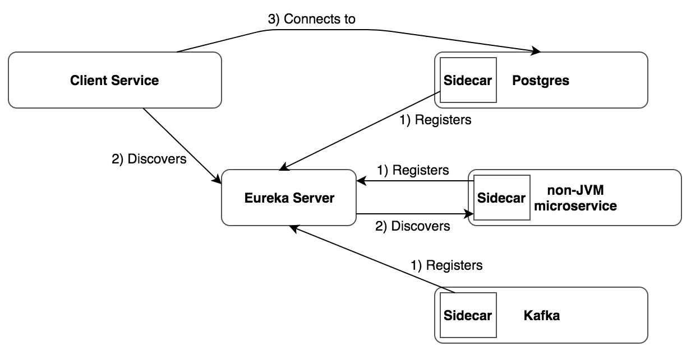
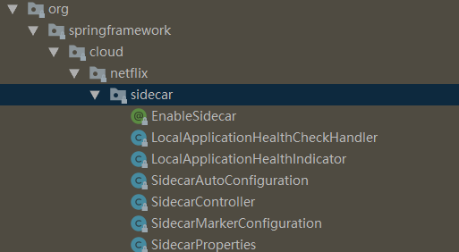
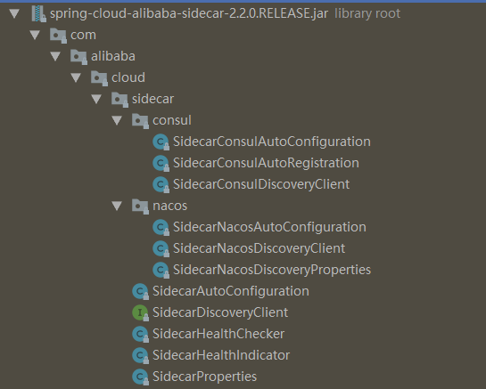

现有几个go、python写的系统，需要提供微服务能力，很自然地想到使用sidecar模式集成到现有java技术栈。
<!-- more -->

# sidecar模式

要将一个应用改成微服务架构，基本有两种方式:
1. 通过 SDK 、 Lib 等软件包的形式，在开发时引入该软件包依赖，使其与业务服务集成起来。
这种方法可以与应用密切集成，提高资源利用率并且提高应用性能。但是这种方法是对代码有侵入的，受到编程语言和软件开发人员水平的限制，但当该依赖有 bug 或者需要升级时，业务代码需要重新编译和发布。

2. 以Sidecar 的形式，在运维的时候与应用服务集成在一起。
这种方式对应用服务没有侵入性，不受编程语言和开发人员水平的限制，做到了控制与逻辑分开部署。但是会增加应用延迟，并且管理和部署的复杂度会增加。


好处：
- 边车(SideCar)模式这种方式,不仅对原来的应用代码零侵入，而且不限制原来应用的语言，特别适合这种异构微服务的场景！另外，以后你的边车(SideCar)要升级了，是可以独立升级的，不用重新打包原来的应用

坏处：
- 服务之间的调用多了**一跳**，性能有影响。

# spring-cloud-netflix-sidecar

netflix提供的sidecar方案，使用eureka作为注册中心。





## 使用方式

1. 第三方应用提供health check接口，返回格式：
```json
{
"status":"UP"
}
```

2. 引入依赖
```xml
<dependency>
    <groupId>org.springframework.cloud</groupId>
    <artifactId>spring-cloud-netflix-sidecar</artifactId>
    <version>2.2.4.RELEASE</version>
</dependency>
```

3. application.yml增加配置
```yaml
# 省略eureka配置部分

# 配置异构服务
sidecar:
  ip: localhost
  port: 8089
  # 被包装应用提供heath check url
  health-check-url: http://localhost:8089/health
```

4. 启动类增加`@EnableSidecar`注解
```java
@SpringBootApplication
@EnableSidecar
public class SidecarApplication {

    public static void main(String[] args) {
        SpringApplication.run(SidecarApplication.class, args);
    }
}
```

## 源码分析





内容很简单。主要包括：
- `@EnableSidecar`注解，表示开启sidecar能力
- 本地应用健康检查
- sidecar配置和controller

本地应用健康检查由handler和indicator组成，可以集成actuate框架。

sidecar controller提供了几个工具方法：
```java
@RequestMapping("/ping")
public String ping() {
	return "OK";
}

@RequestMapping("/hosts/{appName}")
public List<ServiceInstance> hosts(@PathVariable("appName") String appName) {
	return hosts2(appName);
}

@RequestMapping("/hosts")
public List<ServiceInstance> hosts2(@RequestParam("appName") String appName) {
	List<ServiceInstance> instances = this.discovery.getInstances(appName);
	return instances;
}
```

# spring-cloud-alibaba-sidecar

spring-cloud-alibaba-sidecar支持nacos和consul注册中心。
使用方式和netflix sidecar基本相似。
```xml
<dependency>
    <groupId>com.alibaba.cloud</groupId>
    <artifactId>spring-cloud-alibaba-sidecar</artifactId>
    <version>2.2.0.RELEASE</version>
</dependency>
```





启动类增加`@EnableDiscoveryClient`注解。
注意没有`@EnableSidecar`注解，也没有提供controller方法。