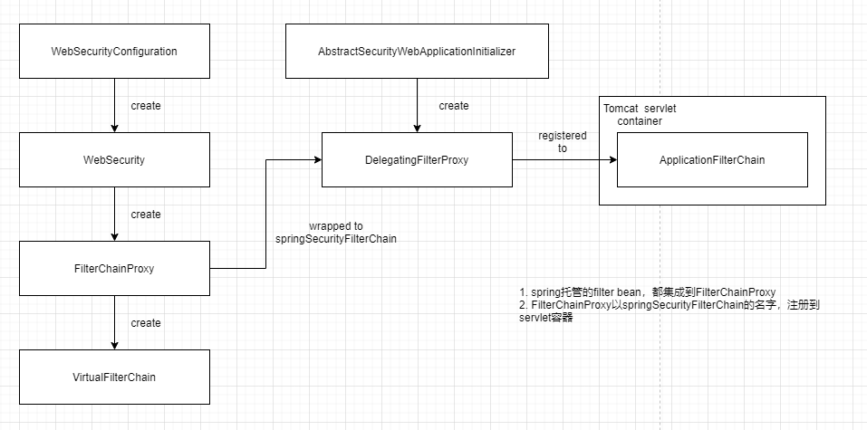

SpringSecurityFilterChain是spring security处理流程的重要链路。本文涉及：
- 做什么？
- 和servlet容器的关联？
- 怎么创建？
- 工作流程？





<!-- more -->

# DelegatingFilterProxy

Filter过滤器是Servlet容器来管理，一般我们需要web.xml文件中配置Filter链。

题外话：直接注册到tomcat容器的过滤器会关联到ApplicationFilterChain。

DelegatingFilterProxy是servlet filter的代理，通过spring容器来管理filter的生命周期。
交由spring托管，可以简化filter的初始化。
```java
public class DelegatingFilterProxy extends GenericFilterBean {

	@Nullable
	private String contextAttribute;

	@Nullable
	private WebApplicationContext webApplicationContext;

	@Nullable
	private String targetBeanName;

	private boolean targetFilterLifecycle = false;

	@Nullable
	private volatile Filter delegate;

	private final Object delegateMonitor = new Object();
```

作为filter，核心方法是doFilter，做了lazy init，实际工作交给delegate处理。
```java
	public void doFilter(ServletRequest request, ServletResponse response, FilterChain filterChain)
			throws ServletException, IOException {

		// Lazily initialize the delegate if necessary.
		Filter delegateToUse = this.delegate;
		if (delegateToUse == null) {
			synchronized (this.delegateMonitor) {
				delegateToUse = this.delegate;
				if (delegateToUse == null) {
					WebApplicationContext wac = findWebApplicationContext();
					if (wac == null) {
						throw new IllegalStateException("No WebApplicationContext found: " +
								"no ContextLoaderListener or DispatcherServlet registered?");
					}
					delegateToUse = initDelegate(wac);
				}
				this.delegate = delegateToUse;
			}
		}

		// Let the delegate perform the actual doFilter operation.
		invokeDelegate(delegateToUse, request, response, filterChain);
	}
```

AbstractSecurityWebApplicationInitializer把springSecurityFilterChain以DelegatingFilterProxy的形式注册到servlet容器。
```java
/**
 * Registers the springSecurityFilterChain
 * @param servletContext the {@link ServletContext}
 */
private void insertSpringSecurityFilterChain(ServletContext servletContext) {
    // 默认为springSecurityFilterChain
	String filterName = DEFAULT_FILTER_NAME;
	DelegatingFilterProxy springSecurityFilterChain = new DelegatingFilterProxy(
			filterName);
	String contextAttribute = getWebApplicationContextAttribute();
	if (contextAttribute != null) {
		springSecurityFilterChain.setContextAttribute(contextAttribute);
	}
	registerFilter(servletContext, true, filterName, springSecurityFilterChain);
}
```


# WebSecurityConfiguration

WebSecurityConfiguration负责创建springSecurityFilterChain。
```java
@Bean(name = AbstractSecurityWebApplicationInitializer.DEFAULT_FILTER_NAME)
public Filter springSecurityFilterChain() throws Exception {
	boolean hasConfigurers = webSecurityConfigurers != null
			&& !webSecurityConfigurers.isEmpty();
	if (!hasConfigurers) {
		WebSecurityConfigurerAdapter adapter = objectObjectPostProcessor
				.postProcess(new WebSecurityConfigurerAdapter() {
				});
		webSecurity.apply(adapter);
	}
	return webSecurity.build();
}
```

# WebSecurity

WebSecurity用来创建FilterChainProxy（即springSecurityFilterChain）。
通过WebSecurityConfigurer或者WebSecurityConfigurerAdapter来自定义WebSecurity。

最核心的方法是`performBuild()`：把SecurityFilterChain构建为FilterChainProxy。
```java
	protected Filter performBuild() throws Exception {
		Assert.state(
				!securityFilterChainBuilders.isEmpty(),
				() -> "At least one SecurityBuilder<? extends SecurityFilterChain> needs to be specified. "
						+ "Typically this done by adding a @Configuration that extends WebSecurityConfigurerAdapter. "
						+ "More advanced users can invoke "
						+ WebSecurity.class.getSimpleName()
						+ ".addSecurityFilterChainBuilder directly");
		int chainSize = ignoredRequests.size() + securityFilterChainBuilders.size();
		List<SecurityFilterChain> securityFilterChains = new ArrayList<>(
				chainSize);
		for (RequestMatcher ignoredRequest : ignoredRequests) {
			securityFilterChains.add(new DefaultSecurityFilterChain(ignoredRequest));
		}
		for (SecurityBuilder<? extends SecurityFilterChain> securityFilterChainBuilder : securityFilterChainBuilders) {
			securityFilterChains.add(securityFilterChainBuilder.build());
		}
		FilterChainProxy filterChainProxy = new FilterChainProxy(securityFilterChains);
		if (httpFirewall != null) {
			filterChainProxy.setFirewall(httpFirewall);
		}
		filterChainProxy.afterPropertiesSet();

		Filter result = filterChainProxy;
		if (debugEnabled) {
			logger.warn("\n\n"
					+ "********************************************************************\n"
					+ "**********        Security debugging is enabled.       *************\n"
					+ "**********    This may include sensitive information.  *************\n"
					+ "**********      Do not use in a production system!     *************\n"
					+ "********************************************************************\n\n");
			result = new DebugFilter(filterChainProxy);
		}
		postBuildAction.run();
		return result;
	}
```

# FilterChainProxy


FilterChainProxy的职责
>Delegates Filter requests to a list of Spring-managed filter beans. 
>The FilterChainProxy is linked into the servlet container filter chain by adding a standard Spring DelegatingFilterProxy declaration in the application web.xml file

FilterChainProxy负责委派filter请求到spring托管的filter。
FilterChainProxy通过spring DelegatingFilterProxy和servlet容器集成。

```java
public class FilterChainProxy extends GenericFilterBean {

	private List<SecurityFilterChain> filterChains;

	private FilterChainValidator filterChainValidator = new NullFilterChainValidator();

	private HttpFirewall firewall = new StrictHttpFirewall();
```

作为Filter，入口方法是`doFilter()`：
```java

public void doFilter(ServletRequest request, ServletResponse response,
		FilterChain chain) throws IOException, ServletException {
    // 检查标记字段
	boolean clearContext = request.getAttribute(FILTER_APPLIED) == null;
	if (clearContext) {
		try {
			request.setAttribute(FILTER_APPLIED, Boolean.TRUE);
			doFilterInternal(request, response, chain);
		}
		finally {
			SecurityContextHolder.clearContext();
			request.removeAttribute(FILTER_APPLIED);
		}
	}
	else {
		doFilterInternal(request, response, chain);
	}
}
```

核心逻辑在`doFilterInternal()`：
```java
	private void doFilterInternal(ServletRequest request, ServletResponse response,
			FilterChain chain) throws IOException, ServletException {

		FirewalledRequest fwRequest = firewall
				.getFirewalledRequest((HttpServletRequest) request);
		HttpServletResponse fwResponse = firewall
				.getFirewalledResponse((HttpServletResponse) response);

		List<Filter> filters = getFilters(fwRequest);

		if (filters == null || filters.size() == 0) {
			if (logger.isDebugEnabled()) {
				logger.debug(UrlUtils.buildRequestUrl(fwRequest)
						+ (filters == null ? " has no matching filters"
								: " has an empty filter list"));
			}

			fwRequest.reset();

			chain.doFilter(fwRequest, fwResponse);

			return;
		}

        // 参数: firewalledRequest, originalChain, additionalFilters
		VirtualFilterChain vfc = new VirtualFilterChain(fwRequest, chain, filters);
		vfc.doFilter(fwRequest, fwResponse);
	}
```

实际是包装为VirtualFilterChain，再做处理：
```java
	private static class VirtualFilterChain implements FilterChain {
		private final FilterChain originalChain;
		private final List<Filter> additionalFilters;
		private final FirewalledRequest firewalledRequest;
		private final int size;
		private int currentPosition = 0;

		private VirtualFilterChain(FirewalledRequest firewalledRequest,
				FilterChain chain, List<Filter> additionalFilters) {
			this.originalChain = chain;
			this.additionalFilters = additionalFilters;
			this.size = additionalFilters.size();
			this.firewalledRequest = firewalledRequest;
		}        
```

VirtualFilterChain先处理additionalFilters，到底后再处理originalChain。
```java
public void doFilter(ServletRequest request, ServletResponse response)
		throws IOException, ServletException {
	if (currentPosition == size) {
		if (logger.isDebugEnabled()) {
			logger.debug(UrlUtils.buildRequestUrl(firewalledRequest)
					+ " reached end of additional filter chain; proceeding with original chain");
		}
		// Deactivate path stripping as we exit the security filter chain
		this.firewalledRequest.reset();
		originalChain.doFilter(request, response);
	}
	else {
		currentPosition++;
		Filter nextFilter = additionalFilters.get(currentPosition - 1);
		if (logger.isDebugEnabled()) {
			logger.debug(UrlUtils.buildRequestUrl(firewalledRequest)
					+ " at position " + currentPosition + " of " + size
					+ " in additional filter chain; firing Filter: '"
					+ nextFilter.getClass().getSimpleName() + "'");
		}
		nextFilter.doFilter(request, response, this);
	}
}
```

官方的filter和配置顺序，参见`HttpSecurityBuilder#addFilter()`：


filter配置顺序，定义在FilterComparator
```java
final class FilterComparator implements Comparator<Filter>, Serializable {
	private static final int INITIAL_ORDER = 100;
	private static final int ORDER_STEP = 100;
	private final Map<String, Integer> filterToOrder = new HashMap<>();

	FilterComparator() {
		Step order = new Step(INITIAL_ORDER, ORDER_STEP);
		put(ChannelProcessingFilter.class, order.next());
		put(ConcurrentSessionFilter.class, order.next());
		put(WebAsyncManagerIntegrationFilter.class, order.next());
		put(SecurityContextPersistenceFilter.class, order.next());
		put(HeaderWriterFilter.class, order.next());
		put(CorsFilter.class, order.next());
		put(CsrfFilter.class, order.next());
		put(LogoutFilter.class, order.next());
		filterToOrder.put(
			"org.springframework.security.oauth2.client.web.OAuth2AuthorizationRequestRedirectFilter",
				order.next());
		filterToOrder.put(
				"org.springframework.security.saml2.provider.service.servlet.filter.Saml2WebSsoAuthenticationRequestFilter",
				order.next());
		put(X509AuthenticationFilter.class, order.next());
		put(AbstractPreAuthenticatedProcessingFilter.class, order.next());
		filterToOrder.put("org.springframework.security.cas.web.CasAuthenticationFilter",
				order.next());
		filterToOrder.put(
			"org.springframework.security.oauth2.client.web.OAuth2LoginAuthenticationFilter",
				order.next());
		filterToOrder.put(
				"org.springframework.security.saml2.provider.service.servlet.filter.Saml2WebSsoAuthenticationFilter",
				order.next());
		put(UsernamePasswordAuthenticationFilter.class, order.next());
		put(ConcurrentSessionFilter.class, order.next());
		filterToOrder.put(
				"org.springframework.security.openid.OpenIDAuthenticationFilter", order.next());
		put(DefaultLoginPageGeneratingFilter.class, order.next());
		put(DefaultLogoutPageGeneratingFilter.class, order.next());
		put(ConcurrentSessionFilter.class, order.next());
		put(DigestAuthenticationFilter.class, order.next());
		filterToOrder.put(
				"org.springframework.security.oauth2.server.resource.web.BearerTokenAuthenticationFilter", order.next());
		put(BasicAuthenticationFilter.class, order.next());
		put(RequestCacheAwareFilter.class, order.next());
		put(SecurityContextHolderAwareRequestFilter.class, order.next());
		put(JaasApiIntegrationFilter.class, order.next());
		put(RememberMeAuthenticationFilter.class, order.next());
		put(AnonymousAuthenticationFilter.class, order.next());
		filterToOrder.put(
			"org.springframework.security.oauth2.client.web.OAuth2AuthorizationCodeGrantFilter",
				order.next());
		put(SessionManagementFilter.class, order.next());
		put(ExceptionTranslationFilter.class, order.next());
		put(FilterSecurityInterceptor.class, order.next());
		put(SwitchUserFilter.class, order.next());
	}

```

HttpSecurity先对filter排序，再构建SecurityFilterChain。
```java
protected DefaultSecurityFilterChain performBuild() {
	filters.sort(comparator);
	return new DefaultSecurityFilterChain(requestMatcher, filters);
}
```

接下来的主角是FilterSecurityInterceptor。


