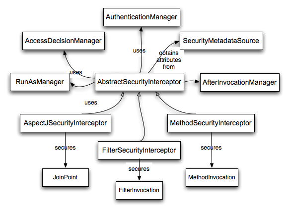
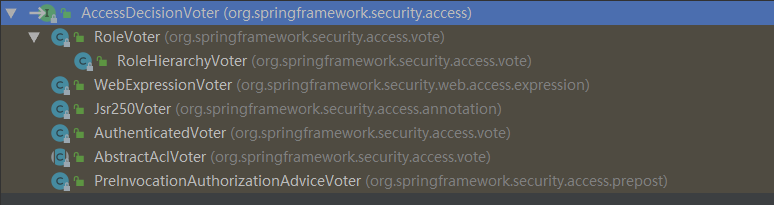

AbstractSecurityInterceptor是安全拦截器的基类。
FilterSecurityInterceptor是鉴权相关的filter。
InterceptorStatusToken是两者通信的渠道。
<!-- more -->

# AbstractSecurityInterceptor

在理解FilterSecurityInterceptor之前，需要先深入AbstractSecurityInterceptor。





AbstractSecurityInterceptor是安全拦截器的基类。
涉及成员：
- AuthenticationManager：认证
- AccessDecisionManager：鉴权
- SecurityMetadataSource：获取属性列表
- RunAsManager：替换认证用户
- AfterInvocationManager：鉴权完成后续处理

核心方法：
- beforeInvocation
- finallyInvocation
- afterInvocation

工作流程：
1. 从SecurityContextHolder获取Authentication对象
2. 通过SecurityMetadataSource判断这个secure object是安全的还是公开的
3. 对于安全请求：
- 如果Authentication.isAuthenticated()为false，或者alwaysReauthenticate为true，就交给AuthenticationManager验证。返回结果更新到SecurityContextHolder。
- AccessDecisionManager判断该请求的授权
- RunAsManager尝试切换用户执行
- 交给子类执行。子类执行完毕后，返回InterceptorStatusToken对象。AbstractSecurityInterceptor#finallyInvocation()用于清理现场。
- 子类调用AbstractSecurityInterceptor#afterInvocation()
- If the RunAsManager replaced the Authentication object, return the SecurityContextHolder to the object that existed after the call to AuthenticationManager.
- AfterInvocationManager处理
4. 对于公开请求：
- 子类返回InterceptorStatusToken对象。

```java
	protected InterceptorStatusToken beforeInvocation(Object object) {
		Assert.notNull(object, "Object was null");
		final boolean debug = logger.isDebugEnabled();

		if (!getSecureObjectClass().isAssignableFrom(object.getClass())) {
			throw new IllegalArgumentException(
					"Security invocation attempted for object "
							+ object.getClass().getName()
							+ " but AbstractSecurityInterceptor only configured to support secure objects of type: "
							+ getSecureObjectClass());
		}

		Collection<ConfigAttribute> attributes = this.obtainSecurityMetadataSource()
				.getAttributes(object);

		if (attributes == null || attributes.isEmpty()) {
			if (rejectPublicInvocations) {
				throw new IllegalArgumentException(
						"Secure object invocation "
								+ object
								+ " was denied as public invocations are not allowed via this interceptor. "
								+ "This indicates a configuration error because the "
								+ "rejectPublicInvocations property is set to 'true'");
			}

			if (debug) {
				logger.debug("Public object - authentication not attempted");
			}

			publishEvent(new PublicInvocationEvent(object));

			return null; // no further work post-invocation
		}

		if (debug) {
			logger.debug("Secure object: " + object + "; Attributes: " + attributes);
		}

		if (SecurityContextHolder.getContext().getAuthentication() == null) {
			credentialsNotFound(messages.getMessage(
					"AbstractSecurityInterceptor.authenticationNotFound",
					"An Authentication object was not found in the SecurityContext"),
					object, attributes);
		}

		Authentication authenticated = authenticateIfRequired();

		// Attempt authorization
		try {
			this.accessDecisionManager.decide(authenticated, object, attributes);
		}
		catch (AccessDeniedException accessDeniedException) {
			publishEvent(new AuthorizationFailureEvent(object, attributes, authenticated,
					accessDeniedException));

			throw accessDeniedException;
		}

		if (debug) {
			logger.debug("Authorization successful");
		}

		if (publishAuthorizationSuccess) {
			publishEvent(new AuthorizedEvent(object, attributes, authenticated));
		}

		// Attempt to run as a different user
		Authentication runAs = this.runAsManager.buildRunAs(authenticated, object,
				attributes);

		if (runAs == null) {
			if (debug) {
				logger.debug("RunAsManager did not change Authentication object");
			}

			// no further work post-invocation
			return new InterceptorStatusToken(SecurityContextHolder.getContext(), false,
					attributes, object);
		}
		else {
			if (debug) {
				logger.debug("Switching to RunAs Authentication: " + runAs);
			}

			SecurityContext origCtx = SecurityContextHolder.getContext();
			SecurityContextHolder.setContext(SecurityContextHolder.createEmptyContext());
			SecurityContextHolder.getContext().setAuthentication(runAs);

			// need to revert to token.Authenticated post-invocation
			return new InterceptorStatusToken(origCtx, true, attributes, object);
		}
	}
```

```java
	protected Object afterInvocation(InterceptorStatusToken token, Object returnedObject) {
		if (token == null) {
			// public object
			return returnedObject;
		}

		finallyInvocation(token); // continue to clean in this method for passivity

		if (afterInvocationManager != null) {
			// Attempt after invocation handling
			try {
				returnedObject = afterInvocationManager.decide(token.getSecurityContext()
						.getAuthentication(), token.getSecureObject(), token
						.getAttributes(), returnedObject);
			}
			catch (AccessDeniedException accessDeniedException) {
				AuthorizationFailureEvent event = new AuthorizationFailureEvent(
						token.getSecureObject(), token.getAttributes(), token
								.getSecurityContext().getAuthentication(),
						accessDeniedException);
				publishEvent(event);

				throw accessDeniedException;
			}
		}

		return returnedObject;
	}

```

`finallyInvocation`清理AbstractSecurityInterceptor产生的上下文。
要在secure object调用之后、`afterInvocation`调用之前使用`finallyInvocation`。
```java
protected void finallyInvocation(InterceptorStatusToken token) {
    // token == null 为public invocation
	if (token != null && token.isContextHolderRefreshRequired()) {
		if (logger.isDebugEnabled()) {
			logger.debug("Reverting to original Authentication: "
					+ token.getSecurityContext().getAuthentication());
		}
		SecurityContextHolder.setContext(token.getSecurityContext());
	}
}
```

InterceptorStatusToken是security拦截器的状态抽象。
AbstractSecurityInterceptor和它的子类通过InterceptorStatusToken来通信。
```java
public class InterceptorStatusToken {
	private SecurityContext securityContext;
	private Collection<ConfigAttribute> attr;
	private Object secureObject;
	private boolean contextHolderRefreshRequired;
```

# FilterSecurityInterceptor


处理鉴权的子类，负责触发secure object调用。
```java
public class FilterSecurityInterceptor extends AbstractSecurityInterceptor implements Filter {}
```

有了AbstractSecurityInterceptor的基础，理解起来简单多。
```java
public void doFilter(ServletRequest request, ServletResponse response,
		FilterChain chain) throws IOException, ServletException {
	FilterInvocation fi = new FilterInvocation(request, response, chain);
	invoke(fi);
}

public void invoke(FilterInvocation fi) throws IOException, ServletException {
	if ((fi.getRequest() != null)
			&& (fi.getRequest().getAttribute(FILTER_APPLIED) != null)
			&& observeOncePerRequest) {
		// filter already applied to this request and user wants us to observe
		// once-per-request handling, so don't re-do security checking
		fi.getChain().doFilter(fi.getRequest(), fi.getResponse());
	}
	else {
		// first time this request being called, so perform security checking
		if (fi.getRequest() != null && observeOncePerRequest) {
			fi.getRequest().setAttribute(FILTER_APPLIED, Boolean.TRUE);
		}
        // AbstractSecurityInterceptor前置操作
		InterceptorStatusToken token = super.beforeInvocation(fi);
        // secure object invocation
		try {
			fi.getChain().doFilter(fi.getRequest(), fi.getResponse());
		}
		finally {
        // AbstractSecurityInterceptor清理操作
			super.finallyInvocation(token);
		}
        // AbstractSecurityInterceptor后置操作
		super.afterInvocation(token, null);
	}
}
```

# AccessDecisionVoter和AccessDecisionManager

AccessDecisionVoter是投票者，需要对Authentication请求投票，有3种结果：
```java
int ACCESS_GRANTED = 1;
int ACCESS_ABSTAIN = 0;
int ACCESS_DENIED = -1;
```
AccessDecisionVoter有多种内置实现。





RoleVoter很简单，直接根据传入属性的前缀判断是否允许访问：
```java
public class RoleVoter implements AccessDecisionVoter<Object> {
	
	private String rolePrefix = "ROLE_";

	public boolean supports(ConfigAttribute attribute) {
		if ((attribute.getAttribute() != null)
				&& attribute.getAttribute().startsWith(getRolePrefix())) {
			return true;
		}
		else {
			return false;
		}
	}

	public int vote(Authentication authentication, Object object,
			Collection<ConfigAttribute> attributes) {
		if (authentication == null) {
			return ACCESS_DENIED;
		}
		int result = ACCESS_ABSTAIN;
		Collection<? extends GrantedAuthority> authorities = extractAuthorities(authentication);

		for (ConfigAttribute attribute : attributes) {
			if (this.supports(attribute)) {
				result = ACCESS_DENIED;

				// Attempt to find a matching granted authority
				for (GrantedAuthority authority : authorities) {
					if (attribute.getAttribute().equals(authority.getAuthority())) {
						return ACCESS_GRANTED;
					}
				}
			}
		}

		return result;
	}

}
```

AccessDecisionManager是判断有无权限的管理器。有3种实现：
- AffirmativeBased：任意一个voter返回同意则允许访问。
- ConsensusBased：多数服从少数。如果同意和拒绝票数一样，则根据`allowIfEqualGrantedDeniedDecisions`判断。
- UnanimousBased：一票否决。如果voter都弃权，则根据`allowIfAllAbstainDecisions`判断。

# RunAsManager

RunAsManager是个有意思的设计，可以**临时**替换SecurityContext中的Authentication对象。
有了RunAsManager，可以支持2层安全模式。
一层是public，面向外部调用者。
另一层是private，并且只提供给public层使用。private层的方法也收到安全约束，因此需要配置特别的授权GrantedAuthority（这些授权不会暴露到外部调用者）。

