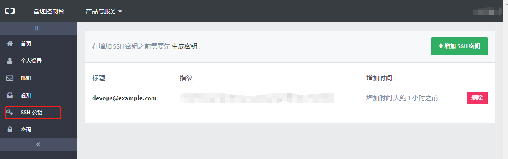

# CI/CD迁移背景

阿里云ecs续费有点贵，于是把个人项目迁移到腾讯云。对应的CI/CD也要重新搞一套。
其中感受到，贵的东西就一个缺点：贵，剩下都是优点。
<!-- more -->
## coding devops现状

腾讯云提供coding devops作为构建平台。
coding devops底层使用Jenkins。通过Jenkins file，定义构建、测试、部署等步骤。
但是，coding devops只做了CI，CD做的比较一般。coding devops并没有直接和腾讯云的ecs机器打通。构建后的artifact没有自动复制到关联机器上（根本就没有关联ecs机器的配置），比较麻烦，scp、ssh又涉及密码、密钥问题。

对比阿里云云效，流水线可以关联ecs机器，构建的产物自动复制到机器，用户只需要关心最终的部署脚本即可。

## 为什么不用Jenkins

目前只有一个项目的构建和部署，使用Jenkins有点重型。
后续ecs上运行的项目多了，会考虑使用Jenkins。

## 为什么不用镜像

实际上coding devops的有镜像的例子，把artifact打包为镜像，上传到私有仓库，再在deploy步骤使用docker命令启动容器。
这是可行的一种方案。只是发现的太晚。。。

# 思路

在腾讯云ecs上编写脚本，自行获取源码，构建，部署。

## 配置ssh

源码保存在阿里云code，目前不想搬过来到coding。需要在阿里云code增加ssh key，给腾讯云机器访问。

操作参考github文档：[生成新 SSH 密钥并添加到 ssh-agent](https://help.github.com/cn/github/authenticating-to-github/generating-a-new-ssh-key-and-adding-it-to-the-ssh-agent)

1. 生成构建专用的ssh key。
```
ssh-keygen -t rsa -b 2048 -C "devops@example.com" -f /home/ubuntu/.ssh/devops
```

2. 加载ssh key。先查看已经加载的ssh key：
```
ubuntu@VM-0-2-ubuntu:~/.ssh$ ssh-add -l
Could not open a connection to your authentication agent.
```
发现ssh-agent没有启动。
```
ubuntu@VM-0-2-ubuntu:~/.ssh$ eval `ssh-agent -s`
Agent pid 5587
ubuntu@VM-0-2-ubuntu:~/.ssh$ ssh-add -l
The agent has no identities.
```
后续优化，使用service在后台启动ssh-agent。

这时候可以加载ssh key。
```
ubuntu@VM-0-2-ubuntu:~/.ssh$ ssh-add /home/ubuntu/.ssh/devops
Identity added: /home/ubuntu/.ssh/devops (/home/ubuntu/.ssh/devops)
```

3. 去阿里云code增加ssh公钥





## 安装java、maven

```
sudo apt-get install openjdk-8-jdk -y
sudo apt-get install maven -y
```

增加maven中央仓库镜像，加速访问。
修改`/etc/maven/settings.xml`，在`mirrors`节点增加
```xml
<mirror>
        <id>nexus-aliyun</id>
        <mirrorOf>central</mirrorOf>
        <name>Nexus aliyun</name>
        <url>http://maven.aliyun.com/nexus/content/groups/public</url>
</mirror>
```


## 构建脚本

```
#! /bin/bash

if [ $# != 2 ] ; then
  echo "USAGE: <ENV> <GIT_BRANCH>"
  echo "Where ENV is in [dev, prod]"
  exit 1;
fi

pkill ssh-agent
eval `ssh-agent -s`
ssh-add /home/ubuntu/.ssh/devops

ENV=$1
GIT_BRANCH=$2

PROJECT_NAME=medical
BASE_DIR=/home/ubuntu/devops/build
PROJECT_DIR=${BASE_DIR}/${PROJECT_NAME}
OUTPUT_DIR=${PROJECT_DIR}/target
GIT_REPO="git@code.aliyun.com:Godzilla555/medical.git"
FINAL_ARTIFACT=medical.jar

rm -rf ${PROJECT_DIR}
mkdir -p ${BASE_DIR}
cd ${BASE_DIR}
git clone -b ${GIT_BRANCH} ${GIT_REPO}
cd ${PROJECT_DIR}
mvn compile package -Dmaven.test.skip=true

cd ${BASE_DIR}
cd ..
mkdir -p deploy/${ENV}/${PROJECT_NAME}
cd deploy/${ENV}/${PROJECT_NAME}
cp ${OUTPUT_DIR}/${FINAL_ARTIFACT} .

OLD_PID=`ps aux | grep java | grep medical | grep ${ENV} | awk '{ print $2 }' `

if [ -n "${OLD_PID}" ]
then
    echo "running ${ENV} app pid = ${OLD_PID}"

    kill -9 ${OLD_PID}
    echo "await termination ..."
    sleep 5
fi

nohup java -jar medical.jar --spring.profiles.active=${ENV} &
```

搞定，以后要构建就人手触发一下。
