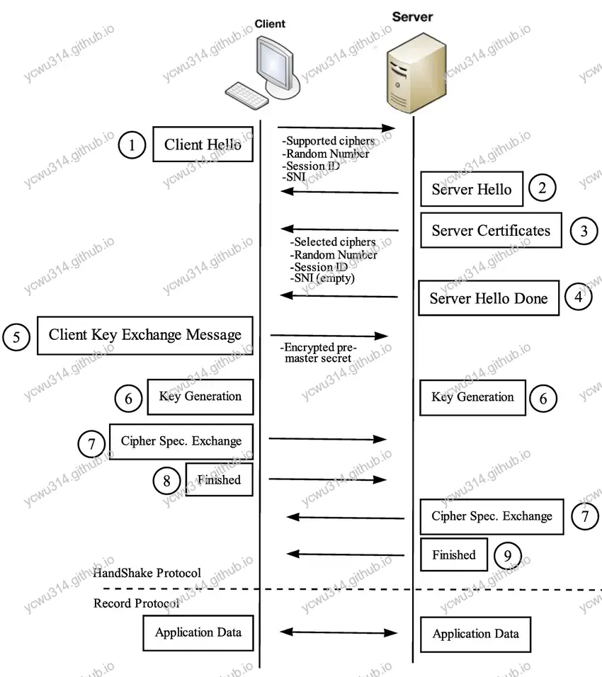
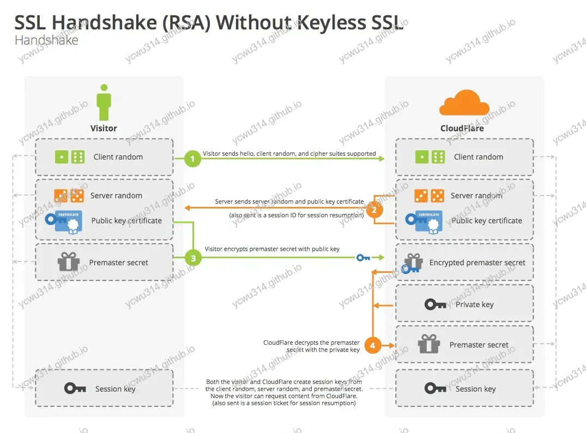
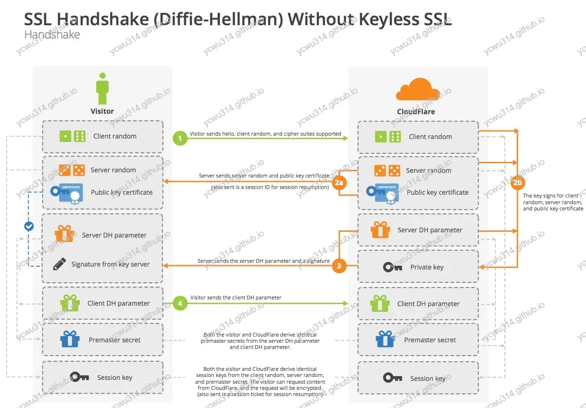

# 前言

http是明文传输，因此对于中间人攻击很脆弱。于是诞生了https加密传输。在tcp三次握手建立连接后，再进行ssl/tls握手，升级为https。


(图片来源：cloudflare.com)

https使用的握手协议，发展了多个版本，从ssl到tls。目前广泛使用的是tls 1.2。tls 1.3也开始推广铺开。本文讨论tls 1.2握手过程。

# tls设计哲学

在深入tls握手过程之前，先思考下如何在公开网络上实现安全通信。
显然要对传输内容加密。而为了实现通信加密，双方要使用一致的加解密方式、密码。
在密码学中，加密算法分为`对称加密`和`非对称加密`两大类别。
对称加密：
- 速度快
- 支持任意长度内容
- 如果密码长度太短，容易被攻击

非对称加密：
- 速度慢
- 不能加密超过密钥长度的内容（除非分组）
- 攻击难度高

非对称加密分为公钥和私钥部分。顾名思义，公钥可以公开传输给任何人使用。私钥要保密存放，不能泄露。
非对称加密一个特性是，使用公钥加密的内容，只能用对应私钥解密。反之亦然。

如果只用非对称加密，那么安全性很高，但是对传输内容长度有限制，并且性能损耗大。这不是一个工程上的好方案。
如果使用对称加密，那么传输内容长度不受限制，性能也好。密码长度足够，安全性也高。但是产生另一个问题：怎么安全传输对称加密的密码？

tls设计哲学是：
- 使用对称加密传输内容，这样传输内容长度不受限、性能也好
- 双方协商使用的加密方式、并且生成对称加密的密码，不会在网络中明文传输
- 为了安全生成对称加密的密码，使用非对称加密方式传输密码的一个部分

<!-- more -->

# tls握手相关概念

深入了解tls握手过程之前，先了解几个概念。
- session id
服务器生成的会话id，用于开启或者恢复会话状态。
- client random
客户端生成的32字节随机数据，每个connection都有唯一的client random。
- server random
类似client random，但是由服务器生成。
- premaster secret
server和client共享的48-byte密码。
- session key
premaster secret、client random、server random一起用于生成session对称加密的密码。
- cipher spec
加密策略，包括生成加密算法（例如AES）和MAC算法（例如HMAC-SHA256）

# tls握手过程概览

rfc5246 section-7.3描述了tls 1.2握手过程
```
Client                                               Server

      ClientHello                  -------->
                                                      ServerHello
                                                     Certificate*
                                               ServerKeyExchange*
                                              CertificateRequest*
                                   <--------      ServerHelloDone
      Certificate*
      ClientKeyExchange
      CertificateVerify*
      [ChangeCipherSpec]
      Finished                     -------->
                                               [ChangeCipherSpec]
                                   <--------             Finished
      Application Data             <------->     Application Data

             Figure 1.  Message flow for a full handshake
```





## ClientHello

客户端发送支持的ciphers组合，生成client random，session id（如果有的话）、扩展字段例如SNI。
SNI是服务器名称指示（英语：Server Name Indication，缩写：SNI）。具体可以参照
- [https-sni-nginx-config](/posts/https-sni-nginx-config)

## ServerHello

服务器端根据SNI选择要发送的证书，决定本次会话使用的cipher，生成server random、session id。

## ClientKeyExchange

客户端校验证书的有效性，方式有CRL、OCSP。具体可以参照
- [nginx-enable-ocsp "nginx enable ocsp"](/posts/nginx-enable-ocsp "nginx enable ocsp")

如果证书检查不通过，则浏览器发出警告。


如果校验通过，客户端生成48byte的premaster secret（ps. 这里是RSA握手模式，DH握手模式有不同）。client random、server random、premaster secret生成session key（key generation）。

使用服务器证书中的公钥对premaster secret进行加密，发送给server。（ps. 这里是RSA握手模式，DH握手模式有不同）

另一方面，服务器使用私钥解密得到premaster secret。通用使用client random、server random、premaster secret生成session key（key generation）。

此时双方有一致的session key。tls握手完毕，后续通信使用session key进行对称加解密。

# tls握手模式和forward secrecy

tls握手模式分为分为RSA模式和DH模式（ Diffie-Hellman）。


(图片来源：cloudflare.com)

authentication是身份验证，是指证书校验。
key establishment是session key生成，具体是premaster secret部分。

使用RSA制作的证书，RSA可以用于签名，以及premaster secret的加密。
使用DSA制作的证书，DSA只能用于前面，premaster secret需要使用DH算法协商。

对于RSA握手，身份验证使用RSA，premaster secret由客户端生成，并且使用证书的公钥进行premaster secret的加密，服务器端使用证书的私钥进行解密，得到premaster secret。





(图片来源：cloudflare.com)

这就有个问题，RSA既用于身份验证，又用于session key生成。一旦私钥泄露，未来所有的tls都不安全，因为
```
session key = f(client random, server random, pre master secret)
```
其中client random、server random是明文，pre master secret能够用泄露的私钥解密！这是`forward secrecy`问题。

针对RSA握手的问题，诞生了DH握手模式。具体来说，premaster secret不再由client生成并且加密传输。而是使用DH算法，双方协商生成premaster secret。





(图片来源：cloudflare.com)

- server hello阶段，额外发送server DH parameter，**并且使用privae key对client random，server random，DH参数加密**（密文）。
- client用public key解密server hello的密文，得到server DH param。client回复client DH param。
- 现在client和server都有client DH param，server DH param，分别计算，得到premaster secret。

因为每次会话建立使用的dh参数是随机的，即使泄露了server的私钥，要攻击未来的会话也是很困难。
具体可以参照
- [nginx-ssl-dhparam-and-forward-secrecy](/posts/nginx-ssl-dhparam-and-forward-secrecy)

# tls握手性能简单分析

从上面可以看到，tls 1.2握手需要2个阶段。
- 第一阶段，明文传client random、server random、证书、cipher。占用一个RTT。
- 第二阶段，client生成premaster secret，用server证书的公钥加密client生成的premaster secret发送给server（RSA握手模式）；或者双方协商DH参数生成premaster secret（DH握手模式）；占用一个RTT。
握手完毕后双方得到一致session key。

从网络传传输角度看，tls 1.2握手**至少**增加了2个RTT。根据服务器配置和浏览器实现，客户端验证server证书有效性，可能要发送一次完整的http请求，额外增加一个RTT；如果是多级证书，那就更多的RTT了。

从计算资源角度看，协商premaster secret阶段要使用非对称加密（RSA或者DH），是cpu密集计算。对服务器cpu消耗更大。

这额外的2到3个RTT，以及使用非对称加密方式处理premaster secret，导致了https建立连接要比直接使用http慢。
对于tls 1.2，优化握手性能的方式有：
1. 提高服务服务器cpu性能，或者使用专门硬件处理非对称加密
2. tls session缓存，具体参照 
- [setup-nginx-with-ssl-cert](/posts/setup-nginx-with-ssl-cert)
3. 优化证书验证流程，浏览器可以预载吊销列表CRL，同时服务器代替客户端查询OCSP，在server hello阶段一并返回，具体可以参照
- [nginx-enable-ocsp](/posts/nginx-enable-ocsp)

# tls握手安全性简单分析

以RSA握手为例，tls握手的核心是双方各自计算出本次会话使用的session key
```
session key = f(client random, server random, pre master secret)
```
其中client random，server random是明文传输，能够被抓包截获。
pre master secret经过非对称加密，即使被被抓包截获，也很难解密。
因此tls安全性比较高。

但是例外总是有的，那就是tls中间人攻击。攻击的时机是tls握手。常见方式有
1. 中间人伪造了证书，并且得到客户端信任。sslsplit
2. 中间人代替client向server发起tls握手请求。client和中间人进行http连接，中间人和server进行http/https连接。sslstrip

```
client  -->  中间人  -->  server
```
那么client random, server random, premaster secret对于中间人来说都是透明的。

不过实施tls中间人的攻击有难度。

对于sslsplit攻击
- 中间人要伪造CA证书难，通常是自签名证书
- client要信任伪造的证书
- 浏览器的证书检查机制，对于伪造证书，会有“证书不可信”的警告信息

对于sslstrip攻击
- 不会有“证书不可信”的警告信息，但是客户端显示的URL会由 `https://` 变成 `http://`
- 因为sslstrp比较棘手，于是诞生了HSTS机制，强制客户端对目标网站进行https连接。

关于hsts，曾经做过介绍
- [nginx-enable-hsts](/posts/nginx-enable-hsts)

结合证书校验机制和HSTS机制，tls握手阶段安全性得到加强。

（TODO：以后补上ssl攻击实验）

# 证书安全

- 除了自签名证书外，证书由受信任机构颁发
- 证书分等级认证，存在门槛
- 每个证书都有效期
- 可以被吊销（revoke）
- tls握手阶段，client会验证证书有效性


# 参考资料

- [The Transport Layer Security (TLS) Protocol Version 1.2](https://tools.ietf.org/html/rfc5246)
- [Keyless SSL: The Nitty Gritty Technical Details](https://new.blog.cloudflare.com/keyless-ssl-the-nitty-gritty-technical-details/)