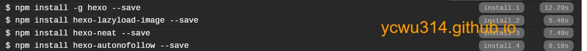

# travis ci cache

这几天在测试构建，一直觉得travis ci有点慢。于是打开日志研究





每次构建安装hexo相关插件，花掉30s时间！
<!-- more -->
发现.travis.yml竟然是
```yml
install:
  - npm install -g hexo --save
  - npm install hexo-lazyload-image --save
  - npm install hexo-neat --save
  - npm install hexo-autonofollow --save
```
导致每次都会下载安装包。
对于不经常变化的库和文件夹，travis ci提供了cache机制，加速构建速度。
```yml
cache:
    apt: true
    directories:
        - node_modules # 缓存不经常更改的内容
```
修改为
```yml
install:
  - npm install
```
构建日志
```
npm WARN prepare removing existing node_modules/ before installation
> fsevents@1.2.9 install /home/travis/build/[secure]/[secure].github.io/node_modules/fsevents
> node install

added 789 packages in 6.407s
```
缓存有过期时间，参见[Caching Dependencies and Directories](https://docs.travis-ci.com/user/caching/#caches-expiration):
>Cache archives are currently set to expire after 28 days for repositories on https://travis-ci.org and 45 days for those on https://travis-ci.com. This means a specific cache archive will be deleted if it wasn’t changed after its expiration delay.

travis ci缓存的读取和更新
>Before the build, we check if a cached archive exists. If it does, we download it and unpack it to the specified locations.
>After the build we check for changes in the directory, create a new archive with those changes, and upload it to the remote storage.

# travis ci cache 效果优化

新的构建平均减少了30s。
