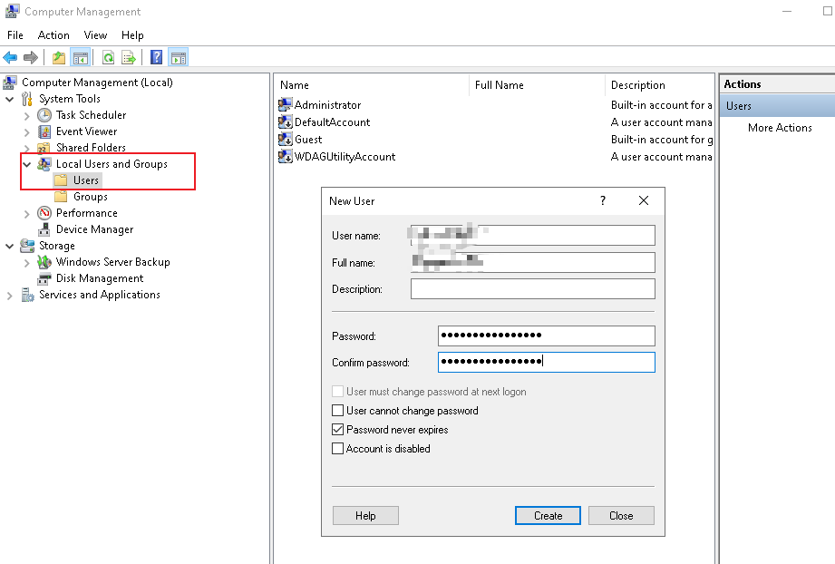
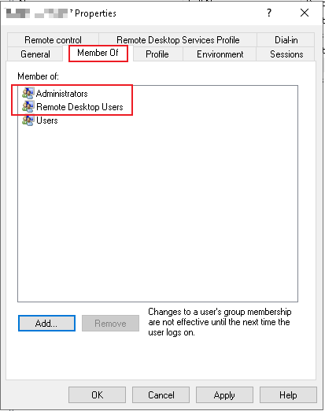
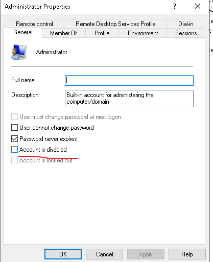

黑五vps促销，24刀搞了台4g3c win小鸡。

# 远程登录

默认账号Administrator，必须改掉。

1. `windows>>管理工具>>计算机管理>>本地用户和组>>用户`



2. 添加`Administrators`和`Remote Desktop Users`



3. 确认新账号能登录后，关闭Administrator账号




```powershell
# 创建用户
$userName = "xxx"
$password = "yyy"
$securePassword = ConvertTo-SecureString -String $password -AsPlainText -Force
New-LocalUser -Name $userName -Password $securePassword -PasswordNeverExpires

# 添加用户到 Administrators 组
Add-LocalGroupMember -Group "Administrators" -Member $userName

# 添加用户到 Remote Desktop Users 组
Add-LocalGroupMember -Group "Remote Desktop Users" -Member $userName


# 获取 Administrator 用户对象
$adminUser = Get-LocalUser -Name Administrator

# 检查是否找到 Administrator 用户
if ($adminUser -eq $null) {
    Write-Host "Administrator 用户不存在。"
} else {
    # 禁用 Administrator 用户
    $adminUser | Disable-LocalUser
    Write-Host "Administrator 用户已禁用。"
}

```


# IPBan

linux下fail2ban预防暴力登录很方便。win下面类似的软件是IPBan。

1. 手动安装

https://github.com/DigitalRuby/IPBan

下载后解压缩，需要管理员权限执行。


2. 自动安装（推荐）


```powershell
[Net.ServicePointManager]::SecurityProtocol = [Net.SecurityProtocolType]::Tls12; iex ((New-Object System.Net.WebClient).DownloadString('https://raw.githubusercontent.com/DigitalRuby/IPBan/master/IPBanCore/Windows/Scripts/install_latest.ps1'))
```

安装目录： `C:\Program Files\IPBan`。自动创建windows服务。

配置说明： https://github.com/DigitalRuby/IPBan/wiki/Configuration

需要调整：`PlatformRegex `。默认为`Linux`，改为`Windows`。保存然后重启IPBan。

# 屏蔽一些入站端口

这些端口通常与以下服务相关：

1. **端口 135（TCP/UDP）：** Microsoft的远程过程调用（RPC）服务。
2. **端口 137（UDP）：** NetBIOS Name Service，用于NetBIOS名称解析。
3. **端口 138（UDP）：** NetBIOS Datagram Service，用于NetBIOS数据包服务。
4. **端口 139（TCP）：** NetBIOS Session Service，用于NetBIOS会话服务。
5. **端口 445（TCP）：** Microsoft-DS（Direct Hosting of SMB over TCP/IP），用于Microsoft Server Message Block（SMB）文件共享服务。


```powershell
# 定义要屏蔽的端口列表
$blockedPorts = 135, 137, 138, 139, 445

# 循环创建防火墙规则
foreach ($port in $blockedPorts) {
    $ruleName = "Block_Port_$port"
    
    # 创建防火墙规则
    New-NetFirewallRule -DisplayName $ruleName -Direction Inbound -Protocol TCP -LocalPort $port -Action Block
    New-NetFirewallRule -DisplayName $ruleName -Direction Inbound -Protocol UDP -LocalPort $port -Action Block
}

# 显示已创建的规则
Get-NetFirewallRule | Where-Object { $_.DisplayName -like 'Block_Port_*' }

```

# syn攻击

```powershell
# 半开连接数
Set-ItemProperty -Path HKLM:\SYSTEM\CurrentControlSet\Services\Tcpip\Parameters -Name "TcpMaxHalfOpen" -Value 500
Set-ItemProperty -Path HKLM:\SYSTEM\CurrentControlSet\Services\Tcpip\Parameters -Name "TcpMaxHalfOpenRetried" -Value 500


# TcpMaxDataRetransmissions： 缩短数据重传次数，以减少攻击持续时间。默认值为5
# 这意味着如果某个 TCP 连接在发送数据时发生错误，系统将尝试重新传输数据最多 5 次，然后放弃连接。这是 TCP 协议的一种机制，旨在在网络中发生问题时保证数据的可靠传输。
Set-ItemProperty -Path HKLM:\SYSTEM\CurrentControlSet\Services\Tcpip\Parameters -Name "TcpMaxDataRetransmissions" -Value 3

# 启用SYN攻击保护
Set-ItemProperty -Path HKLM:\SYSTEM\CurrentControlSet\Services\Tcpip\Parameters -Name "SynAttackProtect" -Value 2

# 当 TCP/IP 协议栈中的端口资源用尽时，系统会记录端口资源用尽的事件，并在事件日志中记录这一情况
Set-ItemProperty -Path HKLM:\SYSTEM\CurrentControlSet\Services\Tcpip\Parameters -Name "TcpMaxPortsExhausted" -Value 5

```

# ICMP攻击保护

```powershell
# ICMP攻击保护
Set-ItemProperty -Path HKLM:\SYSTEM\CurrentControlSet\Services\Tcpip\Parameters -Name "EnableICMPRedirect" -Value 0
```

# IP碎片攻击

如果IP层有数据包要传，而且数据包的长度超过了MTU，那么IP层就要对数据包进行分片（fragmentation）操作，使每一片的长度都小于或等于MTU。


来自chatgpt：

`EnablePMTUDiscovery`（Path MTU Discovery）是一项网络配置，它允许 TCP 协议根据网络路径上的最小传输单元（MTU）来动态调整发送的数据包的大小。MTU 是可以在网络上传输的最大数据包的大小。

当启用 PMTUD，TCP 会根据网络的 MTU 动态调整它发送的数据包的大小，以避免发生分片。分片是指将大的数据包拆分成更小的片段以适应网络的 MTU。启用 PMTUD 有助于减少分片，提高数据传输的效率。

这对于避免在网络上发生分片和重新组装的情况很重要，因为某些网络（例如，IPv4 网络）可能不处理分片和重新组装，从而导致数据包的丢失或传输中断。

在 Windows 操作系统中，可以通过更改注册表或使用网络高级属性来启用或禁用 PMTUD。这个配置在确保网络连接的可靠性和效率方面有一定的重要性，特别是在使用 VPN 或其他网络隧道时。


禁用 Path MTU Discovery （PMTUD）可能在某些情况下是必要的，尽管这可能会导致网络效率下降。以下是一些场景，你可能会考虑禁用 PMTUD：

1. **防火墙或路由器不允许 ICMP 报文：** PMTUD 依赖于 ICMP 报文，如果网络上的防火墙或路由器不允许 ICMP 报文通过，那么 PMTUD 可能无法正常工作。

2. **特定应用需求：** 一些特殊的网络应用可能不适应分片，或者可能有更高的分片阈值，禁用 PMTUD 可能是一个解决方案。

3. **网络不稳定：** 在某些情况下，网络不稳定可能导致 PMTUD 产生不正确的路径最大传输单元（PMTU）估算。在这种情况下，禁用 PMTUD 可能有助于提高稳定性。


```powershell
# IP碎片攻击
Set-ItemProperty -Path HKLM:\SYSTEM\CurrentControlSet\Services\Tcpip\Parameters -Name "EnablePMTUDiscovery" -Value 0
```


# IP源路由攻击保护

IP 源路由是一种网络选项，它允许数据包的发送者指定数据包的传输路径，而不是依赖于路由表来选择路径。

在启用 DisableIPSourceRouting 时，系统将不允许接收到的数据包携带 IP 源路由选项。这样可以提高网络的安全性，因为源路由选项可能被滥用，用于 IP 地址欺骗攻击等。

```powershell
# IP源路由攻击保护
Set-ItemProperty -Path HKLM:\SYSTEM\CurrentControlSet\Services\Tcpip\Parameters -Name "DisableIPSourceRouting" -Value 2
```

0为表示所有数据包，1表示不转发源路由数据包，2表示丢弃所有传入源路由的数据包。


# 禁用失效网关检测

当 EnableDeadGWDetect 被启用时，Windows 将监测默认网关的响应。如果系统检测到默认网关无响应，它会尝试切换到另一个可用的网关，以确保网络连接的连通性。

```powershell
# IP源路由攻击保护
Set-ItemProperty -Path HKLM:\SYSTEM\CurrentControlSet\Services\Tcpip\Parameters -Name "EnableDeadGWDetect" -Value 0
```

# KeepAliveTime

默认2小时。单位ms。

```powershell
# KeepAliveTime
Set-ItemProperty -Path HKLM:\SYSTEM\CurrentControlSet\Services\Tcpip\Parameters -Name "KeepAliveTime" -Value 3000
```

# 取消关机原因

每次关闭系统之前都需要询问关机原因，有点烦人。

- 输入`gpedit.msc`
- 【计算机配置】→【管理模板】→【系统】→【显示“关闭事件跟踪程序”】


```powershell
# 启用关闭时不显示关机原因提示
$RegPath = "HKLM:\SOFTWARE\Microsoft\Windows\CurrentVersion\Policies\System"
$RegName = "shutdownwithoutlogon"
$RegValue = 1

# 设置注册表项
New-Item -Path $RegPath -Force | Out-Null
Set-ItemProperty -Path $RegPath -Name $RegName -Value $RegValue

Write-Host "已配置关闭时不显示关机原因提示。"
```


# 参考资料

- https://m.freebuf.com/articles/system/280171.html
