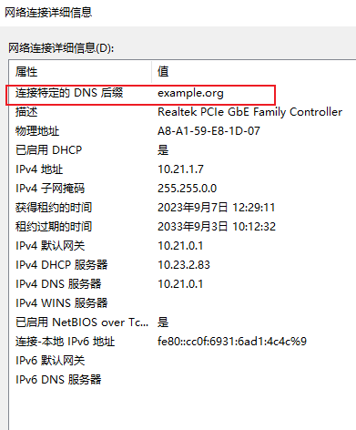
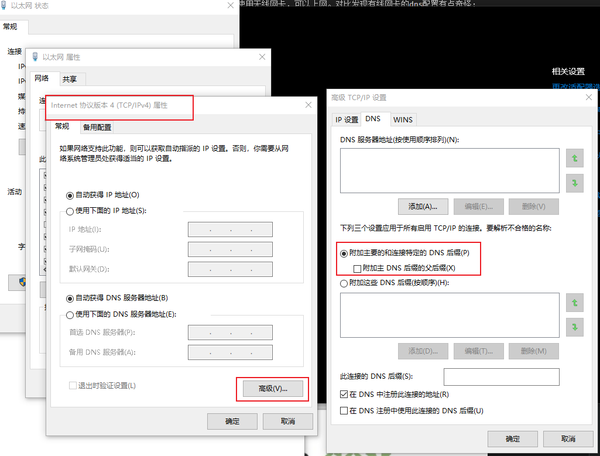
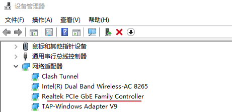

第一次遇到这个奇怪的case，记录下。
在办公室使用有线网卡，晚上关机后，第二天发现无法上网。切换使用无线网卡，可以上网。对比发现有线网卡的dns配置有点奇怪：

尝试了一些方法：
1. 网口连接到另一台电脑 -- 能正常上网，不是网口问题
2. 禁用网卡，再启用 -- 无效
3. 换另一个网口 -- 无效
4. 根据网上资料，修改ipv4协议的dns部分 -- 无效

最后尝试删除硬件，再扫描安装硬件 -- 可以上网了。

