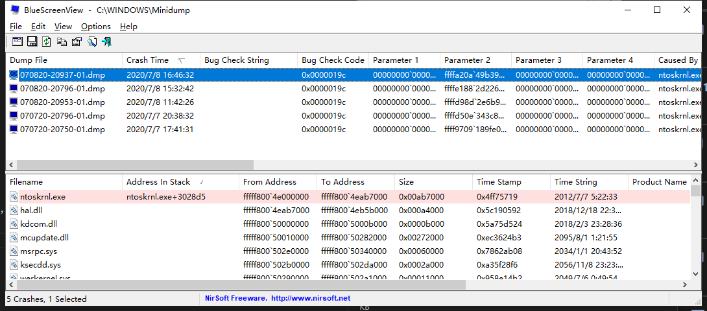

# 通过minidump排查故障

上周bug 10自动更新后，时不时蓝屏，一天发生几次，不能正常使用了。
蓝屏代码是`WIN32K_POWER_WATCHDOG_TIMEOUT`。
<!-- more -->
触发时间点是待机，再唤醒就蓝屏了。
在巨硬官网没查到相应的处理方式。

查资料发现win10崩溃的时候会写下转存，存放在`C:\Windows\Minidump`，可以使用BlueScreenView这个软件查看。

`ntoskrnl.exe`故障导致崩溃。查资料了解是计划任务程序，在空闲时间做内存压缩的。平时确实会闲置一会电脑，就突然卡一下。
参照 [ntoskrnl.exe占用cpu过高](http://blog.sina.com.cn/s/blog_ea9b83e30102yexr.html) 操作，禁止该计划任务。但是蓝屏照旧。

还是要从win10自动更新列表入手。发现更新了显卡驱动：

先尝试更新驱动，从intel官网下载了27开头的最新驱动。
安装完后重启，目前1天多没再发生蓝屏。

# 离线安装win10 update cab

更新于2020.12.22。

bug 10 自动安装了2004更新，之后待机蓝屏。
网上查找到是通病，巨硬在2020年11月提供了可选的kb4586853补丁，还没推送到全渠道。
不想开启windows insider做白老鼠，于是手动安装。

1. 下载安装包。通过关键字查找下载地址：
- https://www.catalog.update.microsoft.com/home.aspx

2. 下载的是cab文件，双击打开是压缩包，没有安装程序。可以通过命令行安装。

1). 搜索CMD右键以管理员权限运行

2). 选择下面任意一个命令安装更新（文件名需要全目录）

>dism /online /add-package /packagepath:文件名

或者

>start /w pkgmgr /ip /m:文件名

