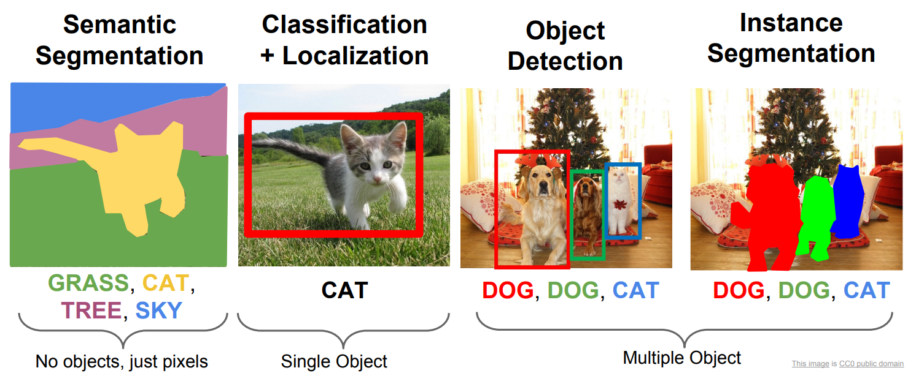

# 检测、分割和分类

在YOLO中，"detect"、"segment"和"classify"是三个不同的任务，它们在目标识别和理解方面有不同的重点和目标。下面是它们的区别：



(cs231n的课件截图)


1. Detect（检测）：检测任务是YOLO的主要任务，目标是在图像或视频中定位和识别出不同类别的对象。YOLO通过预测目标的边界框位置和类别标签来实现目标检测。检测任务旨在确定图像中存在哪些目标以及它们的位置。

2. Segment（分割）：分割任务是指对图像进行像素级别的分割，将图像中的每个像素分配给特定的类别或对象。YOLO中的分割任务旨在将图像中的每个像素分割为不同的目标区域，以实现对目标的精确定位和分割。分割任务可用于图像分割、语义分割等应用。

3. Classify（分类）：分类任务是将输入的图像或物体分为不同的预定义类别或标签。在YOLO中，分类任务通常指的是对图像中的整个对象进行分类，而不是对目标进行定位或分割。YOLO中的分类任务旨在确定图像中的对象属于哪个类别，而不关注其具体位置。


YOLO中的"detect"任务主要关注目标的定位和识别，但是不关注确切的形状。


"segment"任务关注图像的像素级别分割，关注具体形状和位置。


"classify"任务则着重于对整个对象进行类别分类，不关注位置和具体形状。


# 姿势

姿态估计是一项涉及识别图像中特定点（通常称为关键点）位置的任务。关键点可以代表物体的各个部分，如关节、地标或其他显著特征。

关键点的位置通常用一组二维 `[x, y]` 或 3D `[x, y, visible]` 坐标。

适用于需要识别场景中物体的特定部分及其相互之间的位置关系。

# OBB

Oriented Bounding Boxes Object Detection。

定向物体检测器的输出结果是一组旋转的边界框，这些边界框精确地包围了图像中的物体，同时还包含每个边界框的类标签和置信度分数。

YOLO OBB 格式通过四个角点指定边界框，其坐标在 0 和 1 之间归一化：
```
class_index, x1, y1, x2, y2, x3, y3, x4, y4
```


适用于需要识别场景中感兴趣的物体，但又不需要知道物体的具体位置或确切形状。


# 模型后缀

| 任务     | 模型后缀 |
| -------- | -------- |
| detect   | 无，默认 |
| segment  | -seg     |
| classify | -cls     |
| pose     | -pose    |
| obb      | -obb     |

# 资料

- https://docs.ultralytics.com/zh/tasks/
- https://cs231n.stanford.edu/slides/2017/cs231n_2017_lecture11.pdf

