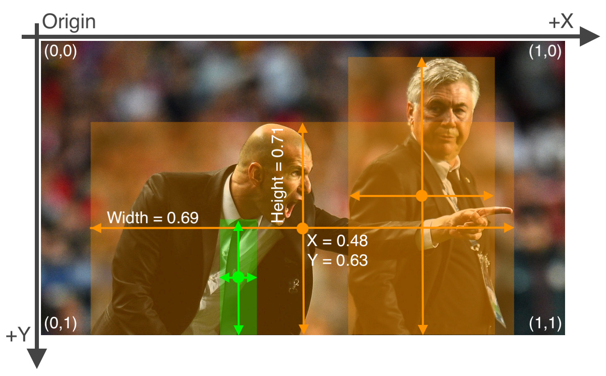

# YOLO 标注格式


YOLO（You Only Look Once）是一种实时目标检测算法，其标注格式通常采用以下形式：

1. **每个标注文件对应一张图像**：每个图像都有一个对应的标注文件，标注文件通常具有相同的名称但不同的后缀（如 `.txt`）。

2. **每行对应一个对象**：标注文件的每一行对应图像中的一个对象。
   
3. **对象的描述**：每行通常包含对象的类别、中心坐标（相对于图像宽度和高度的归一化值）、宽度和高度（相对于图像宽度和高度的归一化值）。


```
<class_id> <center_x> <center_y> <width> <height>
```
其中左上角为原点。因为对坐标归一化处理，因此可以处理图片缩放问题。




目录结构示例：
```
yolo-folder
  images
   - 1.jpg
   - 2.jpg
   - ...
  labels
   - 1.txt
   - 2.txt

  classes.txt
```

labels目录文件内容示例：
```
0 0.45 0.63 0.20 0.30
1 0.28 0.36 0.15 0.25
```
上面的示例表示该图像中有两个对象，第一个对象是类别为0的物体，其中心位于图像的横向0.45倍处，纵向0.63倍处，宽度和高度分别为图像宽度和高度的0.20倍和0.30倍。


# VOC 标注格式

VOC（Visual Object Classes）是一种常用的目标检测数据集格式，其标注格式通常采用 XML 文件来描述。每个 XML 文件对应一个图像的标注信息，XML 文件通常包含对象的类别、边界框位置等信息。

示例：
```xml
<annotation>
    <folder>FolderName</folder>
    <filename>ImageFileName.jpg</filename>
    <path>/path/to/image/ImageFileName.jpg</path>
    <source>
        <database>VOC2007</database>
    </source>
    <size>
        <width>ImageWidth</width>
        <height>ImageHeight</height>
        <depth>ImageDepth</depth>
    </size>
    <segmented>0</segmented>
    <object>
        <name>ClassName</name>
        <pose>Pose</pose>
        <truncated>0</truncated>
        <difficult>0</difficult>
        <bndbox>
            <xmin>XMin</xmin>
            <ymin>YMin</ymin>
            <xmax>XMax</xmax>
            <ymax>YMax</ymax>
        </bndbox>
    </object>
</annotation>

```

上面的示例是一个 VOC 格式的 XML 文件，描述了一个图像中的一个对象，其中包含了对象的类别（dog）、边界框位置（xmin、ymin、xmax、ymax）等信息。

- `<segmented>`: 表示图像是否进行了分割（0表示未分割，1表示已分割）。
- `<truncated>`: 目标对象是否被截断（0表示未截断，1表示已截断）。
- `<difficult>`: 目标对象是否难以识别（0表示不难以识别，1表示难以识别）。
- `<bndbox>`: 包含目标对象边界框的位置信息。坐标原点在左上角。
    - `<xmin>`: 边界框左上角点的横坐标。
    - `<ymin>`: 边界框左上角点的纵坐标。
    - `<xmax>`: 边界框右下角点的横坐标。
    - `<ymax>`: 边界框右下角点的纵坐标。


# COCO 标注格式

COCO（Common Objects in Context）数据集是一个广泛使用的目标检测、图像分割和场景分析的数据集。其标注格式采用了JSON（JavaScript Object Notation）格式。


```json
{
  "info": {},
  "licenses": [],
  "images": [
    {
      "id": 1,
      "width": 800,
      "height": 600,
      "file_name": "image1.jpg",
      "license": 1,
      "flickr_url": "",
      "coco_url": "",
      "date_captured": "2018-01-01 12:00:00"
    },
    {
      "id": 2,
      "width": 1024,
      "height": 768,
      "file_name": "image2.jpg",
      "license": 1,
      "flickr_url": "",
      "coco_url": "",
      "date_captured": "2018-01-02 12:00:00"
    }
  ],
  "annotations": [
    {
      "id": 1,
      "image_id": 1,
      "category_id": 1,
      "bbox": [100, 100, 200, 150],
      "area": 3000,
      "segmentation": [],
      "iscrowd": 0
    },
    {
      "id": 2,
      "image_id": 1,
      "category_id": 2,
      "bbox": [300, 200, 150, 100],
      "area": 1500,
      "segmentation": [],
      "iscrowd": 0
    }
  ],
  "categories": [
    {"id": 1, "name": "person", "supercategory": "person"},
    {"id": 2, "name": "car", "supercategory": "vehicle"}
  ]
}


```